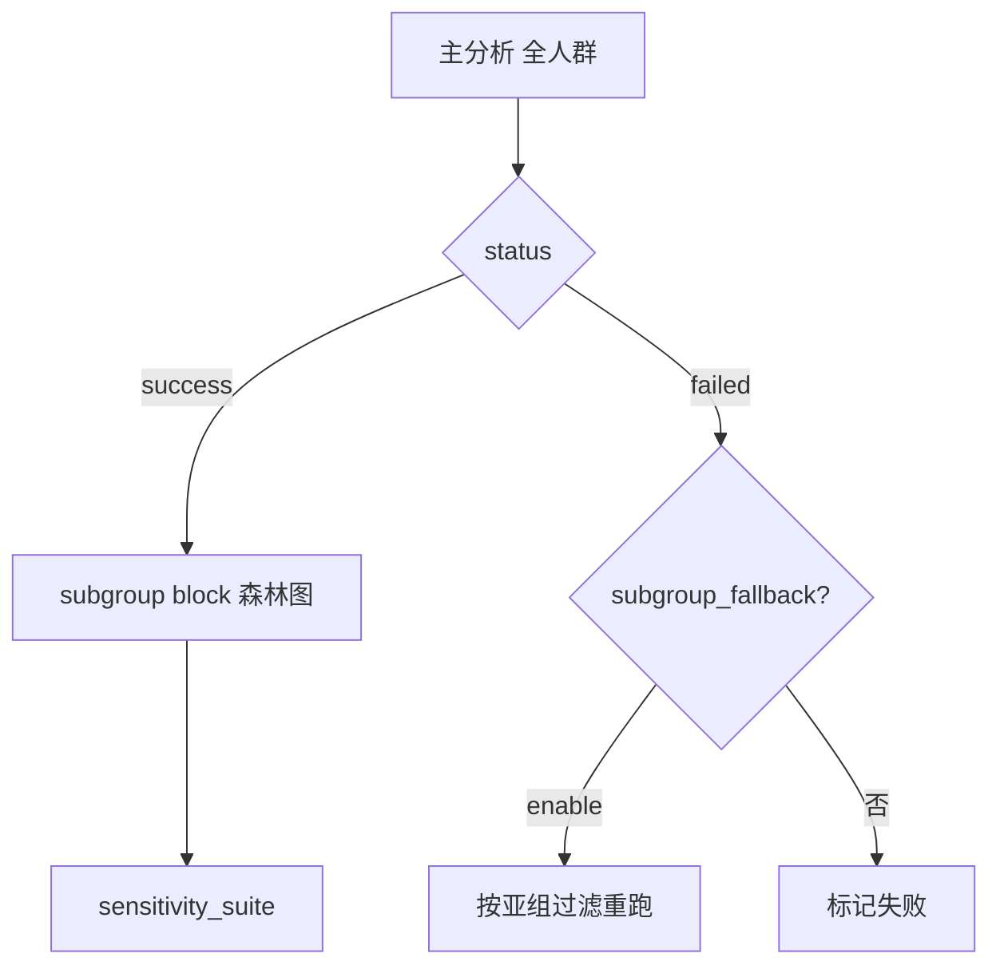

# 参考：亚组 / 敏感性 / 补救

## 三种「亚组」区别

| 名称 | Config | 何时跑 | 对象 | 目的 |
|------|--------|--------|------|------|
| **主流程亚组** `subgroup_incidence` 等 | pipeline block | 每次分析链末尾 | 当前队列 | 分层 OR + P for interaction（森林图） |
| **敏感性** `sensitivity_suite` | `incidence_batch$sensitivity_suite` | 主分析 **success** 后 | success 指标 | 换队列稳健性（排除 HTN/DM、年龄分层） |
| **亚组补救** `subgroup_fallback` | `incidence_batch$subgroup_fallback` | 主分析 **failed** 后 | failed 指标 | 缩小人群试图救活整条流水线 |



## 敏感性 vs data_clean$age_filter

| 方式 | 作用点 | 适用 |
|------|--------|------|
| `data_clean$age_filter` | 共享层 data_clean | 主分析就要限定人群 |
| `sensitivity_suite` / `.subgroup_fallback_expr` | worker 复制 shared ck 后 | 主分析全人群 + 事后敏感性 |

**敏感性不要用 `age_filter`**，否则共享层 cohort 被改，所有指标都受影响。

## sensitivity_suite 配置示例

```r
sensitivity_suite = list(
  enable = TRUE,
  age_cutoff = 65L,
  min_n_per_db = 50L,
  scenarios = list(
    list(label = "SA_no_hypertension", expr = 'is.na(Hypertension) | Hypertension != "Yes"'),
    list(label = "SA_no_diabetes",     expr = 'is.na(T2DM) | T2DM != "Yes"'),
    list(label = "SA_age_ge_{age_cutoff}", expr = "Age >= {age_cutoff}"),
    list(label = "SA_age_lt_{age_cutoff}", expr = "Age < {age_cutoff}")
  )
)
```

薄 config：`.study$sensitivity_enable = TRUE` 即可（build 脚本注入上述默认场景）。

## 引擎文件清单（incidence dual batch 已具备）

| 文件 | 职责 |
|------|------|
| `R/incidence_sensitivity_suite.R` | 敏感性编排 |
| `R/incidence_subgroup_fallback.R` | 失败指标亚组补救 |
| `R/incidence_dual_batch_runner.R` | 主批量；末尾挂 sensitivity + subgroup_fallback |
| `run_incidence_dual_batch.R` | `--sensitivity-only` 等 CLI |
| `configs/study_interface/incidence_dual_batch_build.R` | 薄 config 构建 |

## 产出路径

```
studies/<研究>/by_index/<指标>/
├── eICU/  MIMIC/           # 主分析
├── sensitivity/SA_xxx/     # 敏感性
└── _batch_status.json
```

## 模板【必改】键（incidence_dual_batch）

| 键 | 说明 |
|----|------|
| `.batch_project_root` | `normalizePath(getwd())` |
| `project$disease` / `analysis_group` / `reference_group` | 结局标签 |
| `dual_db$primary/secondary` | 路径、rawdata_obj、column_mapping_type |
| `incidence_batch$output_base` | 与 project_root 一致 |
| `feishu$enable` | 程序员默认 FALSE |
