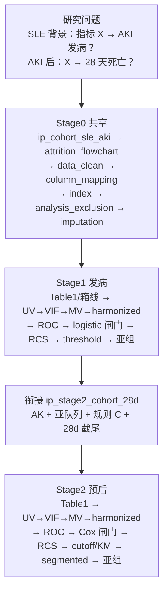

# Task 7 Review Package
# Task 7 Report: Config + 决策树 + Template（SLE→AKI 两阶段）

**Status**: DONE  
**Date**: 2026-08-26  
**Commits**: none（禁止 commit）

**Deliverables**: `configs/templates/config_sle_aki_inc_prog_batch.template.R`；研究 config `G:/02block_result/29_SLE/inincidence_prognosis_39003396_42304330/config_sle_aki_inc_prog_batch.R`；`Decisiontree/decision_tree_sle_aki_inc_prog.md`（15 步、DAG、规则 C、28d、院内截尾/无 aki_time 脚注、飞书 **Bxx**）。

**Config**: `output_dir`=结果根；`dual_db$enable=FALSE`；`pub_figure$profile=mimic_inc_prog_sle_aki`；`mirror_pub_outputs_to_root=TRUE`；`ip_two_stage` 指向 `data/mimic/`；`disease_vars`=Task1 15 项；`age_cutoff=65` 且 Age_Group 两级；Stage0/1/2 按 spec §6（含三胶水块）。Figure 1 用 `attrition$steps`（rdata/id_file/current）对齐 `ip_attrition_steps`（flowchart 不读该对象）。

**Parse**: Windows Rscript source 研究 config + 引擎 template 均 `PARSE_OK`（full=44 blocks）。未改旧课题 config。

754 /mnt/e/01block/01Block-new-Final/configs/templates/config_sle_aki_inc_prog_batch.template.R
252 /mnt/e/01block/01Block-new-Final/Decisiontree/decision_tree_sle_aki_inc_prog.md

17:#  source 后产物: config, pipeline_shared, pipeline_stage1, pipeline_stage2,
37:# Task 1 `_column_review.md` disease_vars（SLE/AKI 结局泄漏 + 肾标志物 + 边界 severity）
57:# 不含 disease_vars（SOFA/CHARLSON/CKD/肌酐等）
66:    # 现场筛入由 ip_cohort_sle_aki 写 ctx$data$raw；rawdata_path 供 attrition / 回退 load
82:    study_type          = "incidence",     # Stage1；ip_stage2_cohort_28d 切到 prognosis
95:  pub_figure = list(
98:  pub_figures = list(
136:    disease_vars = .disease_exclusion_vars,
143:  ip_two_stage = list(
172:        "(ctx$results$ip_stage2_timezero_source)."
181:        "(1 Age=NA excluded in ip_cohort). Main analysis uses the live filter."
201:  # ip_cohort 写出 ctx$results$ip_attrition_steps（baseline_icu / intersect_SLE / age_ge_18）
242:    missing_threshold = 0.3,
243:    age_filter        = NULL,   # Age>=18 已在 ip_cohort
253:    missing_col_threshold = 0.4,
359:    vif_threshold_strict = 4,
360:    vif_threshold_loose  = 10,
361:    min_vars_threshold   = 0,
396:    p_threshold = 0.05, phase = "screen",
399:      initial_factors_n = 1L, p_threshold = 0.05, seed = NULL,
408:    p_threshold = 0.05, phase = "screen",
411:      initial_factors_n = 1L, p_threshold = 0.05, seed = NULL,
420:    p_threshold = 0.05, phase = "screen",
423:      initial_factors_n = 1L, p_threshold = 0.05, seed = NULL,
432:    p_threshold = 0.05, phase = "screen",
435:      initial_factors_n = 1L, p_threshold = 0.05, seed = NULL
449:  threshold_logistic = list(
461:    p_threshold = 0.05, pause_enable = FALSE,
473:    p_threshold = 0.05, pause_enable = FALSE,
485:    p_threshold = 0.05, pause_enable = FALSE,
535:    age_cutoff = 65L,
578:    mimic_imputation_threshold = 0.40,
587:      age_cutoff    = 65L,     # 与 subgroup$age_cutoff 同值
596:      age_cutoff = 65L,
599:        list(label = "Age_{age_cutoff}", expr = "Age >= {age_cutoff}"),

# 分析决策树 — SLE → AKI 发病 + 28 天预后（单库 MIMIC 两阶段）

> 运行入口：`run/sle_aki_inc_prog/run_sle_aki_inc_prog_batch.R`（Task 8）
> 模板：`configs/templates/config_sle_aki_inc_prog_batch.template.R`
> 研究 config：`G:/02block_result/29_SLE/inincidence_prognosis_39003396_42304330/config_sle_aki_inc_prog_batch.R`
> 架构：`dual_db$enable = FALSE`；Stage0 共享 + 按指标 worker（Stage1 → 胶水 → Stage2）
> 图门控：`pub_figure$profile = "mimic_inc_prog_sle_aki"`（仅本套路）
> 飞书工作计划：**Bxx**（Task 9 取下一空号）；多维表 [RBjfb2iwmamW14s4WhKcS7kwnie](https://lcn1in9jd6ie.feishu.cn/base/RBjfb2iwmamW14s4WhKcS7kwnie)
> 对照：单库发病 `decision_tree_incidence_single.md`；预后闸门对齐 survival dual-batch

## 研究设定

| 项 | 值 |
| -- | -- |
| 背景人群 | MIMIC ICU first-stay ∩ `SLE.csv`（现场筛入；dabiao 仅核对） |
| Stage1 类型 | `project$study_type = "incidence"`；结局 `Disease`（AKI/ARF） |
| Stage2 类型 | 胶水块改为 `prognosis`；结局 `fustatus` / 时间 `futime`（28 天行政截尾） |
| 暴露 | 营养/炎症复合指标（`index$only`：CONUT/PNI/GNRI/NLR/SII/…）；缺成分 skip |
| 库 | 单库 MIMIC；产出根 = `project$output_dir`（**不是**引擎仓库） |
| 分位 | 仅由 Stage1 logistic / Stage2 Cox 闸门锁定；下游禁止另写 grouping |

---

## 总览

---

## 流程图 15 步对照（全绿）

| # | 步骤 | 落实（block / 文档） |
