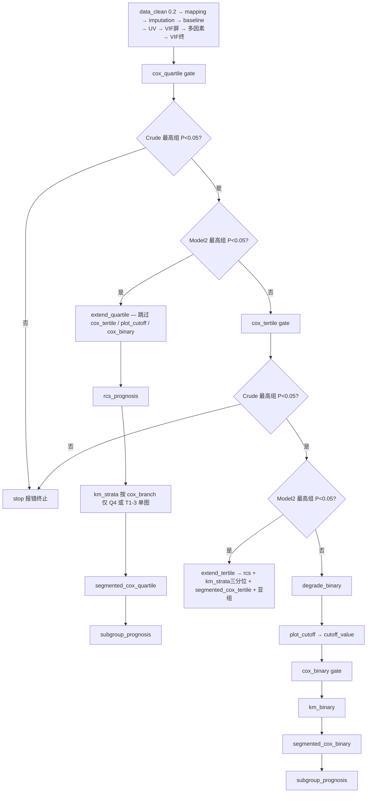

# SAE + RAR 预后流水线分析决策树（已定稿 v2）

- **归档名**: `01decision_tree_survival`
- **配置**: `configs/config_survival_sae.R` + `run_survival_sae.R`
- **实现**: 方案 B（`cox_quartile` / `cox_tertile` / `cox_binary` + `pipeline$cox_gate`）；`gate_enable=FALSE` 时可仅跑四分位

## 研究问题

| 项 | 设定 |
|----|------|
| 人群 | SAE |
| 研究类型 | `prognosis` |
| 暴露 | `RAR`（已有列） |
| 结局 | `fustatus`（1=死亡 → Non-survivor，0=存活 → Survivor） |
| 时间 | `futime` |
| 数据 | `Data/D04_rt_CleanData.RData` → `rt`，ID=`subject_id` |
| 双库 | `FALSE` |
| 镜像产出 | `mirror_pub_outputs_to_root = TRUE` |
| Cox 协变量 | Model1=`Model1Factors`，Model2=`Model2Factors`（第二次 VIF 后） |
| P 阈值 | 0.05 |
| 列缺失 | 剔除缺失 **>20%** 的列（`missing_threshold = 0.2`） |

## 流程图

## pipeline$blocks（声明顺序）

1. `data_clean` … `multicollinearity_final`（标准预后筛选）
2. `cox_quartile` → `cox_tertile`（runner 按 `ctx$results$cox_branch` 跳过）
3. `plot_cutoff` → `cox_binary`（仅 `degrade_binary` 路径）
4. `rcs_prognosis` → `km_strata` → `segmented_cox_quartile` → `segmented_cox_tertile`
5. `km_binary` → `segmented_cox_binary`
6. `subgroup_prognosis`

`mediation_prognosis`：未指定 mediators，暂不纳入。

## 仅跑四分位

`config$cox_quartile$gate_enable = FALSE`（默认兼容），且 `pipeline$blocks` 只列到 `cox_quartile` 或使用 `--only cox_quartile`。
