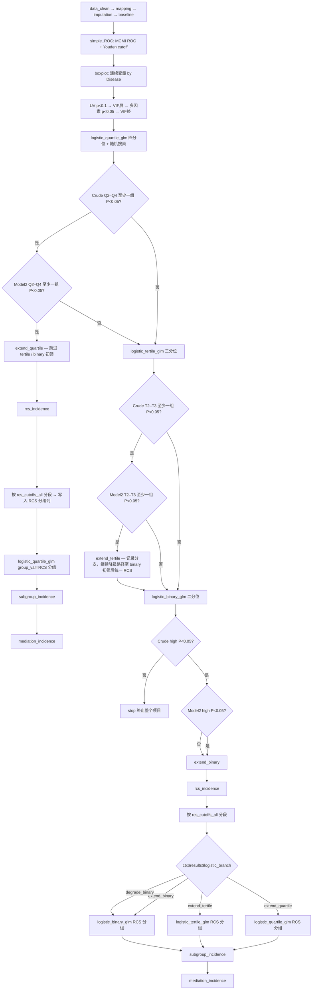

# D05 CLR × Stroke 发病 Logistic 流水线分析决策树（已定稿 v1）

- **归档名**: `03decision_tree_incidence`
- **配置**: `configs/config_incidence_single.R` + `run_incidence_single.R`
- **实现**: 方案 B（`logistic_quartile_glm` / `logistic_tertile_glm` / `logistic_binary_glm` + `pipeline$logistic_gate`）；RCS 分段后复跑 `*_rcs` block（`R/logistic_gate.R`）

## 研究问题

| 项 | 设定 |
|----|------|
| 人群 | Stroke（发病队列） |
| 研究类型 | `incidence` |
| 暴露 | `CLR`（连续变量） |
| 结局 | `Disease`（Stroke vs Normal） |
| 数据 | `Data/D05_rt_CleanData.RData` → `dabiao`，ID=`SEQN` |
| 双库 | `FALSE` |
| Logistic 协变量 | Model1=`Model1Factors`，Model2=随机搜索命中（`logistic_*_glm$random_search`） |
| P 阈值 | 0.05 |
| 列缺失 | 剔除缺失 **>30%** 的列（`missing_threshold = 0.3`）；插补前再剔除缺失 **>20%**（`missing_col_threshold = 0.2`） |
| 检查点 | `checkpoints/D05_CLR_Stroke/` |

## 闸门判定字段（与 `01block_logistic_quartile_glm.R` 对齐）

四分位 Table 2 中，非参照组行（Q2、Q3、Q4）的 P 值列：

| 模型 | P 值列 | 判定 |
|------|--------|------|
| Crude Model | 第 6 列 | Q2–Q4 **全部** ≥ 0.05 → 四分位 Crude 不通过 |
| Model2 | 第 12 列 | Q2–Q4 **至少一个** < 0.05 → 四分位 Model2 通过（扩展分支） |

三分位（T2、T3）、二分位（high）沿用同一列索引规则；参照组分别为 T1、low。

随机搜索命中条件（块内已有）：Crude / Model1 / Model2 的 **p for trend** 均 < 0.05，且 Model2 非参照组 **至少一组** P < 0.05。

## 流程图



## 两条主路径摘要

### 路径 A — 四分位 Model2 显著（`extend_quartile`）

1. `logistic_quartile_glm`（标准四分位 + 随机搜索出表）
2. **跳过** `logistic_tertile_glm`、`logistic_binary_glm` 初筛
3. `rcs_incidence`（`Blocks/15_rcs/02block_rcs_incidence.R`）
4. 用 `ctx$results$rcs_cutoffs_all` 将全部 cutoff 写入暴露分段（`CLR_RCS_Group` 等），更新 `ctx$data$imputed`
5. `logistic_quartile_glm`（`group_var` = RCS 分组列，`include_continuous_row = FALSE`）— RCS 驱动四分位 Table 2
6. `subgroup_incidence` → `mediation_incidence`

### 路径 B — 四分位 Model2 不显著（降级）

1. `logistic_quartile_glm`（出表，闸门标记 `degrade_tertile`）
2. `logistic_tertile_glm` — Crude T2–T3 全不显著则继续降级；Model2 显著则记 `extend_tertile`（仍继续 binary 初筛）
3. `logistic_binary_glm` — **Crude high 不显著 → `stop` 终止项目**；否则记 `extend_binary` 或保留 `extend_tertile`
4. `rcs_incidence`
5. 按 RCS cutoff 分段后，根据 `ctx$results$logistic_branch` 跑对应分位 Logistic：
   - `extend_quartile` → `logistic_quartile_glm`（RCS 分组）
   - `extend_tertile` → `logistic_tertile_glm`（RCS 分组）
   - `extend_binary` / `degrade_binary` → `logistic_binary_glm`（RCS 分组）
6. `subgroup_incidence` → `mediation_incidence`

## pipeline$blocks（目标声明顺序）

1. `data_clean` → `column_mapping` → `imputation`
2. `baseline_binary` → `simple_ROC` → `boxplot` → `univariate_incidence_binary`（p<0.1）→ `multicollinearity_screen`（VIF<4）
3. `multivariate_incidence_binary`（p<0.05）→ `multicollinearity_final`（VIF<4）
4. **初筛分位**（runner 按 `ctx$results$logistic_branch` 跳过冗余块）：
   - `logistic_quartile_glm`
   - `logistic_tertile_glm`
   - `logistic_binary_glm`
5. **RCS + 分段复跑**：
   - `rcs_incidence`
   - `logistic_quartile_glm_rcs`（或同一 block 名 + `group_var` 配置；见下）
   - `logistic_tertile_glm_rcs` / `logistic_binary_glm_rcs`（runner 仅保留与 `logistic_branch` 匹配者）
6. `subgroup_incidence` → `mediation_incidence`

> **实现说明**：初筛与 RCS 分段复跑共用同一 block 函数，通过 `ctx$current_block` 后缀 `_rcs` 区分；`pipeline$logistic_gate$enable = TRUE` 时由 `R/logistic_gate.R` 写 `ctx$results$logistic_branch` 并控制跳过。

## pipeline$logistic_gate（config 目标段）

```r
pipeline <- list(
  # ...
  logistic_gate = list(
    enable = TRUE
  )
)

config$logistic_quartile_glm <- list(
  gate_enable            = TRUE,
  stop_if_crude_all_ns     = FALSE,   # Crude 全 NS → 降级三分位，不 stop
  extend_branch            = "extend_quartile",
  degrade_branch           = "degrade_tertile",
  p_threshold              = 0.05,
  # screen 阶段：标准四分位；rcs 阶段：group_var 读 RCS 列
  phase                    = "screen",
  group_var                = NULL,
  include_continuous_row   = TRUE,
  random_search            = list(max_attempts = 100L, sample_n = 8L, p_threshold = 0.05)
)

config$logistic_tertile_glm <- list(
  gate_enable            = TRUE,
  stop_if_crude_all_ns     = FALSE,
  extend_branch            = "extend_tertile",
  degrade_branch           = "degrade_binary",
  p_threshold              = 0.05,
  phase                    = "screen"
)

config$logistic_binary_glm <- list(
  gate_enable            = TRUE,
  stop_if_crude_highest_ns = TRUE,    # Crude high 不显著 → stop 整个项目
  extend_branch            = "extend_binary",
  degrade_branch           = character(0),
  p_threshold              = 0.05,
  phase                    = "screen"
)

config$rcs_incidence <- list(
  index_var    = "CLR",
  nk_range     = 3:5,
  histbin      = 0.01,
  color_seed   = 123
)
```

## ctx$results 关键契约

| 键 | 写入 Block | 下游用途 |
|----|------------|----------|
| `logistic_branch` | `logistic_*_glm` 闸门 | runner 跳过块；RCS 后选对应分位 Logistic |
| `logistic_gate_detail` | 同上 | Crude / Model2 各组 P 值审计 |
| `roc_auc` / `roc_ci` / `roc_cutoff` / `roc_sensitivity` / `roc_specificity` | `simple_ROC` | 报告；cutoff_value 回退供 subgroup |
| `cutoff_value` | `simple_ROC`（条件写入，若 RCS 未设置）；`rcs_incidence`（覆盖） | `subgroup_incidence` high/low 二分 |
| `Model1Factors` / `Model2Factors` | multicollinearity + logistic 初筛 | RCS、分段 Logistic、亚组、中介 |
| `rcs_cutoffs_all` | `rcs_incidence` | 暴露全 cutoff 列表，用于分段 |
| `rcs_cutoff_group_col` | `rcs_incidence` | 分段因子列名 → `logistic_*_glm$group_var` |
| `cutoff_value` | `rcs_incidence` | 主 cutoff（亚组 high/low 二分） |
| `logistic_model2_factors` | 各 logistic 块 | 亚组 / 中介 Model2 协变量 |

## 终止条件

| 阶段 | 条件 | 行为 |
|------|------|------|
| 四分位 Crude | Q2–Q4 全部 P ≥ 0.05 | 跳过四分位扩展，进入三分位（**不**终止项目） |
| 三分位 Crude | T2–T3 全部 P ≥ 0.05 | 进入二分位 |
| 二分位 Crude | high 组 P ≥ 0.05 | **`stop` 终止整个项目** |
| 四分位 Model2 | Q2–Q4 至少一组 P < 0.05 | 路径 A：直接 RCS → 四分位复跑 → 亚组 → 中介 |
| 四分位 Model2 | Q2–Q4 全部 P ≥ 0.05 | 路径 B：三分位 → 二分位 → RCS → 按 branch 复跑 → 亚组 → 中介 |

## 主要产出

| Block | 产出 |
|-------|------|
| `simple_ROC` | Figure S\<n\> ROC 曲线（MCMI vs Disease）；Table S\<n\> ROC Summary（AUC, CI, Youden cutoff） |
| `boxplot` | Figure S\<n\> 各连续变量箱线图 by Disease；Table S\<n\> Boxplot GroupComparisons |
| `logistic_quartile_glm` | Table 2 四分位（初筛 + 可选 RCS 分段复跑） |
| `logistic_tertile_glm` | Table 2 三分位（降级路径） |
| `logistic_binary_glm` | Table 2 二分位（降级路径） |
| `rcs_incidence` | Fig 2 RCS 三联图；`cutoff_CLR.csv`；`rcs_cutoff_groups_CLR.csv` |
| `subgroup_incidence` | 亚组 Table + 森林图（index 按 `cutoff_value` 二分） |
| `mediation_incidence` | 中介效应表 + 路径图（`auto_covariate_search = TRUE`） |

## 续跑

```bash
Rscript run_incidence_single.R
Rscript run_incidence_single.R --to logistic_quartile_glm
Rscript run_incidence_single.R --from multicollinearity_final
Rscript run_incidence_single.R --only rcs_incidence,subgroup_incidence
```

`--from <block>` 表示从该 block **之后**继续；检查点目录为 `checkpoints/D05_CLR_Stroke/`。

## 与旧版配置的差异

| 项 | 旧版 | 本决策树 v1 |
|----|------|-------------|
| 分位初筛 | 无（直接 RCS） | 先 `logistic_quartile_glm` → 闸门降级 |
| RCS 时机 | 固定在第 9 步 | Model2 四分位显著则提前；否则三分位/二分位后再 RCS |
| 分段 Logistic | 无 | RCS cutoff 驱动 `group_var` 复跑对应分位 |
| 项目终止 | 无自动 stop | 二分位 Crude 不显著则 stop |
| 闸门 | 无 | `pipeline$logistic_gate`（对齐 `cox_gate` 方案 B） |
