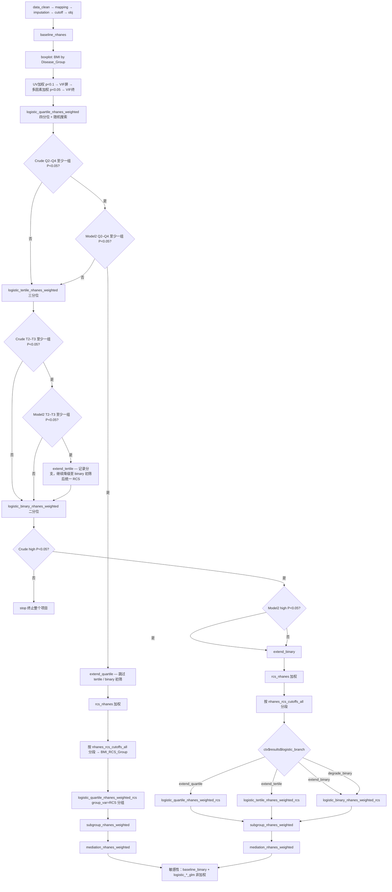

# D04 BMI × OA — NHANES 加权发病分析决策树（已定稿 v4）

- **归档名**: `decision_tree_d04_bmi_oa_nhanes`
- **配置**: `configs/config_incidence_nhanes.R` + `run_incidence_nhanes.R`
- **输出**: `Output/D04_BMI_OA_NHANES`
- **检查点**: `checkpoints/D04_BMI_OA_NHANES`
- **实现**: 方案 B 加权版（`logistic_quartile_nhanes_weighted` / `logistic_tertile_nhanes_weighted` / `logistic_binary_nhanes_weighted` + `pipeline$logistic_gate`）；RCS 分段后复跑 `*_nhanes_weighted_rcs` block（`R/logistic_gate.R`，svyglm Table 2 列索引与 `03` 一致）
- **逻辑对齐**: 分位初筛 + Model2 扩展分支 + 降级 + 二分位 stop，与 `03decision_tree_incidence_single.md` 相同；**模型均为加权 svyglm**
- **文献参考**: Zhou 2024 CMI×抑郁（`Decisiontree_literature/01decision_tree_zhou2024_cmi_depression_nhanes.md`；统计套路：Table 1 → Logistic → RCS → 亚组；指标/结局以本研究数据为准）

---

## 1. 研究问题

| 项目 | 确认值 |
|------|--------|
| 研究问题 | BMI 与骨关节炎（OA）发病的关联 |
| 结局列 | `Disease_Group` |
| 病例组 | `OA` |
| 对照组 | `No_OA` |
| 核心暴露 | **BMI**（连续 + 分组 OR 表） |
| 研究类型 | NHANES 加权横断面发病（`incidence` + `binary`） |
| 数据 | `Data/D04_dabiao_NHANES.RData` → `dabiao`，ID=`SEQN` |
| 调查权重 | `WTMEC2YR` / `SDMVPSU` / `SDMVSTRA` |
| 双库 | `dual_db$enable = FALSE` |
| 表图镜像 | `mirror_pub_outputs_to_root = TRUE` |
| Logistic 协变量 | Model1=`Model1Factors`，Model2=随机搜索命中（`logistic_nhanes_weighted$random_search`） |
| P 阈值 | 0.05 |
| 列缺失 | 剔除缺失 **>30%**；插补前再剔除缺失 **>20%** |

---

## 2. 变量筛选四步链


| 步骤 | Block | 阈值 / 方法 | 关键 ctx |
|------|-------|-------------|----------|
| ① 单因素 | `univariate_nhanes` | **P < 0.1** → `tb_screen`；Table S2a 标注 **P < 0.05** → `tb1` | `tb_screen`, `univar_coef` |
| ② VIF screen | `multicollinearity_nhanes_screen` | **VIF < 4**（加权 VIF） | `vif_screen_pass` |
| ③ 多因素 | `multivariate_nhanes` | 以 **`vif_screen_pass`** 入模；**P < 0.05** → `tb2` | `Model1/2Factors`, `tb2` |
| ④ VIF final | `multicollinearity_nhanes_final` | **VIF < 4** + NHANES 加权 VIF 复核 | 更新 `Model2Factors` |

---

## 3. 闸门判定字段（加权 Table 2，与 `03` / `01block_logistic_quartile_glm.R` 列索引对齐）

加权四分位 Table 2 中，非参照组行（Q2、Q3、Q4）的 P 值列：

| 模型 | P 值列 | 判定 |
|------|--------|------|
| Crude Model | 第 6 列 | Q2–Q4 **全部** ≥ 0.05 → 四分位 Crude 不通过 |
| Model2 | 第 12 列 | Q2–Q4 **至少一个** < 0.05 → 四分位 Model2 通过（扩展分支） |

三分位（T2、T3）、二分位（high）沿用同一列索引规则；参照组分别为 T1、low。

随机搜索命中条件（块内已有）：Crude / Model1 / Model2 的 **p for trend** 均 < 0.05，且 Model2 非参照组 **至少一组** P < 0.05（加权 `svyglm`）。

与旧版 v3「仅 Crude cascade」的差异：**新增 Model2 扩展分支判定**；RCS 时机提前至初筛闸门之后（不再夹在敏感性段之后）。

---

## 4. 完整流程图（加权 logistic_gate）



---

## 5. 两条主路径摘要

### 路径 A — 四分位 Model2 显著（`extend_quartile`）

1. `logistic_quartile_nhanes_weighted`（加权四分位 + 随机搜索出表）
2. **跳过** `logistic_tertile_nhanes_weighted`、`logistic_binary_nhanes_weighted` 初筛
3. `rcs_nhanes`（`Blocks/15_rcs/03block_rcs_nhanes.R`）
4. 用 `ctx$results$nhanes_rcs_cutoffs_all` 将全部 cutoff 写入暴露分段（`BMI_RCS_Group` 等），更新 design / 插补数据
5. `logistic_quartile_nhanes_weighted_rcs`（`group_var` = RCS 分组列，`include_continuous_row = FALSE`）— RCS 驱动加权四分位 Table 2
6. `subgroup_nhanes_weighted` → `mediation_nhanes_weighted`
7. （补充）`baseline_binary` → 非加权 `logistic_*_glm` 敏感性对照

### 路径 B — 四分位 Model2 不显著（降级）

1. `logistic_quartile_nhanes_weighted`（出表，闸门标记 `degrade_tertile`）
2. `logistic_tertile_nhanes_weighted` — Crude T2–T3 全不显著则继续降级；Model2 显著则记 `extend_tertile`（仍继续 binary 初筛）
3. `logistic_binary_nhanes_weighted` — **Crude high 不显著 → `stop` 终止项目**；否则记 `extend_binary` 或保留 `extend_tertile`
4. `rcs_nhanes`
5. 按 RCS cutoff 分段后，根据 `ctx$results$logistic_branch` 跑对应分位加权 Logistic：
   - `extend_quartile` → `logistic_quartile_nhanes_weighted_rcs`
   - `extend_tertile` → `logistic_tertile_nhanes_weighted_rcs`
   - `extend_binary` / `degrade_binary` → `logistic_binary_nhanes_weighted_rcs`
6. `subgroup_nhanes_weighted` → `mediation_nhanes_weighted`
7. （补充）敏感性非加权段

---

## 6. pipeline$blocks（目标声明顺序）

1. `data_clean` → `column_mapping` → `imputation` → `cutoff` → `obj`
2. `baseline_nhanes` → `boxplot` → `univariate_nhanes`（p<0.1）→ `multicollinearity_nhanes_screen`（VIF<4）
3. `multivariate_nhanes`（p<0.05）→ `multicollinearity_nhanes_final`（VIF<4）
4. **初筛分位（加权，runner 按 `ctx$results$logistic_branch` 跳过冗余块）**：
   - `logistic_quartile_nhanes_weighted`
   - `logistic_tertile_nhanes_weighted`
   - `logistic_binary_nhanes_weighted`
5. **RCS + 分段复跑（加权）**：
   - `rcs_nhanes`
   - `logistic_quartile_nhanes_weighted_rcs`
   - `logistic_tertile_nhanes_weighted_rcs`
   - `logistic_binary_nhanes_weighted_rcs`（runner 仅保留与 `logistic_branch` 匹配者）
6. `subgroup_nhanes_weighted` → `mediation_nhanes_weighted`
7. **敏感性（非加权，主分析完成后）**：
   - `baseline_binary`
   - `logistic_quartile_glm` → `logistic_tertile_glm` → `logistic_binary_glm`（与 `logistic_branch` 选定分位一致时 runner 可跳过冗余）

> **实现说明**：初筛与 RCS 分段复跑共用同一 block 函数，通过 `ctx$current_block` 后缀 `_rcs` 与 `phase = "rcs"` 区分；`pipeline$logistic_gate$enable = TRUE` 时由 `R/logistic_gate.R` 写 `ctx$results$logistic_branch` 并控制跳过（加权 Table 2 列索引与 `03` 相同）。

---

## 7. pipeline$logistic_gate（config 目标段）

```r
pipeline <- list(
  # ...
  logistic_gate = list(
    enable = TRUE,
    weighted = TRUE    # NHANES：闸门读取 svyglm Table 2
  )
)

config$logistic_quartile_nhanes_weighted <- list(
  index_var              = "BMI",
  gate_enable            = TRUE,
  stop_if_crude_all_ns   = FALSE,
  extend_branch          = "extend_quartile",
  degrade_branch         = "degrade_tertile",
  p_threshold            = 0.05,
  phase                  = "screen",
  group_var              = NULL,
  include_continuous_row = TRUE
)

config$logistic_tertile_nhanes_weighted <- list(
  index_var              = "BMI",
  gate_enable            = TRUE,
  stop_if_crude_all_ns   = FALSE,
  extend_branch          = "extend_tertile",
  degrade_branch         = "degrade_binary",
  p_threshold            = 0.05,
  phase                  = "screen"
)

config$logistic_binary_nhanes_weighted <- list(
  index_var                = "BMI",
  gate_enable              = TRUE,
  stop_if_crude_highest_ns = TRUE,
  extend_branch            = "extend_binary",
  degrade_branch           = character(0),
  p_threshold              = 0.05,
  phase                    = "screen"
)

config$logistic_nhanes_weighted <- list(
  random_search = list(
    enable             = TRUE,
    max_attempts       = 1000L,
    max_inner_attempts = 1000L,
    p_threshold        = 0.05
  ),
  covariate_source = "vif_final_pass"
)

config$rcs_nhanes <- list(
  index_var       = "BMI",
  max_model1_vars = 4L,
  knot_quantiles  = c(0.1, 0.5, 0.9),
  histper         = 25L
)
```

---

## 8. ctx$results 关键契约

| 键 | 写入 Block | 下游用途 |
|----|------------|----------|
| `logistic_branch` | `logistic_*_nhanes_weighted` 闸门 | runner 跳过块；RCS 后选对应分位加权 Logistic |
| `logistic_gate_detail` | 同上 | Crude / Model2 各组 P 值审计 |
| `nhanes_logistic_selected_scheme` | 闸门（兼容旧 cascade 键） | quartile / tertile / binary |
| `Model1Factors` / `Model2Factors` | multicollinearity + logistic 初筛 | RCS、分段 Logistic、亚组、中介 |
| `nhanes_design` | `obj` | 全部加权分析 |
| `nhanes_rcs_cutoffs_all` | `rcs_nhanes` | 暴露全 cutoff 列表，用于分段 |
| `nhanes_rcs_cutoff_group_col` | `rcs_nhanes` | 分段因子列名 → `logistic_*_nhanes_weighted$group_var` |
| `cutoff_value` | `rcs_nhanes` / `cutoff` | 主 cutoff（亚组 high/low 二分） |
| `logistic_model2_factors` | 各 logistic 块 | 亚组 / 中介 Model2 协变量 |

---

## 9. 终止条件

| 阶段 | 条件 | 行为 |
|------|------|------|
| 四分位 Crude | Q2–Q4 全部 P ≥ 0.05 | 跳过四分位扩展，进入三分位（**不**终止项目） |
| 三分位 Crude | T2–T3 全部 P ≥ 0.05 | 进入二分位 |
| 二分位 Crude | high 组 P ≥ 0.05 | **`stop` 终止整个项目** |
| 四分位 Model2 | Q2–Q4 至少一组 P < 0.05 | 路径 A：直接 RCS → 四分位加权复跑 → 亚组 → 中介 |
| 四分位 Model2 | Q2–Q4 全部 P ≥ 0.05 | 路径 B：三分位 → 二分位 → RCS → 按 branch 复跑 → 亚组 → 中介 |

---

## 10. 主要产出

| Block | 产出 |
|-------|------|
| `baseline_nhanes` | 加权 Table 1 + 正态性 Table S |
| `boxplot` | BMI 箱线图 by `Disease_Group` |
| `univariate_nhanes` | 加权单因素 Table S2a |
| `logistic_quartile_nhanes_weighted` | 加权 Table 2 四分位（初筛 + 可选 RCS 分段复跑） |
| `logistic_tertile_nhanes_weighted` | 加权 Table 2 三分位（降级路径） |
| `logistic_binary_nhanes_weighted` | 加权 Table 2 二分位（降级路径） |
| `rcs_nhanes` | 加权 RCS 图；`cutoff_BMI.csv`；`nhanes_rcs_cutoff_groups_BMI.csv` |
| `logistic_*_nhanes_weighted_rcs` | RCS 分段驱动加权 Table 2 |
| `subgroup_nhanes_weighted` | 加权亚组 Table + 森林图 |
| `mediation_nhanes_weighted` | 加权中介表 + 路径图 |
| `baseline_binary` + `logistic_*_glm` | 敏感性非加权对照表 |

**mediation_nhanes_weighted 逻辑**（不变）：

1. 血检指标池：`config$mediation_nhanes_weighted$lab_indicator_vars`
2. 加权 LM：`svyglm(BMI ~ 血检, gaussian)` Crude / Model1 / Model2
3. 加权中介：path a + path b/c；PSU cluster bootstrap
4. 暴露固定 BMI，结局 `Disease_Group`

---

## 11. 续跑

```bash
Rscript run_incidence_nhanes.R
Rscript run_incidence_nhanes.R --to logistic_quartile_nhanes_weighted
Rscript run_incidence_nhanes.R --from multicollinearity_nhanes_final
Rscript run_incidence_nhanes.R --only rcs_nhanes,subgroup_nhanes_weighted
```

`--from <block>` 表示从该 block **之后**继续；检查点目录为 `checkpoints/D04_BMI_OA_NHANES/`。

---

## 12. 与 v3 / 单库 `03` 的差异

| 项 | v3（旧） | v4（本版） | 单库 `03` |
|----|----------|------------|-----------|
| 分位初筛 | 仅 Crude cascade | **logistic_gate**（Crude + Model2） | logistic_gate（glm） |
| Model2 扩展 | 无 | **extend_quartile / extend_tertile** | 同左 |
| RCS 时机 | 敏感性段之后 | **初筛闸门之后** | 初筛闸门之后 |
| RCS 后 Logistic | `logistic_rcs_cutoff_nhanes_weighted` 单块 | **按 branch 复跑 `logistic_*_nhanes_weighted_rcs`** | `logistic_*_glm_rcs` |
| 项目终止 | 无自动 stop | **二分位 Crude NS → stop** | 同左 |
| 模型 | svyglm 加权 | svyglm 加权 | glm 非加权 |
| 敏感性 | 夹在 cascade 与 RCS 之间 | **主分析完成后** | 无（单库无 NHANES 敏感性段） |

---

## 13. 实现补丁（待 / 进行中）

| 项 | 动作 |
|----|------|
| `logistic_*_nhanes_weighted` | 接入 `logistic_gate_apply_after_table`（加权 Table 2 列 6 / 12） |
| `R/logistic_gate.R` | 支持 `weighted = TRUE`；`pipeline_logistic_gate_should_skip` 识别 `*_nhanes_weighted` / `*_nhanes_weighted_rcs` |
| `pipeline_runner.R` | 注册 `logistic_*_nhanes_weighted_rcs` 别名（或 `_rcs` 后缀路由） |
| `config_incidence_nhanes.R` | `pipeline$logistic_gate$enable = TRUE`；块 config 补 `gate_*` 字段；blocks 顺序按 §6 |
| 弃用/降级 | `logistic_rcs_cutoff_nhanes_weighted` 由 branch 复跑块替代（或保留为 rcs phase 内部实现） |
