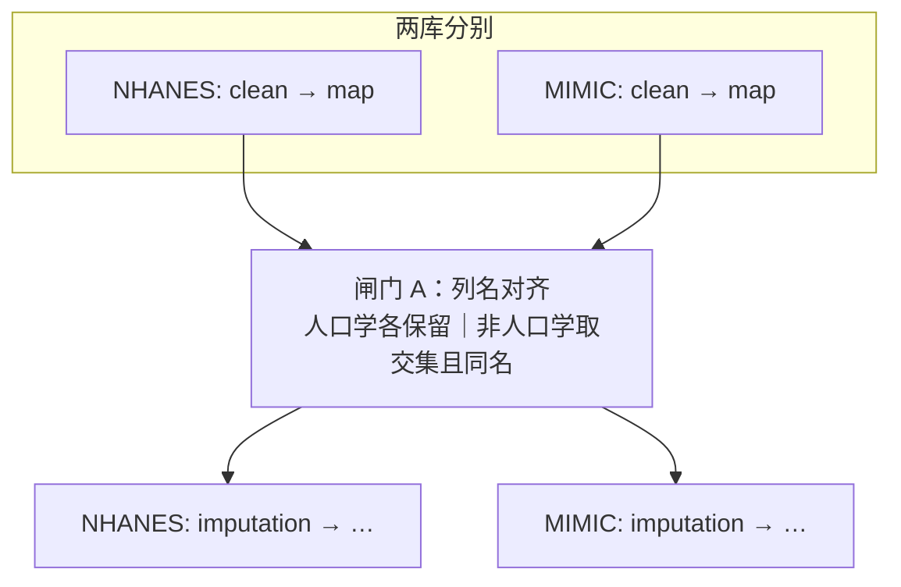
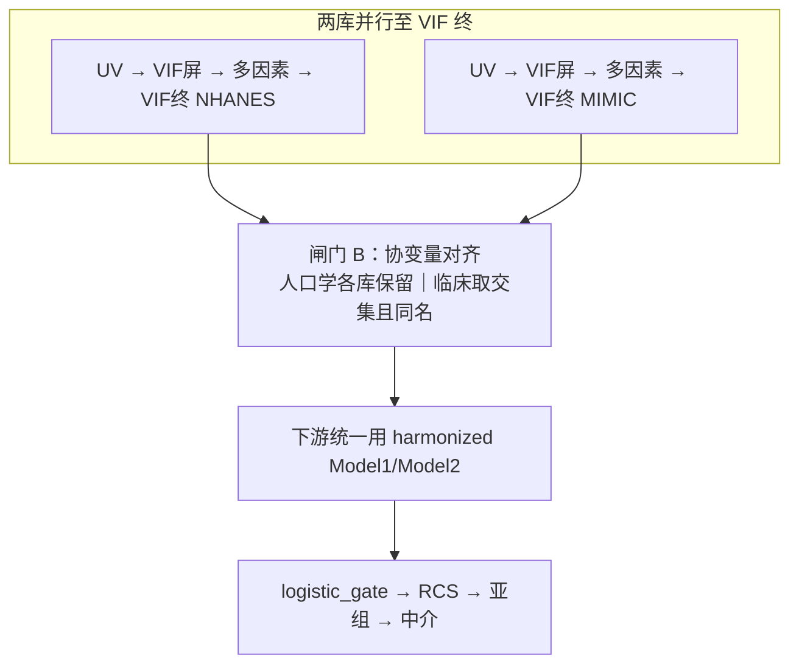
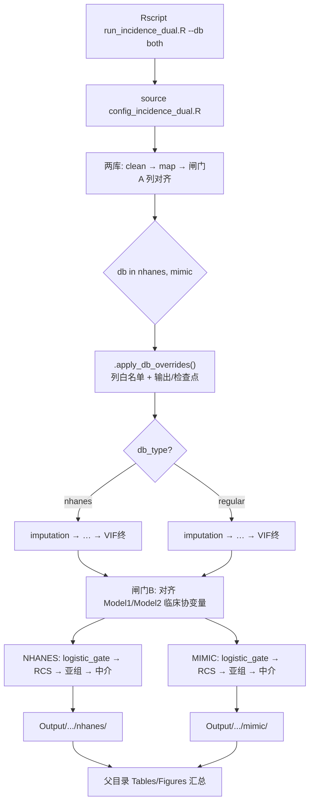
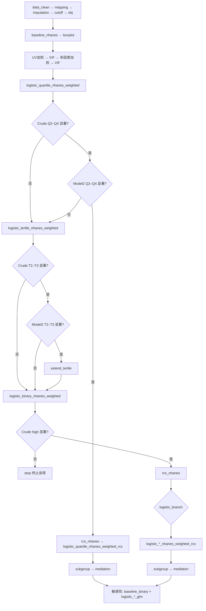

# D04 MCV × OA — 双库发病分析决策树（已定稿 v4）

- **归档名**: `05decision_tree_incidence_dual`
- **配置**: `configs/config_incidence_dual.R` + `run_incidence_dual.R`（**独立双库专用**；不 `source` 单库 config）
- **单库参考**（逻辑来源，运行时不引用）:
  - 普通库 → `03decision_tree_incidence_single.md` + `configs/config_incidence_single.R`
  - NHANES → `04decision_tree_onset_nhanes_single.md`（v4 加权 logistic_gate）+ `configs/config_incidence_nhanes.R`
- **双库实现**: `run_incidence_dual.R` 按库类型切换 `pipeline_nhanes` / `pipeline_regular`；对齐 `run_hf_dual_clustering.R` 的 `--db` 分库循环
- **输出根目录**: `Output/D04_MCV_OA_dual/`
- **检查点**: `checkpoints/D04_MCV_OA_dual/{nhanes|mimic}/`

---

## 1. 研究问题

| 项 | 设定 |
|----|------|
| 研究问题 | MCV 与骨关节炎（OA）发病的关联 |
| 人群 | OA 发病队列（双库各自独立分析） |
| 研究类型 | `incidence`（双库：分析**步骤一致**，block **按库类型切换**） |
| 核心暴露 | **MCV** = Hematocrit / RBC（插补后 `index` 块重算，两库公式一致） |
| 结局列 | `Disease_Group` |
| 病例组 | `OA` |
| 对照组 | `No_OA` |
| 双库 | `dual_db$enable = TRUE`（`--db nhanes\|mimic\|both`） |
| P 阈值 | 单因素筛选 **0.1**；多因素 / 闸门 / 显著标注 **0.05** |
| 列缺失 | `data_clean` 剔除缺失 **>30%**；插补前再剔除缺失 **>20%** |
| 库级镜像 | 各库 `mirror_pub_outputs_to_root = TRUE` |
| 汇总镜像 | `Output/D04_MCV_OA_dual/Tables` 与 `Figures` 汇总两库产出（文件名加库前缀） |
| **双库对齐** | 插补前对齐**列名**；第二次 VIF 后对齐**协变量**（人口学可各异，其余必须一致） |

### 1.1 数据入口

| 库 | 路径 | 对象名 | ID 列 | 库类型 | Pipeline |
|----|------|--------|-------|--------|----------|
| primary（NHANES） | `Data/nhanes/D04_dabiao_NHANES_2000.RData` | `dabiao_sample` | `SEQN` | `nhanes` | `pipeline_nhanes` |
| secondary（MIMIC） | `Data/mimic/D04_dabiao.RData` | `dabiao` | `subject_id` | `regular` | `pipeline_regular` |

**复合暴露 MCV**（`imputation` 之后、`index` 块）：

```
MCV = Hematocrit / RBC
```

- 闸门 A 要求两库共有组分列 `Hematocrit`、`RBC`（列缺失率均 **<20%**，不会被插补剔除）
- `config$index$only = c("MCV")`；两库插补后统一重算，不依赖单库原生 MCV 列

**调查权重**（仅 NHANES）：`WTMEC2YR` / `SDMVPSU` / `SDMVSTRA`

### 1.2 库类型路由

| 场景 | 行为 |
|------|------|
| NHANES + 普通库（本研究） | NHANES → `pipeline_nhanes`；MIMIC → `pipeline_regular` |
| 两库均为普通库 | **两库均** → `pipeline_regular` |
| 两库均为 NHANES | **两库均** → `pipeline_nhanes`（须各有权重列） |

---

## 2. 双库变量对齐（核心约束，v3 新增）

双库**不是**完全独立各跑各的：在两个闸门处强制对齐，保证除人口统计学外，分析变量集两库**名称与集合完全一致**。对齐后**仍分库执行**各自 pipeline（NHANES 加权 / MIMIC 普通），仅共享「可分析列」与「下游协变量」契约。

### 2.1 人口学 vs 非人口学（划分规则）

| 类别 | 判定 | 双库是否必须一致 | 示例 |
|------|------|------------------|------|
| **人口统计学** | `config$dual_db$harmonization$demo_keywords` 命中 | **否**（各库可保留本库人口学列） | `Age`, `Gender`, `Race`, `Education`, `PIR`, `Smoke`, `Marital_Status`, `Insurance` … |
| **非人口学** | 映射后分析列中，剔除 ID/结局/暴露/权重/人口学 | **是**（列名必须一模一样） | `Hematocrit`, `RBC`, `Hypertension`, `WBC`, 化验指标 … |

固定排除（不参与「非人口学交集」）：`ID`/`SEQN`/`subject_id`、`Disease_Group`、暴露 `MCV`（插补后生成）、NHANES 权重列（`WTMEC2YR` 等）、插补中间列。

闸门 A 校验暴露组分：`Hematocrit` + `RBC` 必须在两库非人口学交集中（`index_component_vars`）。

### 2.2 闸门 A — 插补前对齐列名（`column_mapping` 之后、`imputation` 之前）

**时机**：两库均完成 `data_clean` + `column_mapping` 后，**在进入 `imputation` 之前**。

**规则**：

1. 取两库映射后列名集合 `cols_nhanes`、`cols_mimic`。
2. 各自保留全部**人口学列**（本库有则用，无则缺）。
3. **非人口学列**取两库交集 `common_non_demo_cols`，且要求**字符串完全一致**（已通过 `column_mapping` 标准化）。
4. 每库进入插补的数据列 = `{本库人口学} ∪ common_non_demo_cols ∪ {结局, 暴露, 权重(仅NHANES), ID}`。
5. 仅在一库存在的非人口学列 → **丢弃**（或 `--db both` 首次对齐时 `warning` 列出）；不得进入后续分析。
6. 若 `common_non_demo_cols` 为空或暴露组分（`Hematocrit`/`RBC`）不在交集中 → `stop`。

**写入**（`run_incidence_dual.R` 在 `--db both` 或第二次单库跑前计算）：

| ctx / config 键 | 含义 |
|-----------------|------|
| `dual_db$harmonization$common_non_demo_cols` | 两库共享非人口学列（有序） |
| `dual_db$harmonization$demo_cols_nhanes` / `demo_cols_mimic` | 各库人口学列清单 |
| `ctx$results$dual_db_column_harmonized` | 闸门 A 已执行标记 |



### 2.3 闸门 B — 第二次 VIF 后对齐协变量（`multicollinearity_*_final` 之后）

**时机**：两库均完成**第二次 VIF** 块之后：

| 库 | 对应 block |
|----|------------|
| NHANES | `multicollinearity_nhanes_final` |
| MIMIC | `multicollinearity_final` |

**规则**：

1. 读取各库 `ctx$results$Model1Factors`、`Model2Factors`（VIF 终筛后）。
2. 拆分为 `demo_*` 与 `clinical_*`（非人口学协变量）。
3. **临床/非人口学协变量**取两库交集 `common_model_factors`，名称必须完全一致；顺序以 config 中 `common_non_demo_cols` 或字母序固定。
4. 各库最终用于下游的协变量：
   - `Model1Factors` = `{本库 Model1 中的人口学因子} ∪ common_model_factors`（去重，人口学在前或按 config 约定）
   - `Model2Factors` = `{本库 Model2 中的人口学因子} ∪ common_model_factors`（在 Model1 人口学基础上，临床部分与对库一致）
5. **自本步起至 pipeline 结束**（logistic_gate → RCS → 亚组 → 中介），两库**强制**使用对齐后的 `Model1Factors` / `Model2Factors`；禁止块内再按单库 VIF 结果扩缩临床协变量。
6. 若某库 Model2 临床部分与对库交集为空 → `stop` 并提示检查单因素/VIF 阈值。

**写入**：

| 键 | 含义 |
|----|------|
| `dual_db$harmonization$common_model_factors` | 两库共享临床协变量（有序） |
| `dual_db$harmonization$harmonized_model1_nhanes` / `harmonized_model1_mimic` | 对齐后 Model1（含本库人口学） |
| `dual_db$harmonization$harmonized_model2_nhanes` / `harmonized_model2_mimic` | 对齐后 Model2 |
| `ctx$results$Model1Factors` / `Model2Factors` | 各库 checkpoint 续跑前**覆盖**为 harmonized 版本 |



### 2.4 `run_incidence_dual.R` 执行顺序（含对齐）

| 步骤 | 条件 | 动作 |
|------|------|------|
| 1 | `--db both` | 先对两库跑到 `column_mapping`，执行**闸门 A**，写 harmonization 缓存 |
| 2 | 每库 | 从 `imputation` 起各跑各的 pipeline 至 VIF 终 |
| 3 | 两库 VIF 终检查点均存在 | 执行**闸门 B**，写 `harmonized_model1/2_*`，更新各库 checkpoint 内 `ctx$results` |
| 4 | 每库 | 从 VIF 终**之后**续跑（logistic → RCS → …），块内读 `Model1Factors`/`Model2Factors` 即为对齐后版本 |

单库试跑（`--db nhanes` only）：若 harmonization 缓存不存在，闸门 A/B **跳过**并 `warning`；正式分析须 `--db both` 至少跑完对齐段一次。

### 2.5 config 目标段（`dual_db$harmonization`）

```r
dual_db = list(
  enable = TRUE,
  harmonization = list(
    # 人口学关键词（列名匹配，大小写不敏感）
    demo_keywords = c(
      "Age", "Gender", "Sex", "Race", "ethnicity",
      "Education", "edu", "Income", "PIR", "poverty",
      "Smoking", "Smoke", "Marital", "Insurance", "Language"
    ),
  # 闸门 A 输出（run 脚本写入）
    common_non_demo_cols     = NULL,
    demo_cols_nhanes         = NULL,
    demo_cols_mimic          = NULL,
  # 闸门 B 输出（run 脚本写入）
    common_model_factors     = NULL,
    harmonized_model1_nhanes   = NULL,
    harmonized_model2_nhanes   = NULL,
    harmonized_model1_mimic    = NULL,
    harmonized_model2_mimic    = NULL,
    require_same_clinical_cols = TRUE,
    sync_after_vif_final       = TRUE   # multicollinearity_*_final 之后强制对齐
  )
)
```

---

## 3. 双库总览流程



**与单库决策树的对应关系**：

| 分析阶段（概念） | NHANES 库 block | MIMIC 库 block |
|------------------|-----------------|----------------|
| 数据准备 | clean → map → impute → **index(MCV)** → **cutoff → obj** | clean → map → impute → **index(MCV)** |
| Table 1 | `baseline_nhanes`（加权） | `baseline_binary` |
| 描述 / ROC | `boxplot` | `simple_ROC` + `boxplot` |
| 变量筛选 | `univariate_nhanes` → VIF → `multivariate_nhanes` → VIF → **闸门 B** | `univariate_incidence_binary` → VIF → `multivariate_incidence_binary` → VIF → **闸门 B** |
| 下游协变量 | **harmonized** `Model1Factors` / `Model2Factors` | 同左 |
| 主 Table 2 | 加权 `logistic_*_nhanes_weighted` + **logistic_gate** | 非加权 `logistic_*_glm` + **logistic_gate** |
| 敏感性 Table 1 / Logistic | 主分析后 `baseline_binary` + `logistic_*_glm`（非加权对照） | —（主分析即非加权） |
| RCS | `rcs_nhanes`（初筛闸门后） | `rcs_incidence`（初筛闸门后） |
| RCS 后 Logistic | `logistic_*_nhanes_weighted_rcs`（按 branch） | `logistic_*_glm_rcs`（按 branch） |
| 闸门引擎 | `R/logistic_gate.R`（`weighted=TRUE`，svyglm 列 6/12） | `R/logistic_gate.R`（glm 列 6/12） |
| 亚组 | `subgroup_nhanes_weighted` | `subgroup_incidence` |
| 中介 | `mediation_nhanes_weighted` | `mediation_incidence` |

---

## 4. NHANES 库 — `pipeline_nhanes`（对齐 `04decision_tree_onset_nhanes_single` v4）

> **核心变更（v2）**：NHANES 主分析 Logistic 由「仅 Crude cascade」升级为与 `03` 相同的 **logistic_gate**（Crude + Model2 扩展/降级 + 二分位 stop），模型保持 **svyglm 加权**；RCS 移至初筛闸门之后；RCS 后按 `logistic_branch` 复跑 `logistic_*_nhanes_weighted_rcs`。

> **双库约束（v3）**：`imputation` 输入列受闸门 A 约束；`multicollinearity_nhanes_final` 之后 `Model1Factors`/`Model2Factors` 由闸门 B 覆盖，再进入 logistic / RCS / 亚组 / 中介。

### 4.1 变量筛选四步链


### 4.2 闸门判定（加权 Table 2，列索引与 `03` 一致）

| 模型 | P 值列 | 判定 |
|------|--------|------|
| Crude Model | 第 6 列 | Q2–Q4 **全部** ≥ 0.05 → 四分位 Crude 不通过 |
| Model2 | 第 12 列 | Q2–Q4 **至少一个** < 0.05 → 四分位 Model2 通过（`extend_quartile`） |

三分位（T2、T3）、二分位（high）沿用同一列索引；随机搜索条件与 `03` 相同（加权 svyglm）。

### 4.3 完整流程图（加权 logistic_gate）



### 4.4 两条主路径（与 `03` 平行，模型为 svyglm）

| 路径 | 条件 | 流程 |
|------|------|------|
| **A** `extend_quartile` | 四分位 Crude + Model2 均显著 | 四分位加权初筛 → **跳过** tertile/binary → `rcs_nhanes` → `logistic_quartile_nhanes_weighted_rcs` → 亚组 → 中介 |
| **B** 降级 | Model2 四分位不显著 | 四分位 → 三分位 → 二分位（Crude high NS → **stop**）→ `rcs_nhanes` → 按 branch 跑对应 `logistic_*_nhanes_weighted_rcs` → 亚组 → 中介 |

### 4.5 `pipeline_nhanes$blocks`（声明顺序）

```
data_clean → column_mapping → imputation → cutoff → obj
→ baseline_nhanes → boxplot
→ univariate_nhanes → multicollinearity_nhanes_screen → multivariate_nhanes → multicollinearity_nhanes_final
→ logistic_quartile_nhanes_weighted → logistic_tertile_nhanes_weighted → logistic_binary_nhanes_weighted
→ rcs_nhanes
→ logistic_quartile_nhanes_weighted_rcs → logistic_tertile_nhanes_weighted_rcs → logistic_binary_nhanes_weighted_rcs
→ subgroup_nhanes_weighted → mediation_nhanes_weighted
→ baseline_binary → logistic_quartile_glm → logistic_tertile_glm → logistic_binary_glm
```

`pipeline_nhanes$logistic_gate = list(enable = TRUE, weighted = TRUE)`

### 4.6 NHANES 终止条件

| 阶段 | 条件 | 行为 |
|------|------|------|
| 四分位 Crude | Q2–Q4 全部 P ≥ 0.05 | 进入三分位（不终止） |
| 三分位 Crude | T2–T3 全部 P ≥ 0.05 | 进入二分位 |
| 二分位 Crude | high P ≥ 0.05 | **`stop` 终止该库**（双库下另一库可继续） |
| 四分位 Model2 | 至少一组 P < 0.05 | 路径 A：直接 RCS |

### 4.7 NHANES ctx$results 关键契约

| 键 | 写入 Block | 下游用途 |
|----|------------|----------|
| `logistic_branch` | `logistic_*_nhanes_weighted` 闸门 | 跳过块；RCS 后选分位加权 Logistic |
| `logistic_gate_detail` | 同上 | Crude / Model2 P 值审计 |
| `nhanes_logistic_selected_scheme` | 闸门（兼容） | quartile / tertile / binary |
| `Model1Factors` / `Model2Factors` | VIF 终 → **闸门 B 覆盖** → logistic | RCS、分段 Logistic、亚组、中介（临床部分两库一致） |
| `nhanes_design` | `obj` | 全部加权分析 |
| `nhanes_rcs_cutoffs_all` / `nhanes_rcs_cutoff_group_col` | `rcs_nhanes` | 分段 → `group_var` |
| `cutoff_value` | `rcs_nhanes` / `cutoff` | 亚组 high/low 二分 |

### 4.8 双库 NHANES vs MIMIC — Logistic 闸门对照

| 项 | NHANES（`pipeline_nhanes`） | MIMIC（`pipeline_regular`） |
|----|----------------------------|------------------------------|
| 闸门逻辑 | 与 `03` 相同 | 与 `03` 相同 |
| 初筛块 | `logistic_*_nhanes_weighted` | `logistic_*_glm` |
| RCS 块 | `rcs_nhanes` | `rcs_incidence` |
| RCS 复跑 | `logistic_*_nhanes_weighted_rcs` | `logistic_*_glm_rcs` |
| 模型 | **svyglm 加权** | glm 非加权 |
| 随机搜索 | `logistic_nhanes_weighted$random_search` | `logistic_*_glm$random_search` |
| 敏感性 | 主分析后非加权 `logistic_*_glm` | 无（主分析即非加权） |
| stop 范围 | 终止**当前库** | 终止**当前库** |

---

## 5. MIMIC 库 — `pipeline_regular`（对齐 `03decision_tree_incidence_single`，暴露改为 MCV）

### 5.1 闸门判定字段（与 `01block_logistic_quartile_glm.R` 对齐）

四分位 Table 2 中，非参照组行（Q2、Q3、Q4）的 P 值列：

| 模型 | P 值列 | 判定 |
|------|--------|------|
| Crude Model | 第 6 列 | Q2–Q4 **全部** ≥ 0.05 → 四分位 Crude 不通过 |
| Model2 | 第 12 列 | Q2–Q4 **至少一个** < 0.05 → 四分位 Model2 通过（扩展分支） |

三分位（T2、T3）、二分位（high）沿用同一列索引规则；参照组分别为 T1、low。

随机搜索命中条件：Crude / Model1 / Model2 的 **p for trend** 均 < 0.05，且 Model2 非参照组 **至少一组** P < 0.05。

### 5.2 完整流程图（含 logistic_gate）

```mermaid
flowchart TD
  PRE_M[data_clean → mapping → imputation → index(MCV)]
  PRE_M --> BL[baseline_binary]
  BL --> ROC_S[simple_ROC: MCV ROC + Youden cutoff]
  ROC_S --> BXP[boxplot: MCV 等 by Disease_Group]
  BXP --> UV[UV p&lt;0.1 → VIF屏 → 多因素 p&lt;0.05 → VIF终]
  UV --> Q4[logistic_quartile_glm 四分位 + 随机搜索]

  Q4 --> C1{Crude Q2–Q4 至少一组 P&lt;0.05?}
  C1 -->|否| T3[logistic_tertile_glm 三分位]
  C1 -->|是| M2Q{Model2 Q2–Q4 至少一组 P&lt;0.05?}

  M2Q -->|是| EXT_Q[extend_quartile — 跳过 tertile / binary 初筛]
  EXT_Q --> RCS1[rcs_incidence]
  RCS1 --> SEG1[按 rcs_cutoffs_all 分段 → MCV_RCS_Group]
  SEG1 --> LQ1[logistic_quartile_glm_rcs group_var=RCS 分组]
  LQ1 --> SUB1[subgroup_incidence]
  SUB1 --> MED1[mediation_incidence]

  M2Q -->|否| T3

  T3 --> C2{Crude T2–T3 至少一组 P&lt;0.05?}
  C2 -->|否| BIN[logistic_binary_glm 二分位]
  C2 -->|是| M2T{Model2 T2–T3 至少一组 P&lt;0.05?}
  M2T -->|是| EXT_T[extend_tertile — 继续降级至 binary 后统一 RCS]
  M2T -->|否| BIN
  EXT_T --> BIN

  BIN --> C3{Crude high P&lt;0.05?}
  C3 -->|否| STOP[stop 终止该库]
  C3 -->|是| M2B{Model2 high P&lt;0.05?}
  M2B -->|是| EXT_B[extend_binary]
  M2B -->|否| EXT_B

  EXT_B --> RCS2[rcs_incidence]
  RCS2 --> SEG2[按 rcs_cutoffs_all 分段]
  SEG2 --> BR{ctx$results$logistic_branch}
  BR -->|extend_quartile| LQ2[logistic_quartile_glm_rcs]
  BR -->|extend_tertile| LT2[logistic_tertile_glm_rcs]
  BR -->|extend_binary / degrade_binary| LB2[logistic_binary_glm_rcs]
  LQ2 --> SUB2[subgroup_incidence]
  LT2 --> SUB2
  LB2 --> SUB2
  SUB2 --> MED2[mediation_incidence]
```

### 5.3 两条主路径摘要

#### 路径 A — 四分位 Model2 显著（`extend_quartile`）

1. `logistic_quartile_glm`（标准四分位 + 随机搜索）
2. **跳过** `logistic_tertile_glm`、`logistic_binary_glm` 初筛
3. `rcs_incidence`（`Blocks/15_rcs/02block_rcs_incidence.R`）
4. `ctx$results$rcs_cutoffs_all` → 写入 `MCV_RCS_Group` 等，更新 `ctx$data$imputed`
5. `logistic_quartile_glm_rcs`（`group_var` = RCS 分组列，`include_continuous_row = FALSE`）
6. `subgroup_incidence` → `mediation_incidence`

#### 路径 B — 四分位 Model2 不显著（降级）

1. `logistic_quartile_glm`（标记 `degrade_tertile`）
2. `logistic_tertile_glm` — Crude 全 NS 则继续降级；Model2 显著则记 `extend_tertile`（仍继续 binary）
3. `logistic_binary_glm` — **Crude high 不显著 → `stop` 终止该库**；否则记 `extend_binary` / `extend_tertile`
4. `rcs_incidence` → 按 `logistic_branch` 跑对应 `logistic_*_glm_rcs`
5. `subgroup_incidence` → `mediation_incidence`

### 5.4 `pipeline_regular$blocks`（声明顺序）

```
data_clean → column_mapping → imputation
→ baseline_binary → simple_ROC → boxplot
→ univariate_incidence_binary → multicollinearity_screen → multivariate_incidence_binary → multicollinearity_final
→ logistic_quartile_glm → logistic_tertile_glm → logistic_binary_glm
→ rcs_incidence → logistic_quartile_glm_rcs → logistic_tertile_glm_rcs → logistic_binary_glm_rcs
→ subgroup_incidence → mediation_incidence
```

> **实现说明**：初筛与 RCS 分段复跑共用同一 block 函数，通过 `ctx$current_block` 后缀 `_rcs` 区分；`pipeline_regular$logistic_gate$enable = TRUE` 时由 `R/logistic_gate.R` 写 `ctx$results$logistic_branch` 并控制跳过。

### 5.5 MIMIC 终止条件

| 阶段 | 条件 | 行为 |
|------|------|------|
| 四分位 Crude | Q2–Q4 全部 P ≥ 0.05 | 进入三分位（**不**终止） |
| 三分位 Crude | T2–T3 全部 P ≥ 0.05 | 进入二分位 |
| 二分位 Crude | high 组 P ≥ 0.05 | **`stop` 终止该库**（另一库不受影响） |
| 四分位 Model2 | Q2–Q4 至少一组 P < 0.05 | 路径 A：直接 RCS → 四分位复跑 → 亚组 → 中介 |
| 四分位 Model2 | Q2–Q4 全部 P ≥ 0.05 | 路径 B：三分位 → 二分位 → RCS → 按 branch 复跑 |

### 5.6 MIMIC ctx$results 关键契约

| 键 | 写入 Block | 下游用途 |
|----|------------|----------|
| `logistic_branch` | `logistic_*_glm` 闸门 | runner 跳过块；RCS 后选对应分位 Logistic |
| `logistic_gate_detail` | 同上 | Crude / Model2 各组 P 值审计 |
| `roc_auc` / `roc_cutoff` 等 | `simple_ROC` | 报告；`cutoff_value` 供 subgroup |
| `cutoff_value` | `simple_ROC` / `rcs_incidence` | `subgroup_incidence` high/low 二分 |
| `Model1Factors` / `Model2Factors` | VIF 终 → **闸门 B 覆盖** → logistic | RCS、分段 Logistic、亚组、中介（临床部分两库一致） |
| `rcs_cutoffs_all` / `rcs_cutoff_group_col` | `rcs_incidence` | 暴露分段 → `logistic_*_glm$group_var` |

---

## 6. `config_incidence_dual.R` 结构（独立合并，不引用单库文件）

```r
config <- list(
  data = list(...),           # 默认 primary；run 脚本按库 override
  project = list(
    disease = "OA",
    analysis_group = "OA",
    reference_group = "No_OA",
    study_type = "incidence",
    output_dir = "Output/D04_MCV_OA_dual",   # 库级追加 /nhanes 或 /mimic
    mirror_pub_outputs_to_root = TRUE
  ),
  incidence = list(outcome_var = "Disease_Group", index_var = "MCV",
                   index_component_vars = c("Hematocrit", "RBC")),
  logistic  = list(index_var = "MCV"),
  index     = list(enable = TRUE, only = c("MCV")),
  nhanes    = list(...),      # 仅 NHANES 库使用
  dual_db = list(
    enable = TRUE,
    mirror_aggregate = TRUE,  # 父目录汇总 Tables/Figures
    primary = list(
      name = "NHANES", db_type = "nhanes",
      rawdata_path = "Data/nhanes/D04_dabiao_NHANES_2000.RData",
      rawdata_obj = "dabiao_sample", id_column = "SEQN",
      column_mapping_type = "NHANES"
    ),
    secondary = list(
      name = "MIMIC", db_type = "regular",
      rawdata_path = "Data/mimic/D04_dabiao.RData",
      rawdata_obj = "dabiao", id_column = "subject_id",
      column_mapping_type = "MIMIC",
      column_mapping_type = "MIMIC"
    ),
    harmonization = list(
      demo_keywords = c("Age", "Gender", "Sex", "Race", "Education", "PIR",
                        "Smoke", "Marital", "Insurance", "Language"),
      common_non_demo_cols = NULL,
      common_model_factors = NULL,
      require_same_clinical_cols = TRUE,
      sync_after_vif_final = TRUE
    )
  ),
  # --- NHANES 块参数（index=MCV）---
  baseline_nhanes, cutoff, obj, univariate_nhanes, multivariate_nhanes,
  multicollinearity, logistic_nhanes_weighted,
  logistic_quartile/tertile/binary_nhanes_weighted,  # gate_enable / phase / extend_branch
  rcs_nhanes,
  subgroup, mediation_nhanes_weighted,
  # --- 普通库块参数（index=MCV，outcome=Disease_Group）---
  baseline_binary, roc_simple, univariate_incidence_binary,
  multivariate_incidence_binary, logistic_quartile/tertile/binary_glm,
  rcs_incidence, subgroup_incidence, mediation_incidence
)

pipeline_nhanes <- list(
  name = "incidence_d04_bmi_oa_nhanes_dual",
  blocks = c(...),   # 见 §3.5
  logistic_gate = list(enable = TRUE, weighted = TRUE)
)
pipeline_regular <- list(
  name = "incidence_d04_bmi_oa_regular_dual",
  blocks = c(...),   # 见 §4.4
  logistic_gate = list(enable = TRUE)
)
```

**首次试跑**：各块 `pause_on_min_sig_vars = FALSE` / 关键 `pause_enable = FALSE`。

---

## 7. 双库运行与镜像

### 7.1 CLI

```bash
# 全流程（两库 + 父目录汇总）
Rscript run_incidence_dual.R --db both

# 单库
Rscript run_incidence_dual.R --db nhanes
Rscript run_incidence_dual.R --db mimic

# 阶段性
Rscript run_incidence_dual.R --db nhanes --to imputation
Rscript run_incidence_dual.R --db mimic --to logistic_quartile_glm
Rscript run_incidence_dual.R --db mimic --from multicollinearity_final
Rscript run_incidence_dual.R --db nhanes --only boxplot,rcs_nhanes
```

`--from <block>` 表示从该 block **之后**继续。

### 7.2 输出目录结构

```
Output/D04_MCV_OA_dual/
├── Tables/                          # 汇总级（both 跑完后）
│   ├── nhanes_Table1.xlsx
│   ├── mimic_Table1.xlsx
│   └── ...
├── Figures/                         # 汇总级
│   ├── nhanes_rcs_MCV.pdf
│   ├── mimic_rcs_MCV.pdf
│   └── ...
├── nhanes/
│   ├── step01_data_clean/ ...
│   ├── Tables/                      # 库级镜像
│   └── Figures/
└── mimic/
    ├── step01_data_clean/ ...
    ├── Tables/
    └── Figures/
```

### 7.3 检查点

```
checkpoints/D04_MCV_OA_dual/
├── nhanes/    # stepNN_<block>.rds
└── mimic/
```

---

## 8. 主要产出对照

### 8.1 NHANES 库

| Block | 产出 |
|-------|------|
| `imputation` | Table S1（插补前后） |
| `cutoff` | MCV 分位 / ROC cutoff 图 |
| `baseline_nhanes` | 加权 Table 1 + 正态性 Table S |
| `boxplot` | MCV 箱线图 by `Disease_Group` |
| `univariate_nhanes` | 加权单因素 Table S2a |
| `multivariate_nhanes` | 加权多因素 Table 2 |
| `logistic_*_nhanes_weighted` | 加权 Table 2 分位（logistic_gate 初筛） |
| `rcs_nhanes` | 加权 RCS 图 + cutoff CSV |
| `logistic_*_nhanes_weighted_rcs` | RCS 分段驱动加权 Table 2 |
| `baseline_binary` + `logistic_*_glm` | 主分析后敏感性非加权对照 |
| `subgroup_nhanes_weighted` | 加权亚组森林图 |
| `mediation_nhanes_weighted` | 中介表 + 路径图 |

### 8.2 MIMIC 库

| Block | 产出 |
|-------|------|
| `imputation` | Table S1 |
| `baseline_binary` | Table 1 |
| `simple_ROC` | MCV ROC 曲线 + Summary（AUC, Youden cutoff） |
| `boxplot` | 连续变量箱线图 by `Disease_Group` |
| `logistic_quartile/tertile/binary_glm` | Table 2 分位（初筛 + 闸门路径） |
| `rcs_incidence` | Fig 2 RCS 三联图；`cutoff_MCV.csv`；`rcs_cutoff_groups_MCV.csv` |
| `logistic_*_glm_rcs` | RCS 分段复跑 Table 2 |
| `subgroup_incidence` | 亚组 Table + 森林图 |
| `mediation_incidence` | 中介效应表 + 路径图 |

---

## 9. 与单库决策树的差异

| 项 | 单库 `03` / `04` | 本双库 v3 |
|----|------------------|-----------|
| 配置文件 | 各自独立 `config_incidence_*.R` | **独立** `config_incidence_dual.R`（合并参数，不 source 单库） |
| 运行入口 | `run_incidence_single.R` / `run_incidence_nhanes.R` | **仅双库** `run_incidence_dual.R` |
| Pipeline | 单套 blocks | **`pipeline_nhanes` + `pipeline_regular`**，run 按 `db_type` 切换 |
| 暴露指标 | `03` 为 MCMI/CLR 示例 | 双库统一 **MCV**（`Hematocrit/RBC`，插补后 `index` 重算） |
| 结局 | `03` 为 `Disease` 示例 | 双库统一 **`Disease_Group`**（OA / No_OA） |
| 数据路径 | 各自单库路径 | `Data/nhanes/...` + `Data/mimic/...` |
| 镜像 | 库级 `Tables/Figures` | 库级 + **父目录汇总**（`nhanes_` / `mimic_` 前缀） |
| Logistic 闸门 | `03` glm gate；`04` v4 加权 gate | 两库**同一套 gate 逻辑**；NHANES=svyglm，MIMIC=glm |
| 项目终止 | 单库 stop 终止项目 | **仅终止当前库**；另一库可继续 |
| 两普通库 | — | 两库均走 `pipeline_regular` |
| 列/协变量对齐 | 无 | **闸门 A**（插补前列交集）+ **闸门 B**（VIF 后 Model 对齐） |

---

## 10. 实现清单（config / run 交付时核对）

| # | 项 | 状态 |
|---|-----|------|
| 1 | `configs/config_incidence_dual.R` | 待建 |
| 2 | `run_incidence_dual.R`（`--db` + 闸门 A/B + index(MCV) + 汇总镜像） | 已建 |
| 3 | `R/dual_db_harmonize.R`（或 `run_incidence_dual.R` 内） | `harmonize_columns_pre_imputation()` + `harmonize_covariates_post_vif()` |
| 4 | `R/utils.R`：`mirror_dual_db_aggregate()` 父目录汇总 | 待建（可选小函数） |
| 5 | `R/logistic_gate.R` | 支持 `weighted=TRUE` + `*_nhanes_weighted` 块名 |
| 6 | `R/pipeline_runner.R` | 注册 `logistic_*_nhanes_weighted_rcs` 路由 |
| 7 | logistic / RCS / 亚组 / 中介块 | 双库模式下读 `harmonized_model1/2`，禁止单库擅自改临床协变量 |
| 8 | `config_incidence_dual.R` | `dual_db$harmonization` + 闸门 A/B 缓存路径 |
| 9 | 不修改单库 config 的运行入口逻辑 | 双库独立 `run_incidence_dual.R` |

---

## 11. 待定项

| 项 | 说明 |
|----|------|
| `demo_keywords` 终稿 | 以两库映射后列名实测为准，写入 `dual_db$harmonization` |
| 仅单库试跑 | 无 harmonization 缓存时闸门 A/B 跳过并 warning |
| MIMIC Height/Weight | 映射后列名实测；缺列则 stop |
| 临床协变量交集过小 | 闸门 B 若 `common_model_factors` 为空则 stop，需放宽单因素/VIF 或扩充共有列 |
