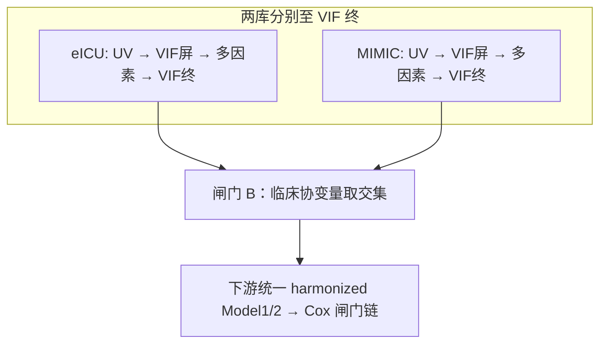
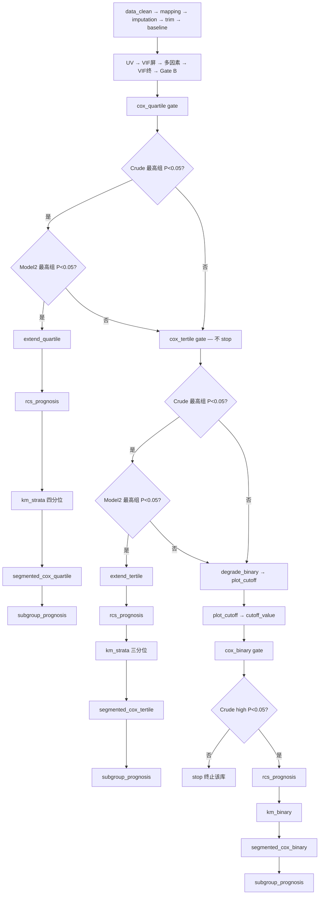

# 消化道出血 预后双库批量分析决策树（已定稿 v2）

- **归档名**: `06decision_tree_survival_dual_batch`
- **配置**: `configs/config_survival_dual_batch.R`（或产出目录 `Data/config_survival_dual_batch.R`）
- **运行**: `run/survival/run_survival_dual_batch.R`
- **单库参考**: `01decision_tree_survival.md` + `configs/config_survival_sae.R`
- **双库参考**: `05decision_tree_incidence_dual.md` + `config_incidence_dual_batch.R`
- **引擎**: `R/survival_dual_batch_runner.R` + `R/incidence_dual_batch_runner.R`（共享层/派发/飞书）

---

## 1. 研究问题

| 项 | 设定 |
|----|------|
| 文献参考 | Xu et al. 2024, *Cardiovasc Diabetol* 23:212, PMID **38902748**（CMI 与死亡，系统炎症中介） |
| 疾病编码 | **06** — Gastrointestinal_Bleeding |
| 研究类型 | `prognosis` |
| 暴露 | 复合指标批量（`index_group = dual_safe` → `composite_index_vars.R`） |
| 结局 | `fustatus`（1=死亡） |
| 时间 | `futime` |
| 数据 | `Data/eicu/D04_rt_CleanData.RData` → `rt`；`Data/mimic/D04_rt_CleanData.RData` → `rt` |
| ID | `subject_id` |
| 双库 | `dual_db$enable = TRUE`（primary=eICU，secondary=MIMIC，`db_type=regular`） |
| 并行 | 共享层 1 次 → 指标层 N 路 worker（`--workers auto`） |
| 飞书 | `feishu$push_on_worker_finish` + `push_on_batch_summary` |
| Cox 闸门 | `pipeline$cox_gate$enable = TRUE`（方案 B） |
| P 阈值 | 单因素筛选 **0.1**；多因素 / Cox 闸门 **0.05** |
| 列缺失 | 共享层不删列（`gate_a_missing_threshold=1.0`）；per-index 插补前协变量 **>40%** 删列 |

### 1.1 与发病 batch 的概念对照

| 发病（incidence batch） | 预后（survival batch） |
|-------------------------|------------------------|
| `logistic_gate` | `cox_gate` |
| `logistic_quartile/tertile/binary_glm` | `cox_quartile/tertile/binary` |
| `rcs_incidence` / `rcs_nhanes` | `rcs_prognosis` |
| `logistic_*_glm_rcs`（RCS 截点后再跑 Logistic） | `segmented_cox_quartile/tertile/binary`（RCS/初筛截点后再跑 Cox） |
| `subgroup_incidence` | `subgroup_prognosis` |
| `mediation_incidence` | 暂不纳入 batch |
| `sensitivity_suite` | `survival_batch$sensitivity_suite`（同场景，重跑预后 worker） |
| `subgroup_fallback` | `survival_batch$subgroup_fallback`（失败指标亚组补救） |

---

## 2. 双库变量对齐（闸门 A / B）

与发病双库 v3 相同：插补前对齐**列名**，VIF 终后对齐**临床协变量**；人口学各库可保留差异。

### 2.1 闸门 A — 插补前列名交集（`column_mapping` 之后、`imputation` 之前）

| 类别 | 双库是否必须一致 | 示例 |
|------|------------------|------|
| 人口统计学 | **否** | Age, Gender, Race, Smoking … |
| 非人口学临床列 | **是**（列名字符串完全一致） | 化验、合并症 … |
| 固定排除 | — | ID, `futime`, `fustatus`, 暴露指标列, 权重列 |

写入：`dual_db$harmonization$common_non_demo_cols`、`column_keep_*`、`demo_cols_*`

### 2.2 闸门 B — VIF 终后协变量对齐（`multicollinearity_final` 之后）

1. 读取各库 `Model1Factors` / `Model2Factors`
2. 临床协变量取两库交集 `common_model_factors`
3. 各库 `Model1/2` = 本库人口学 ∪ `common_model_factors`
4. 下游 Cox / RCS / segmented_cox / 亚组强制使用对齐后因子



---

## 3. 三层批量架构

```
层 A 共享层（每库 1 次）
  Gate A（列名交集，gate_a_missing_threshold=1.0）
  → data_clean(threshold=1.0) → column_mapping → dual_db_column_harmonize → index
  ↓ checkpoint: mapped + computed_index_names（行级 NA 保留，不插补）

层 B 指标层（并行 N 路 Worker，每指标独立子进程）
  ① 复制 shared ck → 删除其他指标列
  ② 过滤当前指标 NA 行（p_trim 极值在 imputation 后由 trim_index_extreme 完成）
  ③ imputation → trim_index_extreme
  ④ baseline → UV → VIF屏 → 多因素 → VIF终
  ⑤ Gate B（both 时双库协变量对齐）
  ⑥ Cox 初筛闸门链（四分位→三分位→plot_cutoff→二分）
  ⑦ rcs_prognosis（写 cutoff_value / rcs_cutoff）
  ⑧ 按 cox_branch 跑 KM + segmented_cox（RCS 截点后再跑 Cox）
  ⑨ subgroup_prognosis
  ⑩ _batch_status.json → 飞书 → 文件夹【成功】/【失败】

层 C 汇总层
  Batch_summary_all_indices.csv + 飞书 Sheet1 汇总行

层 D 事后层（主批量完成后，仅 success / failed 指标）
  D1 sensitivity_suite：按场景过滤队列，重跑完整预后 worker → by_index/<ix>/sensitivity/<场景>/
  D2 subgroup_fallback：failed 指标按亚组剔除人群，重跑完整 worker → by_index/<ix>/<亚组>/
```

### 3.1 指标筛查（共享层结束后）

```
候选池（dual_safe / 显式 index_vars）
  → Gate A 列交集
  → 共享 index 在 mapped 上计算
  → 双库交集 ∩ 每库 n_valid >= min_valid_per_db（默认 50）
  → 派发 worker
```

`db_mode=both` 时严格取**交集**；worker 内若单库不可用自动降级 `eicu_only` / `mimic_only`。

---

## 4. Worker 三阶段（双库 both）

| 阶段 | 范围 | 说明 |
|------|------|------|
| Phase 1 | `index` → `multicollinearity_final` | 各库独立跑到 VIF 终 |
| Gate B | 双库同步 | `dual_db_force_gate_b_sync` |
| Phase 2 | `multicollinearity_final` → `cox_binary` | Cox 初筛闸门链（`cox_gate` 控制跳过） |
| Phase 3 | 最后落盘 cox ck → pipeline 末尾 | RCS → KM → segmented_cox → 亚组 |

---

## 5. 单库完整分析流程（eICU / MIMIC 相同 blocks）

### 5.1 变量筛选四步链


### 5.2 Cox 初筛闸门链（不显著即停）

判定规则（与单库 `01decision_tree_survival` 一致）：

| 阶段 | Crude 最高组 | Model2 最高组 | 行为 |
|------|-------------|--------------|------|
| 四分位 | P ≥ 0.05 | — | **不 stop**，降级 `degrade_tertile` → 三分位 |
| 四分位 | P < 0.05 | P < 0.05 | 降级 `degrade_tertile` |
| 四分位 | P < 0.05 | P ≥ 0.05 | **`extend_quartile`**，跳过三分位/二分初筛 |
| 三分位 | P ≥ 0.05 | — | 降级 `degrade_binary` |
| 三分位 | P < 0.05 | P ≥ 0.05 | **`extend_tertile`** |
| 二分位 | P ≥ 0.05 | — | **`stop` 终止该库**（该指标 worker 失败） |
| 二分位 | P < 0.05 | — | 记 `extend_binary` / `degrade_binary`，进入 RCS 路径 |

> 注：四分位/三分位 Crude 不显著时**继续降级**；**仅二分位 Crude 不显著时 hard stop**（与发病 logistic_gate 一致）。



### 5.3 RCS 截点后再跑 Cox（对应发病 `logistic_*_rcs`）

| 发病块 | 预后块 | 触发分支 | 截点来源 | 产出 |
|--------|--------|----------|----------|------|
| `rcs_incidence` | `rcs_prognosis` | 初筛闸门通过后 | Model2 曲线 HR=1 / 峰值规则 | Fig 2 RCS 三联图；`cutoff_value`；`cutoff_<ix>.csv` |
| `logistic_quartile_glm_rcs` | `segmented_cox_quartile` | `extend_quartile` | `ctx$results$cox_index_breaks`（四分位断点）+ RCS 图 | Table S4 分段 Cox（4 外层段） |
| `logistic_tertile_glm_rcs` | `segmented_cox_tertile` | `extend_tertile` | 三分位断点 + RCS | Table S4 分段 Cox（3 外层段） |
| `logistic_binary_glm_rcs` | `segmented_cox_binary` | `extend_binary` / `degrade_binary` | `cutoff_value`（RCS 或 `plot_cutoff`） | Table S4 分段 Cox（2 外层段） |

**runner 跳过规则**（`pipeline_cox_gate_should_skip`）：

| `cox_branch` | 跳过的块 |
|--------------|----------|
| `extend_quartile` | `cox_tertile`, `plot_cutoff`, `cox_binary`, `segmented_cox_tertile`, `km_binary`, `segmented_cox_binary` |
| `extend_tertile` | `cox_tertile`(重复), `plot_cutoff`, `cox_binary`, `segmented_cox_quartile`, `km_binary`, `segmented_cox_binary` |
| `degrade_binary` | `rcs` 前已跑完的扩展 KM/segmented_quartile/tertile 等（见 `cox_gate.R`） |
| `extend_binary` | `cox_tertile`, `rcs` 前部分 KM 块（见 `cox_gate.R`） |

### 5.4 两条主路径摘要

#### 路径 A — 四分位 Model2 显著（`extend_quartile`）

1. `cox_quartile`（初筛 + 协变量搜索）
2. **跳过** `cox_tertile`、`plot_cutoff`、`cox_binary`
3. `rcs_prognosis` → 写 `cutoff_value` / `rcs_cutoff`
4. `km_strata`（`{ix}_quartile`）
5. `segmented_cox_quartile`（按 RCS/四分位截点再跑 Cox）
6. `subgroup_prognosis`

#### 路径 B — 降级至二分（`degrade_binary` / `extend_binary`）

1. `cox_quartile` → `cox_tertile` → `plot_cutoff` → `cox_binary`
2. 二分位 Crude 不显著 → **`stop`**
3. `rcs_prognosis` → `km_binary` → `segmented_cox_binary`（按 RCS `cutoff_value` 再跑 Cox）
4. `subgroup_prognosis`

### 5.5 `pipeline_regular_batch$blocks`（完整声明顺序）

```
data_clean → column_mapping → dual_db_column_harmonize → index
→ imputation → trim_index_extreme
→ baseline_binary
→ univariate_prognosis → multicollinearity_screen
→ multivariate_prognosis → multivariate_covariate_resolve → multicollinearity_final
→ dual_db_covariate_harmonize
→ cox_quartile → cox_tertile → plot_cutoff → cox_binary
→ rcs_prognosis
→ km_strata → segmented_cox_quartile → segmented_cox_tertile
→ km_binary → segmented_cox_binary
→ subgroup_prognosis
```

`pipeline_regular_batch$cox_gate = list(enable = TRUE)`

**共享层 blocks**：`data_clean`, `column_mapping`, `dual_db_column_harmonize`, `index`

### 5.6 终止条件汇总

| 阶段 | 条件 | 行为 |
|------|------|------|
| 四分位 Crude | 最高组 P ≥ 0.05 | 进入三分位（**不终止**） |
| 三分位 Crude | 最高组 P ≥ 0.05 | 进入 `degrade_binary` 路径 |
| 二分位 Crude | high 组 P ≥ 0.05 | **`stop` 终止该库** |
| 四分位 Model2 | 最高组 P < 0.05 | 路径 A：`extend_quartile` → RCS → segmented_cox_quartile |
| Cox 协变量搜索失败 | `on_search_fail=degrade/stop` | 按 config 降级或终止 |
| 双库 batch | 单库 stop | **另一库可继续**；worker 状态由两库综合判定 |

### 5.7 ctx$results 关键契约

| 键 | 写入 Block | 下游用途 |
|----|------------|----------|
| `cox_branch` | `cox_*` 闸门 | runner 跳过块；选 KM / segmented_cox 分支 |
| `cox_gate_detail` | 同上 | Crude / Model2 P 值审计 |
| `cox_index_breaks` | `cox_quartile/tertile` | `segmented_cox_*` 外层断点 |
| `cox_highest_group_model2_hr` | `cox_*` | segmented_cox HR 方向 anchor |
| `cutoff_value` / `rcs_cutoff` | `rcs_prognosis` / `plot_cutoff` | `km_binary`、`segmented_cox_binary`、亚组二分 |
| `Model1Factors` / `Model2Factors` | VIF 终 → **闸门 B 覆盖** | Cox / RCS / segmented / 亚组 |
| `segmented_cox_quartile/tertile/binary` | 对应 segmented 块 | 报告 Table S4 |

---

## 6. 敏感性分析（`survival_batch$sensitivity_suite`）

与发病 batch **同机制**（`R/incidence_sensitivity_suite.R` 模式，预后 worker 重跑）：

| 项 | 设定 |
|----|------|
| 触发 | 主批量完成后，对 **status=success** 的指标自动执行；或 `--sensitivity-only` |
| 机制 | 生成临时 config，注入 `.subgroup_fallback_expr`（队列过滤），调 `run_survival_dual_batch_worker.R` |
| 默认场景 | 与发病 template 一致（可配置） |

```r
sensitivity_suite = list(
  enable       = TRUE,
  age_cutoff   = 65L,
  min_n_per_db = 50L,
  scenarios = list(
    list(label = "SA_no_hypertension", expr = 'is.na(Hypertension) | Hypertension != "Yes"'),
    list(label = "SA_no_diabetes",     expr = 'is.na(T2DM) | T2DM != "Yes"'),
    list(label = "SA_age_ge_{age_cutoff}", expr = "Age >= {age_cutoff}"),
    list(label = "SA_age_lt_{age_cutoff}", expr = "Age < {age_cutoff}")
  )
)
```

产出：`by_index/<ix>【成功】/sensitivity/<场景>/{eICU,MIMIC}/`

CLI：

```bash
Rscript run/survival/run_survival_dual_batch.R --sensitivity-only
Rscript run/survival/run_survival_dual_batch.R --sensitivity-only --only-index RAR
```

---

## 7. 失败指标亚组补救（`survival_batch$subgroup_fallback`）

与发病 batch **同机制**（`R/incidence_subgroup_fallback.R`）：

| 项 | 设定 |
|----|------|
| 触发 | 主批量完成后，对 **status=failed/error** 的指标；或 `--subgroup-fallback-only` |
| 机制 | 按 `subgroups` 列表剔除/筛选人群，在 per-index ck 上过滤后**重跑完整预后流程** |
| `try_all` | TRUE=所有亚组都试；FALSE=首个成功即停 |

```r
subgroup_fallback = list(
  enable = TRUE, try_all = TRUE, min_n_per_subgroup = 30L,
  age_cutoff = 65L, age_mid_lower = 45L, obesity_standard = "chinese",
  subgroups = list(
    list(label = "Age_{age_cutoff}", expr = "Age >= {age_cutoff}"),
    list(label = "Hypertension", expr = 'Hypertension == "Yes"'),
    list(label = "Diabetes", expr = 'Diabetes == "Yes"'),
    ...
  )
)
```

---

## 8. 飞书结果管理

| 时机 | 函数 | 表 |
|------|------|-----|
| 每指标 worker 完成 | `incidence_batch_feishu_push_result` | 成功表 / 失败表 |
| batch 汇总结束 | `incidence_batch_feishu_update_summary` | Sheet1 项目汇总 |
| 补推历史 | `run/feishu/run_feishu_sync_batch.R` | — |

字段：`nhanes_branch`/`mimic_branch` 存 `cox_branch`；`nhanes_or`/`mimic_or` 存最高组 Model2 HR。

---

## 9. CLI 与产出目录

```bash
R="/mnt/c/Program Files/R/R-4.5.1/bin/x64/Rscript.exe"

# 共享层
"$R" run/survival/run_survival_dual_batch.R --shared-only --config "<path>/config_survival_dual_batch.R"

# 全量并行
"$R" run/survival/run_survival_dual_batch.R --workers auto --config "<path>/config_survival_dual_batch.R"

# 敏感性（主分析 success 后）
"$R" run/survival/run_survival_dual_batch.R --sensitivity-only --config "<path>/config_survival_dual_batch.R"

# 失败亚组补救
"$R" run/survival/run_survival_dual_batch.R --subgroup-fallback-only --config "<path>/config_survival_dual_batch.R"

# 单 worker 调试
"$R" run/survival/run_survival_dual_batch_worker.R --index RAR --db both --ptrim 0.01
```

```
G:/02block_result/06_Gastrointestinal_Bleeding/prognosis_38902748/
├── Data/config_survival_dual_batch.R
├── checkpoints/_shared/{eICU,MIMIC}/index.rds
├── checkpoints/by_index/<ix>/{eICU,MIMIC}/
├── by_index/<ix>【成功】/
│   └── sensitivity/SA_no_hypertension/…
├── by_index/【failed_subgr_<label>_succ】<ix>/   # 亚组补救成功时
├── logs/<ix>.log
└── Tables/Batch_summary_all_indices.csv
```

---

## 10. 与发病 batch 差异一览

| 项 | 发病 dual batch | 预后 dual batch |
|----|----------------|-----------------|
| 闸门引擎 | `logistic_gate` | `cox_gate` |
| 初筛主表 | `logistic_*_glm` | `cox_*` |
| RCS 后复跑 | `logistic_*_glm_rcs` | `segmented_cox_*` |
| 加权库 | 可有 NHANES pipeline | 本研究两库均为 regular |
| ROC / boxplot | MIMIC 有 | 预后 batch 默认**不纳入** |
| 中介 | `mediation_incidence` | 暂不纳入 |
| 敏感性 | `sensitivity_suite` | 同场景，重跑预后 worker |
| 失败补救 | `subgroup_fallback` | 同机制 |
