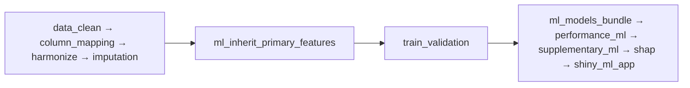

# ML 双库批量分析决策树

- **归档名**: `07decision_tree_ml_dual_batch`
- **单库配置**: `configs/config_ml_dual.R`
- **批量配置**: `configs/config_ml_dual_batch.R`（或产出目录内 `config_ml_dual_batch.R`）
- **运行**:
  - 单研究: `run/ml/run_ml_dual.R --db both`
  - 批量: `run/ml/run_ml_dual_batch.R --workers auto`
- **参考**: `05decision_tree_incidence_dual.md` + `06decision_tree_survival_dual_batch.md`
- **引擎**: `R/ml_dual_batch_runner.R` + `R/incidence_dual_batch_runner.R`（共享层/派发/飞书）
- **专用 Blocks**: `Blocks/24_ml_dual/`

---

## 1. 研究问题

| 项 | 设定 |
|----|------|
| 疾病示例 | Psoriasis（旋旋项目） |
| 研究类型 | `prediction` / ML |
| 暴露 | `ALBI`, `RAR`, `SII`（可单指标或批量多指标） |
| 结局 | `Disease`（二分类） |
| 主库 | NHANES（加权，`db_type=nhanes`） |
| 验证库 | MIMIC（普通库，**仅 ML 下游**） |
| 双库模式 | `dual_db$workflow = primary_full_secondary_ml` |
| 并行 | 共享层 1 次 → 指标层 N 路 worker（`--workers auto`） |
| 飞书 | `feishu$push_on_worker_finish` + `push_on_batch_summary` |
| 产出根目录 | `//192.168.68.133/02block_result/{疾病编码}_{疾病}/ml_dual_{PMID}/` |

### 1.1 与发病 batch 的概念对照

| 发病 batch | ML dual batch |
|------------|---------------|
| logistic 闸门链 | **无**（ML 不做 OR 初筛） |
| `multicollinearity_nhanes_final` 后 Gate B + logistic | 主库 VIF 终后直接 `ml_feature_selection_bundle` |
| 两库均跑完整发病流程 | **主库全流程 + 验证库仅 ML** |
| `logistic_gate` | `logistic_gate$enable = FALSE` |
| OR 写入飞书 | **AUC**（`nhanes_auc` / `mimic_auc`） |

---

## 2. 主库 NHANES 变量筛选（参考发病双库）


**不再使用**旧版一体块 `univariate_multivariate` → `multicollinearity`。

---

## 3. 验证库 MIMIC（secondary ML only）



主库 `ml_feature_selection_bundle` 完成后，特征 RDS 写入：

`checkpoints/.../harmonization/feature_selection_final_primary.rds`

验证库 `ml_inherit_primary_features` 读取并注入 `feature_selection_final`。

---

## 4. 三层批量架构

```
层 A 共享层（每库 1 次）
  Gate A → data_clean → column_mapping → dual_db_column_harmonize → index
  ↓ checkpoint: mapped（行级 NA 保留）

层 B 指标层（并行 N 路 Worker）
  ① 复制 shared ck → 删其他指标列
  ② 过滤当前指标 NA 行 + trim_index_extreme
  ③ NHANES: imputation → … → VIF 终 → ml_feature_selection_bundle → ML 全流程
  ④ MIMIC:  imputation → ml_inherit → ML 全流程
  ⑤ _batch_status.json → 飞书 → 文件夹【成功】/【失败】

层 C 汇总层
  Batch_summary + 飞书汇总行
```

### 4.1 产出目录结构

```
//192.168.68.133/02block_result/
  {疾病编码}_{疾病}/
    ml_dual_{PMID}/
      Data/
        nhanes/D04_dabiao.RData
        mimic/D04_dabiao.RData
      checkpoints/
        _shared/{NHANES|MIMIC}/
        by_index/{ALBI|RAR|SII}/{NHANES|MIMIC}/
        _global_harmonization/
      by_index/
        ALBI/
          NHANES/   ← 主库输出
          MIMIC/    ← 验证库输出
          _batch_status.json
      logs/
      config_ml_dual_batch.R
```

---

## 5. Worker 两阶段（db_mode=both）

| 阶段 | 库 | 范围 | 说明 |
|------|-----|------|------|
| Phase 1a | NHANES | `index` → `ml_feature_selection_bundle` | VIF 分步 + 特征选择 + 导出 RDS |
| Phase 1b | NHANES | `ml_feature_selection_bundle` → 末尾 | ML 训练/评估/SHAP/Shiny |
| Phase 2a | MIMIC | `index` → `ml_inherit_primary_features` | 插补 + 注入主库特征 |
| Phase 2b | MIMIC | `ml_inherit` → 末尾 | ML 全流程 |

NHANES 特征导出必须在 MIMIC `ml_inherit` 之前完成。

---

## 6. 指标模式

| 模式 | config 键 | 行为 |
|------|-----------|------|
| **multi_combined**（默认） | `ml_batch$index_mode = "multi_combined"` | 候选池按 NHANES 单因素 P 值取 `multi_top_n` 个，**合并为一次** ML（如 `ALBI_RAR_SII`） |
| **single_loop** | `ml_batch$index_mode = "single_loop"` | 两库共同可用的**单指标**逐个并行 worker |

单研究 `config_ml_dual.R`：`prediction$index_vars = c("ALBI","RAR","SII")` 且 `index_mode = multi_combined` 时三指标同跑一次。

切换为逐个单指标批量：

```r
config$ml_batch$index_mode <- "single_loop"
config$ml_batch$index_vars <- c("ALBI", "RAR", "SII")  # 或 composite_index_vars 池
```

## 7. 运行命令（固定 R 4.5.1）

```bash
R="/mnt/c/Program Files/R/R-4.5.1/bin/x64/Rscript.exe"
"$R" run/ml/run_ml_dual.R --config configs/config_ml_dual.R --db both

# 批量
"$R" run/ml/run_ml_dual_batch.R --workers auto
```

飞书凭证：`run/feishu/.env.feishu`（优先）或项目根 `.env.feishu`

## 8. 飞书字段

| 字段 | 含义 |
|------|------|
| 指标 | `ALBI` / `RAR` / `SII` |
| 状态 | success / error / failed |
| 库模式 | both / nhanes_only / mimic_only |
| 主库AUC | NHANES 最优模型 AUC |
| 验证库AUC | MIMIC 最优模型 AUC |
| 耗时秒 | worker 运行时间 |

环境变量：`FEISHU_APP_ID`, `FEISHU_APP_SECRET`, `FEISHU_BITABLE_APP_TOKEN`（配置文件：`run/feishu/.env.feishu`）

---

## 8. Blocks 注册名（pipeline_runner）

| register_block | 文件 |
|----------------|------|
| `ml_inherit_primary_features` | `Blocks/24_ml_dual/01block_ml_inherit_primary_features.R` |
| `ml_feature_selection_bundle` | `Blocks/24_ml_dual/02block_ml_feature_selection_bundle.R` |
| `ml_models_bundle` | `Blocks/24_ml_dual/03block_ml_models_bundle.R` |

---

## 10. 续跑与检查点

- 单研究: `run/ml/run_ml_dual.R --from multicollinearity_nhanes_final --db nhanes`
- 批量 worker 跳过已完成: 默认 `--skip-existing`（读 `_batch_status.json` 中 `status=success`）
- 强制重跑: `--no-skip`
