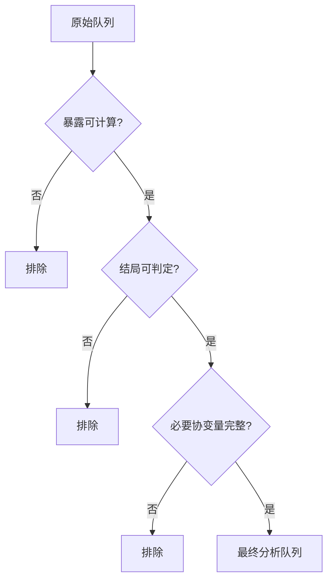
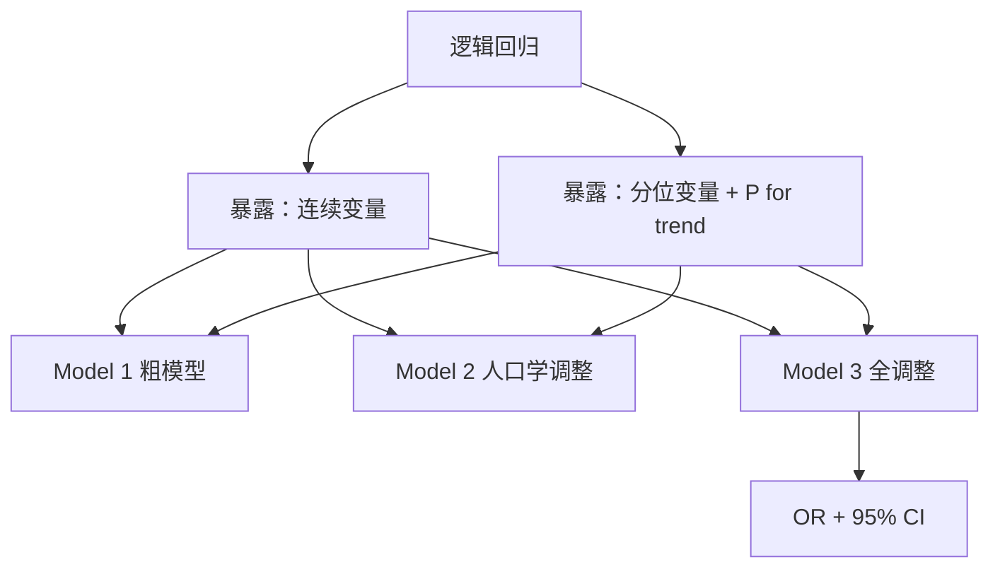
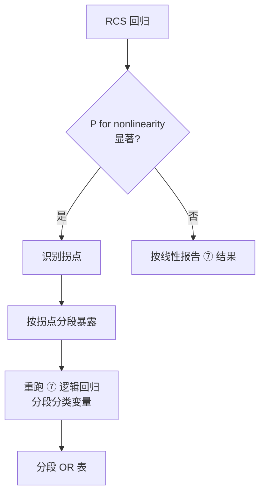
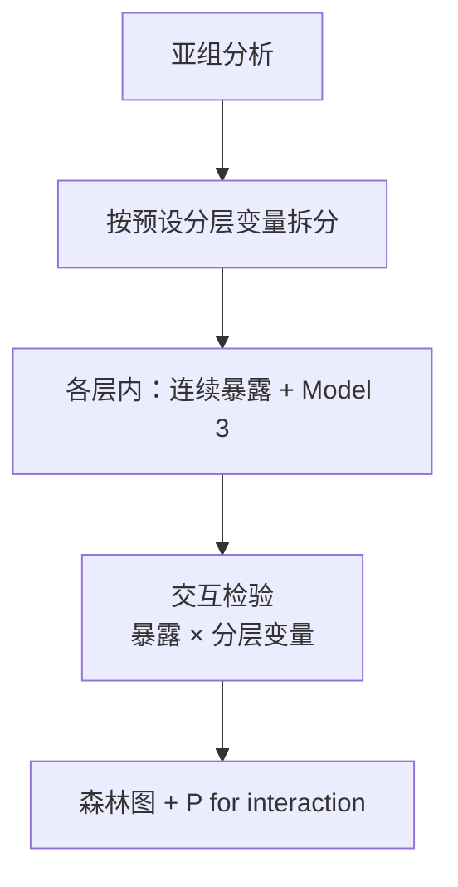
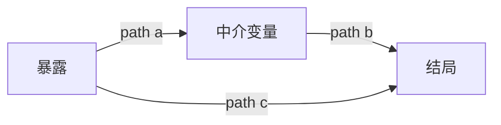
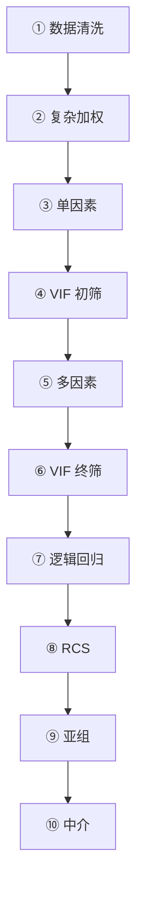

# Zhou 2024 — CMI × 抑郁（方法决策树 · 纯逻辑）

- **文献**: Zhou X, et al. *Association between cardiometabolic index and depression: NHANES 2011–2014.* **J Affect Disord** 2024.
- **DOI**: [10.1016/j.jad.2024.02.024](https://doi.org/10.1016/j.jad.2024.02.024)
- **归档名**: `01decision_tree_zhou2024_cmi_depression_nhanes`
- **数据库**: NHANES（复杂抽样加权）· 横断面发病（Logistic）

> 本文档仅描述**分析逻辑**，不含具体样本量、效应值、变量清单或 Table/Figure 映射。

---

## 1. 纳入 / 排除逻辑

---

## 2. 方法总流程

### 2.1 NHANES 单库

### 2.2 普通单库

**唯一差异**：NHANES 在 ① 之后增加 **② 复杂加权**；其后各步均在 survey design 下加权估计。普通库无此步。

---

## 3. 分步逻辑（NHANES）

| 步骤 | 做什么 | 输出 / 下游依赖 |
|------|--------|----------------|
| **① 数据清洗** | 缺失排除 · 变量衍生 · 插补 | 干净分析数据集 |
| **② 复杂加权** | 构建 survey design（权重 / PSU / 层） | 后续全部加权模型共用 |
| **③ 单因素** | 暴露、协变量与结局逐一关联；基线组间比较 | 描述性表；候选协变量池 |
| **④ VIF** | 共线性初筛，剔除高 VIF 变量 | 入模变量集 v1 |
| **⑤ 多因素** | 多变量筛选 / 递进模型定协变量 | Model 1 → 2 → 3 |
| **⑥ VIF** | 终模共线性复核 | **终模协变量集** → 供 ⑦⑧⑨⑩ |
| **⑦ 逻辑回归** | 暴露 → 结局 OR；连续 + 分位 + P for trend | 主效应表 |
| **⑧ RCS** | 检验非线性；识别拐点；拐点分段后**重跑逻辑回归** | 剂量–反应曲线 + 分段 OR 表 |
| **⑨ 亚组** | 按预设变量分层 + 交互检验 | 森林图 / 交互 P 值 |
| **⑩ 中介** | 暴露 → 中介 → 结局；path a/b/c | 中介比例 / 路径图 |

---

## 4. 分步逻辑（普通单库）

| 步骤 | 与 NHANES 的差异 |
|------|------------------|
| ① 数据清洗 | 同左；无 survey weight 要求 |
| ②–⑨ | 对应 NHANES 的 ③–⑩；模型为 **glm / 常规 VIF / 非加权** |

---

## 5. ⑦ 逻辑回归 — 子逻辑

- **Model 1**：未调整  
- **Model 2**：+ 年龄 / 性别 / 种族（或等价人口学集）  
- **Model 3**：+ 终模协变量（来自 ⑥ VIF 终筛）  
- NHANES 版：**svyglm**；普通库：**glm**

---

## 6. ⑧ RCS — 子逻辑

- RCS 在 **Model 3 协变量** 下拟合  
- 拐点分段后的 Logistic 属于 RCS 步骤延伸，不另设第 11 步

---

## 7. ⑨ 亚组 — 子逻辑

---

## 8. ⑩ 中介 — 子逻辑

- 中介模型调整集 **不含** 中介变量本身  
- NHANES 版：加权 mediation + bootstrap  
- 普通库：常规 mediation + bootstrap

---

## 9. 总流程图（NHANES · 纯逻辑）

---

*文档版本 v3 · 纯逻辑 · 2026-06-15*
