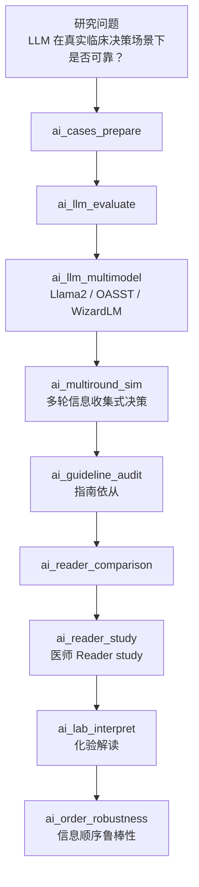

# 分析决策树 — AI 临床决策评测（MIMIC-CDM）

> 配置：`configs/config_ai_clinical_cdm.R`  
> Batch：`run/ai_clinical/run_ai_clinical_cdm_batch.R`  
> 文献：Hager 2024 *Nat Med* (paper_009)

## 完整流水线

## Block 映射（56）

| Step | Block | 说明 |
|------|-------|------|
| 01 | `ai_cases_prepare` | 病例导出 |
| 02 | `ai_llm_evaluate` | 基线 LLM 评测 |
| 03 | `ai_guideline_audit` | 指南依从审计 |
| 04 | `ai_reader_comparison` | Reader 对比摘要 |
| 05 | `ai_multiround_sim` | 多轮临床决策模拟 |
| 06 | `ai_llm_multimodel` | 多模型评测（smoke 规则引擎） |
| 07 | `ai_reader_study` | 完整 Reader study 表 |
| 08 | `ai_lab_interpret` | 化验解读准确率 |
| 09 | `ai_order_robustness` | 信息呈现顺序鲁棒性 |

> 注：smoke 模式下 LLM 为按模型名差异化的规则引擎，非真实 API 调用。

## 飞书

- 工作计划编号：**B24**
- `workplan_code = "B24"`
