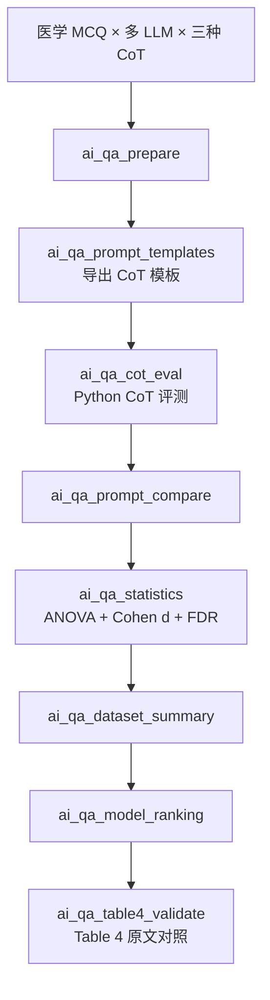

# 分析决策树 — 医学 QA CoT 提示工程（Jeon）

> 配置：`configs/config_ai_medical_qa_cot.R`  
> Batch：`configs/config_ai_medical_qa_cot_batch.R` → `run/ai_medical_qa/run_ai_medical_qa_cot_batch.R`  
> 并行总入口：`run/study/run_four_user_paper_pipelines_parallel_batch.R`  
> 文献：Jeon — CoT prompt engineering for medical QA  
> Python：`python/block_literature_extensions.py`（`mode_ai_medical_qa_cot`）  
> Prompt 模板：`prompts/ai_medical_qa_cot_templates.md`  
> 飞书：**B26**

## 研究问题

Control / Traditional CoT / Interactive CoT 在 MedQA、MedMCQA、EHRNoteQA 上对不同 LLM 的准确率差异？ANOVA/Kruskal + Cohen's d + FDR(BH) 校正？Table 4 原文数值能否自动对照？

## 完整流水线（Single）

## Batch 分层

| 层 | Blocks | 说明 |
|----|--------|------|
| **shared** | `ai_qa_prepare` → `ai_qa_prompt_templates` | 全数据集 QA 准备 + 模板导出 |
| **unit** | `ai_qa_cot_eval` → `ai_qa_prompt_compare` → `ai_qa_statistics` | 并行 3 路：`MedQA` / `MedMCQA` / `EHRNoteQA` |
| **finalize** | `ai_qa_dataset_summary` → `ai_qa_model_ranking` → `ai_qa_table4_validate` | 汇总全 unit 结果 + Table 4 对照 |

## Block 映射

| Step | Block | 文件 | 主要产出 |
|------|-------|------|----------|
| 01 | `ai_qa_prepare` | `63/01block_ai_qa_prepare.R` | `Tables/AI_QA/qa_prepared.csv` |
| 02 | `ai_qa_prompt_templates` | `63/07block_ai_qa_prompt_templates.R` | `Prompt_Templates_CoT.md`、`Table_CoT_Prompt_Templates.csv` |
| 03 | `ai_qa_cot_eval` | `63/02block_ai_qa_cot_eval.R` | `Table_CoT_Accuracy_Summary.csv`、`Table_CoT_Eval_Results.csv` |
| 04 | `ai_qa_prompt_compare` | `63/03block_ai_qa_prompt_compare.R` | `Table_AI_QA_Prompt_Compare.csv` |
| 05 | `ai_qa_statistics` | `63/04block_ai_qa_statistics.R` | `Table_AI_QA_CoT_Statistics.csv`（含 `p_fdr_BH`） |
| 06 | `ai_qa_dataset_summary` | `63/05block_ai_qa_dataset_summary.R` | `Table_AI_QA_Dataset_Summary.csv` |
| 07 | `ai_qa_model_ranking` | `63/06block_ai_qa_model_ranking.R` | `Table_AI_QA_Model_Ranking.csv` |
| 08 | `ai_qa_table4_validate` | `63/08block_ai_qa_table4_validate.R` | `Table_AI_QA_Table4_Literature_Validation.csv` |

## 原文对照（Table 4）

| 数据集 | 模型 | Prompt | 原文准确率 |
|--------|------|--------|-----------|
| MedQA | o1-mini | Traditional_CoT | 0.724 |
| MedQA | GPT-4o-mini | Traditional_CoT | 0.680 |
| MedMCQA | o1-mini | Traditional/Interactive CoT | 0.617 |
| EHRNoteQA | o1-mini | Control / Interactive CoT | 0.884 / 0.835 |
| EHRNoteQA | GPT-4o-mini | Interactive_CoT | 0.835 |

> `--use-literature` 模式下 Python 向目标值加噪声模拟；真实 API 评测需关闭该选项并配置密钥。

## Smoke 数据

- `Data/smoke/D01_ai_medical_qa.csv` / `.RData`
- 生成：`scripts/create_smoke_four_user_paper_pipelines_data.R`
