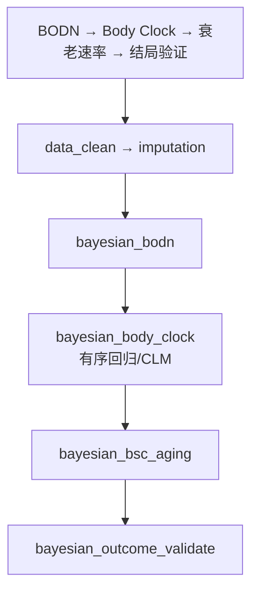

# 分析决策树 — 共病贝叶斯 Health Octo Tool

> 配置：`configs/config_bayesian_comorbidity.R`  
> Batch：`run/bayesian_comorbidity/run_bayesian_comorbidity_batch.R`  
> 文献：Salimi 2025 *Nature Communications*

## 完整流水线

## Block 映射

| Step | Block | 文件夹 |
|------|-------|--------|
| 1-4 | `bayesian_*` | `Blocks/51_bayesian_comorbidity/` |

## 飞书

- 工作计划编号：**B10**
- `workplan_code = "B10"`
