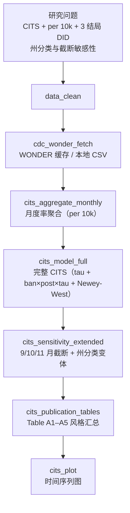

# 分析决策树 — CDC WONDER Dobbs CITS

> 配置：`configs/config_cdc_wonder_dobbs.R`  
> Batch：`configs/config_cdc_wonder_dobbs_batch.R` → `run/cdc_wonder/run_cdc_wonder_dobbs_batch.R`  
> 并行总入口：`run/study/run_four_new_paper_pipelines_parallel_batch.R`  
> 文献：Gressler 2025 *BMC Public Health* — Dobbs 裁决后 Natality CITS  
> 工具：`R/cdc_wonder_cits_utils.R`

## 研究问题

Dobbs 裁决（2022-11）后，**禁堕胎州 vs 非禁州**三类出生结局（per 10,000 births）的 CITS 差异与 DID 式变化是多少？截断日期与州分类敏感性如何？

## 完整流水线（Single）



## Batch 分层

| 层 | Blocks | 说明 |
|----|--------|------|
| **shared** | `data_clean` → `cdc_wonder_fetch` → `cits_aggregate_monthly` → `cits_publication_tables` | 全结局共享聚合与发表表 |
| **unit** | `cits_model_full` → `cits_sensitivity_extended`（仅 Congenital_anomaly）→ `cits_plot` | 并行 3 路：`Nonliving_birth` / `Congenital_anomaly` / `Maternal_morbidity` |

## Block 映射

| Step | Block | 文件 | 主要产出 |
|------|-------|------|----------|
| 01 | `data_clean` | `Blocks/02_data_clean/` | 州级月度记录 |
| 02 | `cdc_wonder_fetch` | `60/05block_cdc_wonder_fetch.R` | WONDER 月度缓存读入 |
| 03 | `cits_aggregate_monthly` | `60/01block_cits_aggregate_monthly.R` | `Table_CITS_Monthly_Aggregate.csv` |
| 04 | `cits_model_full` | `60/06block_cits_model_full.R` | `Table_CITS_Full_Model_Coefficients.csv`、`Table_CITS_DID_Change_per10k.csv` |
| 05 | `cits_sensitivity_extended` | `60/07block_cits_sensitivity_extended.R` | 截断 / 州分类敏感性 |
| 06 | `cits_publication_tables` | `60/08block_cits_publication_tables.R` | Table A1–A5 风格汇总 |
| 07 | `cits_plot` | `60/04block_cits_plot.R` | `Figure_CITS_*.pdf` |

## CITS 模型规格（`cits_model_full`）

回归式（per 10,000 births）：

```
rate_per10k ~ ban + post + tau + ban:post + ban:tau + post:tau + ban:post:tau
```

| 项 | 含义 |
|----|------|
| `tau` | 基线时间趋势（月序） |
| `ban:post` | 干预后禁州水平变化 |
| `ban:tau` / `post:tau` / `ban:post:tau` | 组内 post 斜率变化（完整 CITS） |
| 稳健 SE | Newey-West（`sandwich` 包） |

## 结局与敏感性

| 结局 | 变量 | Batch unit |
|------|------|------------|
| 非活产 | `Nonliving_birth` | ✓ |
| 先天异常 | `Congenital_anomaly` | ✓（含扩展敏感性） |
| 母体 morbidity | `Maternal_morbidity` | ✓ |

- 干预日默认：`2022-11-01`
- 敏感性截断：`2022-09-01` / `2022-10-01` / `2022-11-01`
- 州分类：`.cits_ban_states_default()` / `.cits_total_ban_states()` / `.cits_protected_states()`

## 数据与 Smoke

- 记录级：`Data/smoke/D01_cdc_wonder_dobbs.RData`（`CDCWonderDobbs`）
- 月度缓存：`Data/smoke/D01_cdc_wonder_monthly_rates.csv`
- 生成：`scripts/create_smoke_four_new_paper_pipelines_data.R`

## 飞书

- 工作计划编号：**B15**
- `workplan_code = "B15"`
