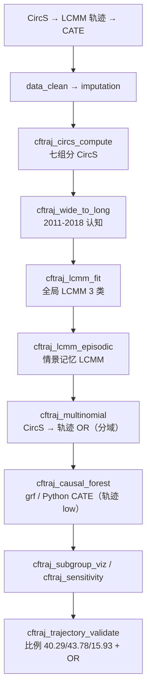

# 分析决策树 — 因果森林 + 认知轨迹（Ma 2026 CHARLS）

> 配置：`configs/config_cftraj_charls.R`  
> Batch：`configs/config_cftraj_charls_batch.R` → `run/causal_forest_trajectory/run_cftraj_charls_batch.R`  
> 并行总入口：`run/study/run_four_user_paper_pipelines_parallel_batch.R`  
> 文献：Ma 2026 *Alzheimers Dement* — CircS × LCMM 轨迹 × causal forest CATE  
> Python 回退：`lcmm_trajectory`（R lcmm 不可用时）、`causal_forest_cate`（grf 不可用时）  
> 飞书：**B28**

## 研究问题

CircS（≥4/7 组分）如何关联认知轨迹类别（高/中/低）？**全局认知**与**情景记忆**分开 LCMM + multinomial logistic；causal forest CATE 以轨迹类 `low` 为结局；脆弱亚组与原文轨迹比例/OR 能否自动对照？

## 完整流水线（Single）

## Batch 分层

| 层 | Blocks | 说明 |
|----|--------|------|
| **shared** | `data_clean` → `imputation` → `cftraj_circs_compute` → `cftraj_wide_to_long` | CHARLS 共享 checkpoint |
| **unit** | `cftraj_lcmm_fit` → `cftraj_lcmm_episodic` → `cftraj_multinomial` → `cftraj_causal_forest` → `cftraj_subgroup_viz` → `cftraj_sensitivity` | 并行 2 路：`Global` / `Episodic` |
| **finalize** | `cftraj_trajectory_validate` | 汇总轨迹比例 + multinomial OR 与原文对照 |

## Block 映射

| Step | Block | 文件 | 主要产出 |
|------|-------|------|----------|
| 01 | `data_clean` | `Blocks/02_data_clean/` | 清洗后宽表 |
| 02 | `imputation` | `Blocks/03_imputation/` | 插补后分析集 |
| 03 | `cftraj_circs_compute` | `64/01block_cftraj_circs_compute.R` | `Table_CircS_Components.csv` |
| 04 | `cftraj_wide_to_long` | `64/02block_cftraj_wide_to_long.R` | 纵向认知 long（global + episodic） |
| 05 | `cftraj_lcmm_fit` | `64/03block_cftraj_lcmm_fit.R` | `LCMM/Table_CfTraj_LCMM_Assignment.csv` |
| 06 | `cftraj_lcmm_episodic` | `64/08block_cftraj_lcmm_episodic.R` | `LCMM/Table_CfTraj_LCMM_Assignment_episodic.csv` |
| 07 | `cftraj_multinomial` | `64/04block_cftraj_multinomial.R` | `Table_CfTraj_Multinomial_CircS_global.csv` / `_episodic.csv` |
| 08 | `cftraj_causal_forest` | `64/05block_cftraj_causal_forest.R` | `CATE/global/`、`CATE/episodic/` 分域 CATE |
| 09 | `cftraj_subgroup_viz` | `64/06block_cftraj_subgroup_viz.R` | `Table_CfTraj_Vulnerable_Subgroups.csv` |
| 10 | `cftraj_sensitivity` | `64/07block_cftraj_sensitivity.R` | CircS 阈值敏感性 |
| 11 | `cftraj_trajectory_validate` | `64/09block_cftraj_trajectory_validate.R` | `Table_CfTraj_Literature_Validation.csv` |

## 原文对照

| 指标 | 原文目标 | 域 |
|------|----------|-----|
| 轨迹类比例 high / moderate / low | 40.29% / 43.78% / 15.93% | global |
| CircS→low OR | 1.27 (1.06–1.52) | global |
| CircS→low OR | 1.28 (1.06–1.55) | episodic |

> Smoke 上 LCMM 可能回退 Python 简化轨迹，比例/OR 不与原文一致属预期。

## Smoke 数据

- `Data/smoke/D01_cftraj_charls.RData`（`CfTrajCHARLS`）
- 生成：`scripts/create_smoke_four_user_paper_pipelines_data.R`
