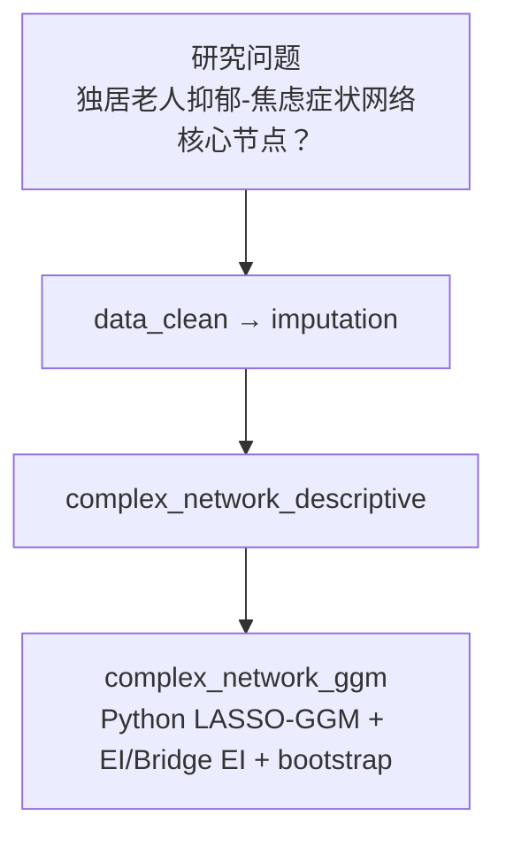

# 分析决策树 — 复杂网络（CLHLS 抑郁×焦虑 GGM）

> 配置：`configs/config_complex_network_clhls.R`  
> Batch：`run/complex_network/run_complex_network_clhls_batch.R`  
> 文献：Chang 2025 *BMC Psychiatry* — CLHLS 独居老人

## 完整流水线

## Block 映射

| Step | Block | 文件夹 |
|------|-------|--------|
| 1 | `complex_network_descriptive` | `Blocks/50_complex_network/` |
| 2 | `complex_network_ggm` | `Blocks/50_complex_network/` + `python/` |

## 飞书

- 工作计划编号：**B14**
- `workplan_code = "B14"`
