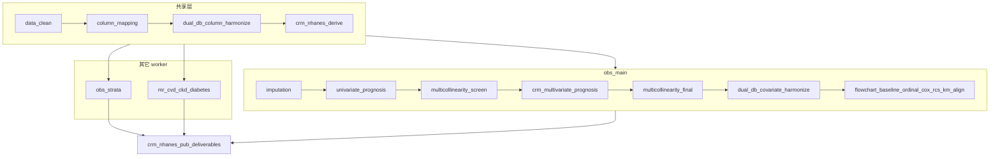

# 分析决策树 — NHANES CRM × 孟德尔（Han 2025 JAHA）

> Config：`configs/templates/config_crm_nhanes_mr_batch.template.R`  
> Run：`run/crm_nhanes_mr/run_crm_nhanes_mr_batch.R`  
> 规格：`docs/superpowers/specs/2026-07-24-crm-nhanes-mr-design.md`  
> 修订：2026-07-27 — 预后式协变量筛选 → Model2Factors 接入原 Han 发表链（**不做** SUA cox 四分位/三分位/二分闸门）

## 研究设定

| 项 | 值 |
|---|---|
| 观察端 | NHANES（单库；CHARLS 跳过） |
| `study_type` | `prognosis`（满足 univariate/multivariate_prognosis；Han 正表仍调查加权） |
| 暴露 | SUA / hyperuricemia / gout（痛风可为 SUA≥8 代理） |
| MR | SUA → CVD / CKD / Diabetes（GCST90018977 + FinnGen R9） |
| 协变量筛选结局 | 全因死亡（`futime`/`fustatus`） |

## 总览

## 共享层

`data_clean → column_mapping → dual_db_column_harmonize → crm_nhanes_derive`

- `dual_db$enable=FALSE` 时列对齐块跳过不报错（为日后双库预留）
- derive 兼容 `SEQN` / `ID`，写出 `SUA`、`CRM_count`、`futime`/`fustatus`、权重等

## obs_main

1. **筛选前**：`imputation`（**不挂** `trim_index_extreme`）
2. **协变量链**：`univariate_prognosis` → `multicollinearity_screen` → `crm_multivariate_prognosis`（包装预后多因素，绕过 NHANES→`multivariate_nhanes` 硬停）→ `multicollinearity_final` → `Model2Factors`
3. **双库协变量对齐**：`dual_db_covariate_harmonize`（单库跳过）
4. **Han 发表链**（**无** `cox_quartile` / `cox_tertile` / `cox_binary`）：flowchart → baseline → ordinal → cox_pub → rcs → km → pub_align  
   - Model2 **优先**读 `ctx$results$Model2Factors`（筛选结果）

## 其它 worker

- `obs_strata`：`crm_gout_strata` → `crm_nhanes_subgroup_supp`（亚组亦优先 Model2Factors）
- `mr_*`：`crm_mr_literature`（TwoSampleMR；forest/LOO 按 SNP 数动态高度）

## Block ↔ 交付物映射

| 交付物 | Block / 来源 | 备注 |
|--------|--------------|------|
| Table 1 | `crm_nhanes_ordinal_pub` | 加权有序 OR；原文 Table 2 |
| Table 2 | `crm_nhanes_cox_pub` | 加权 Cox；原文 Table 4 |
| Table 3 | MR 汇总 | 原文 Table 5 |
| Table S1–S2 | MR IV / GWAS 清单 | |
| Table S3–S4 | 加权基线（HU / CRM≥1×HU） | 原文 S4/S6 |
| Table S5 | 死亡率 | 原文 S7 NHANES |
| Table S6–S7 | 亚组 OR / Cox | 原文 S9/S11 |
| **Table S8** | `univariate_prognosis` | 非加权单因素 Cox 筛选 |
| **Table S9** | `multicollinearity_screen` | VIF screen |
| **Table S10** | `crm_multivariate_prognosis` | 非加权多因素 Cox |
| **Table S11** | `multicollinearity_final` | VIF final / Model2Factors |
| Figure 1 | `crm_nhanes_km_pub` | 按 CRM 计数 KM |
| Figure 2 | `crm_nhanes_rcs_pub` | SUA→死亡 RCS |
| Figure S1 | flowchart | |
| MR Figure S2–S13 | `crm_mr_literature` | scatter/forest/LOO/funnel |

## 方法学备注

筛选链用标准预后块 **非加权** Cox；Han 正表仍用 **调查加权** OR/Cox/RCS，协变量取筛选得到的 Model2Factors。【证据不足：Han 原文未使用本仓库 VIF 筛选链】

## CHARLS 跳过

Table1/3（CHARLS）、Figure2（CHARLS RCS）、Table S3/S5/S7/S8/S10 等 CHARLS 专属 → 不伪造。
