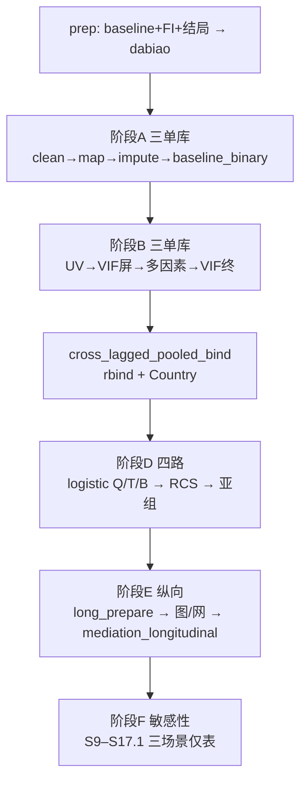
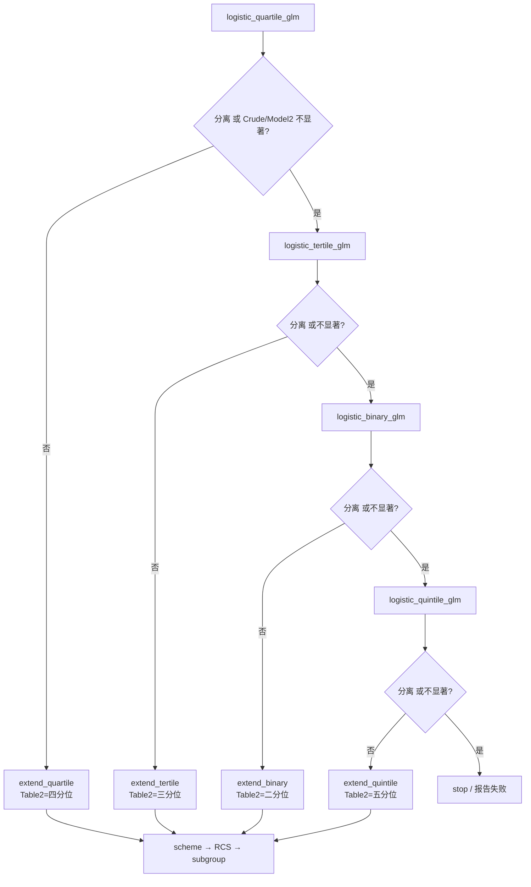

# 分析决策树 — 交叉滞后 · 髋部骨折 × 虚弱（三库 + Pooled）

> 研究：Hip fracture × FI（PMID 40595747）  
> 产出根：`G:/02block_result/16_Hip fracture/cross-laged_40595747`  
> Prep：`scripts/prep_cross_lagged_hip_frailty.R`  
> 一期入口：`run/incidence/run_incidence_single.R` + `config_phase1_*.R`  
> 正式 batch：`run/cross_lagged/run_cross_lagged_frailty.R --batch`  
> 模板：`configs/templates/config_cross_lagged_frailty_batch.template.R`  
> Spec：`docs/superpowers/specs/2026-07-30-cross-lagged-hip-frailty-design.md`

## 研究设定

| 项 | 值 |
|---|---|
| 研究类型 | 横断面段 `incidence`；尾部纵向交叉滞后 / 中介 |
| 队列 | CHARLS / ELSA / HRS + **Pooled**（插补后 rbind，非 meta） |
| 暴露 | 连续 `FI`（0–1）；二分 `Frailty = I(FI≥0.25)`（**不用** `AIP_FI`） |
| 结局 | `Disease_Group`：`Hip_Fracture` / `No_Fracture` |
| 基线波 | CHARLS 2011；ELSA wave2；HRS 2012 |
| Table 1 | **仅连续 FI**；二分不进表；三库顺序/列名由 `configs/cross_lagged/table1_harmonized_vars.R` 统一（run 入口自动套用） |
| 单因素 / VIF screen | **仅 Table 1 特征**（`baseline_binary$include_vars` / `univariate_from_baseline_table1=TRUE`）；Table S3/S4 不得含库特异实验室等非基线表变量 |
| Pooled | VIF final **之后**才进；协变量 **必须含 `Country`**（China/UK/America） |
| 中介 | **纵向** `mediation_longitudinal`（禁止本套路主路径调用 `mediation_incidence` / `cross_lagged_mediation`） |

---

## 总览



---

## 阶段 A — 到 Table 1（仅 CHARLS / ELSA / HRS）

| Step | Block | 说明 |
|------|-------|------|
| 01 | `data_clean` | 缺列阈值；结局两水平 |
| 02 | `column_mapping` | 列名标准化（`database_type` 按库） |
| — | ~~`index`~~ | **`index$enable=FALSE`**（FI 已在 prep 写入） |
| 03 | `imputation` | MICE |
| — | ~~`trim_index_extreme`~~ | **本套路不修剪 FI 极端值**（pipeline 不挂该 block） |
| 04 | `baseline_binary` | Table 1；`Frailty` 不进表；须含 `FI`；**三库统一** `include_vars`/`labels`（`cross_lagged$table1_harmonize`） |

**Pooled 禁止进入本阶段。**

一期 CLI：

```bash
Rscript run/incidence/run_incidence_single.R \
  --config ".../config_phase1_CHARLS.R"
```

---

## 阶段 B — 协变量筛选（仅三单库）

| Step | Block |
|------|-------|
| 06 | `simple_ROC` / `boxplot`（可选，对齐发病 regular） |
| 07 | `univariate_incidence_binary`（P&lt;0.1；**候选池 = Table 1 include_vars**） |
| 08 | `multicollinearity_screen`（VIF&lt;4；输入 = UV p&lt;0.1 ∩ Table1） |
| 09 | `multivariate_incidence_binary`（P&lt;0.05） |
| 10 | `multivariate_covariate_resolve` |
| 11 | `multicollinearity_final`（VIF&lt;4） |

写出各库 `Model1Factors` / `Model2Factors`。

**三库协变量锁定（阶段 C 前强制执行）**

1. 优先：`intersect(CHARLS, ELSA, HRS | VIF final Model2)`（去掉 FI/Frailty）
2. **若 final 交集为空** → 回退：`intersect(... | VIF screen / UV p&lt;0.1 后 Model2)`
3. Model1 = 锁定集中的 Age（若有）；Model2 = 完整锁定集；Pooled Model2 再加 `Country`
4. 实现：`R/cross_lagged_covariate_lock.R`；由 `--phase vif_pooled（Blocks/54_cross_lagged_full/phases/）` / `--phase relock` 调用

**Pooled 禁止进入：`data_clean` … `multicollinearity_final`。**

---

## 阶段 C — 拼 Pooled

| Step | Block | 说明 |
|------|-------|------|
| 12 | `cross_lagged_pooled_bind` | 三库 `imputed` rbind；加 `Country`；Model2 = **锁定集** ∪ `{Country}`（锁定规则见阶段 B） |

Country 映射：CHARLS=`China`，ELSA=`UK`，HRS=`America`。

---

## 阶段 D — 四路主分析（CHARLS / ELSA / HRS / Pooled）

分位级联（`R/logistic_gate.R`，`logistic_gate_apply_cascade_defaults`）：

**四分位 → 三分位 → 二分位 → 五分位（末招）**

降级触发（任一）：
1. **分离**：非参照组 OR ≥ 1e4，或 CI 含 `(0,NA)`/`Inf` 且 OR 异常大
2. **不显著**：Crude 非参照组全 ≥0.05，或 Crude 过但 Model2 全 ≥0.05



闸门列索引：

| 模型 | 列 | 判定 |
|------|--------|------|
| OR / 95%CI | 第 4 / 5 列 | 分离检测 |
| Crude P | 第 6 列 | 非参照组全部 ≥0.05 → 降阶 |
| Model2 P | 第 12 列 | 至少一组 &lt;0.05 → extend |

声明块序（每路）：

`logistic_quartile_glm` → `logistic_tertile_glm` → `logistic_binary_glm` → `logistic_quintile_glm` → `rcs_incidence` → `logistic_*_glm_rcs` → `subgroup_incidence`

本阶段 **不** 调用 `mediation_incidence`。

> 髋部骨折×FI 研究：ELSA 四分位 Q1 零事件完全分离 → 闸门降三分位；`summary_result` **Table 2 = 三分位**。  
> **汇总策略**：闸门链仍可跑 quartile/binary/quintile（敏感性留在 `phase*` step 目录），但 **`summary_result` 不收录二分位/四分位/五分位 GLM 表**（`Blocks/54_cross_lagged_full/phases/collect_summary_result.sh` / `Blocks/54_cross_lagged_full/phases/reorder_summary_result.sh`）。  
> **Table S5（Change）**：自动时间窗 — **2 年=`two_wave`，≥3 年=`three_plus`**；同一分位=闸门；四库并列。  
> **Table S5.1（Change，全库两年）**：强制所有库 `two_wave`（与 CHARLS 同口径的敏感性表）；同样进 `summary_result`。  
> **纵向/交叉滞后默认不要 Pooled**：S5/S6/S7/S8 仅 **CHARLS / ELSA / HRS**；`--phase long_figs` 默认 `--no-pooled`（加 `--with-pooled` 才开）。主文 logistic 的 Pooled 仍可在 phase2 保留。  
> **Table S6（相关）**：FI↔Depression↔Hip fracture，Crude/Model1/Model2；**三库**分区；格式 Variable / Estimate / 95% CI / P。  
> **Table S7（纵向中介）**：仅**合并一张表**（三库分行）；不再收录分库 `Table S7-*`。  
> **抑郁中介协变量规则（可复用，写进流水线）**：  
> - 中介固定为中间波 **Depression**（`Depression_cont`）；各库可不同协变量。  
> - 候选：crude / Age / Age+Alcohol / UV(p&lt;0.1 vs Y) / paper_like / 常见 1–3 元人口学组合。  
> - 评分优先：ACME p&lt;0.05 → Complementary → total p&lt;0.05 → |prop|∈[0.10,0.55] → path a&b 均显著 → ACME 更小 → 同等偏好更少协变量。  
> - **出版偏好**：若 crude 最优但 Age 仍 ACME p&lt;0.05，则锁定 Age。  
> - **S6 Model1 ≠ Model2（强制）**：Model1=`Age`；Model2=最优路径集；若与 Model1 相同则追加 `Alcohol_drinking`（或次优筛选项）。  
> - 各库独立选最优；**Pooled = 各库最优并集 + Country**。  
> - **S7**：路径协变量 = 该库 Model2。  
> - 实现：`R/cross_lagged_mediation_covar_select.R`；锁文件 `mediation_depression_covar_lock.{rds,txt}`；`--rescreen-mediation-covars` 强制重筛。  
> - **不再收录**：分库 Table S7-*；Flowchart attrition 表（原 S9；Figure 1 已覆盖纳排）。  
> **Table S8（CLPN 邻接）**：三库各一张；行列为 FI 条目**真名**（无 `T1_` 前缀，如 `Dressing` / `Hypertension`；见 `R/cross_lagged_fi_item_labels.R`）；读入时 ELSA/HRS 短码统一到 CHARLS stem（HRS 去波次前缀 `n/o/p/q/r`）；丢弃高缺失/无变异节点后再拟合，避免邻接全 0。  
> **Figure S1 / S2（CLPN 稳定性，硬默认）**：对齐文献 Supplementary Figs. 25–26 与同源 Step07（`bootnet(..., nBoots = 1000)`）：  
> - **S1** = nonparametric edge CI（`edgeCI`）；**S2** = case-dropping（`edgeStability`）  
> - **`n_boot_edge = 1000`，`n_boot_case = 1000`，`nfolds = 10`**（与文献一致；**出版图禁止 smoke / 下调次数**）  
> - 实现：`cross_lagged_network_bootstrap`；挂 `pub_figs` / 纵向 `pipeline_longitudinal`；可用 `--boot-edge`/`--boot-case` 或 env `CROSS_LAGGED_BOOT_EDGE`/`CASE` 覆盖（仅调试）  
> **时间窗规则**：调查年数=2 → `two_wave`（T1/T2 pair，CHARLS）；≥3 → `three_plus`（前两期暴露、第3期起随访，对齐原文；ELSA/HRS）；Pooled 按 Cohort 分层后可 `mixed`。  
> **Table S-XX**：`logistic_quartile_glm_rcs`（RCS **primary cutoff 二分**）；**CHARLS / ELSA / HRS / Pooled 均需**；协变量与主文锁定一致。  
> **RCS 规则（写进流水线）**：  
> - **图（Fig 2）**：可标全部交点（`rcs_cutoffs_all`）  
> - **分组 / Table S-XX**：只用主 cutoff（`rcs_incidence$group_cutoffs = "primary"` → 2 组）  
> - 禁止用 `"all"` 进汇总（多 OR=1 时会变成 3–4 组，库间不可比）
>
> **敏感性（`--phase sensitivity`；编号自 S8 之后固定顺延；暂不重画敏感性补充图）**：  
> - **跳过竞争风险**：当前 D01/dabiao 无死亡变量；配置占位 `cross_lagged_sensitivity$competing_risk = FALSE`，有死亡数据后再开。  
> - **锁定协变量（与主文一致）**：Model1=`Age`；Model2=`Age` + `Alcohol_drinking`（见 `phase3_relock_acceptance.txt`）；暴露=`FI`；结局=`Disease_Group`。  
> - **每场景产出**：Table 1 + 主文锁定 tertile logistic（Model2）+ Change S5 风格 + S5.1（two_wave）；**不覆盖**主文 Table 1 / Table 2 / S5。  
> - **实现**：`R/cross_lagged_sensitivity.R` + `phases/phase_sensitivity.R`（不改写旧 CVD `10block_cross_lagged_sensitivity.R`）。  
> - **汇总白名单**：collect/reorder **仅收录文件名含 `Sensitivity` 的 S9–S17.1**；拒绝敏感性目录里误写的 Normality / 无标签 Baseline。  
> - **场景与固定表号**：  

| 场景 | 数据口径 | Baseline | Logistic (tertile) | Change | Change two-wave |
|------|----------|----------|--------------------|--------|-----------------|
| A 剔除基线共病 ≥2 | 读插补后 `D01_AfterMI`；基线共病计数 ≥2 剔除 | S9-{DB} | S10-{DB} | S11 | S11.1 |
| B 未插补完整病例（listwise） | **读插补前 `dabiao`**；对 `FI+Disease_Group+Model2` **列表删除** `complete.cases`；**不做 MI**；**N 允许 ≤ AfterMI**（不以同 N 为目标）；Change 用同一 ID 筛 long | S12-{DB} | S13-{DB} | S14 | S14.1 |
| C 排除随访 ≤2 年发病 | 插补表 ∩ 剔除「首次发病年−基线年 ≤2」；CHARLS/ELSA 波次间隔 4 年时可无人被剔 | S15-{DB} | S16-{DB} | S17 | S17.1 |

> - **慢性病集合**（有则计 1）：`hibpe/Hypertension`、`diabe/Diabetes`、`cancre/Cancer`、`arthre/Arthritis`、`lunge/Lung`、`psyche/Psychiatric`、`memrye/Memory`；`chronic_min_count = 2`。  
> - **B 完整病例（硬口径）**：插补前 `dabiao` + 仅对**分析变量**（`FI + Disease_Group + Model2`）做 **listwise**；**不做 MI**。N 可小于 AfterMI（例：CHARLS 7082→7051）；**禁止**解读为“与 AfterMI 同 N、不列表删除”。Change（S14/S14.1）用该 ID 集合跑纵向，仍不做二次插补。表标签含 `unimputed listwise`。  
> - **≤2 年发病**：首次发病年 − 基线年 ≤ 2 的个体剔除；保留更晚发病与未发病。  
> - CLI：`Rscript run/cross_lagged/run_cross_lagged_frailty.R --phase sensitivity --study-root ...`（可选 `--only CHARLS` / `--scenario exclude_chronic_ge2|complete_case|exclude_event_le_2y`）。  
> - **正式跑通样本（2026-08-12）**：  

| 场景 | CHARLS | ELSA | HRS |
|------|--------|------|-----|
| A 共病≥2 | 7082→6417（−665） | 3977→3628（−349） | 3906→2680（−1226） |
| B 完整病例 | 7082→7051（−31） | 3977（0） | 3906（0） |
| C ≤2年发病 | 7082（0；波次差4年） | 3977（0） | 3906→3844（−62） |

> - **结果要点（横断面 Model2，Q3 vs Q1）**：三场景下 FI 与髋部骨折正向关联均仍成立；CHARLS Q3 OR≈2.0–2.3，ELSA≈3.3–3.5，HRS≈18–20；连续 FI 均显著。Change：CHARLS Mean FI Q3 HR≈3.6–3.8（P&lt;0.001）稳健；ELSA/HRS 事件少、CI 宽。**主结论稳健。**
---

## 阶段 E — 纵向扩展

| Step | Block | 说明 |
|------|-------|------|
| 20 | `cross_lagged_long_prepare` | 长/宽表；X 基线 FI，M 中间抑郁，Y 晚波骨折；读 `data/medition/` |
| 21 | `cross_lagged_corr_table` | **Table S6**：FI↔抑郁↔结局 Crude/M1/M2（**M1≠M2**） |
| 22 | `cross_lagged_forest_or` | FI 中位二分亚组 OR 森林图（已修 xlim） |
| 23 | `cross_lagged_country_year_bar` | 年/国暴露分布（来自 barplot_new；旧 barplot 废弃） |
| 24 | `cross_lagged_fig1_group` | Fig1：按结局分层的 FI~年折线 |
| 25 | `cross_lagged_network` | **Table S8** + **Figure 4** CLPN：FI 条目真名邻接矩阵 + 网络图 |
| 25b | `cross_lagged_network_bootstrap` | **Figure S1/S2**；**nBoots=1000/1000**（文献对齐，禁止 smoke） |
| 26 | `cross_lagged_change_logistic` | **Mean FI / FI change**；2 年=`two_wave`，≥3 年=`three_plus`；分位=闸门；交付 **Table S5** 四库并列 |
| M | `mediation_longitudinal` | **Table S7（合并）** + 马卡龙路径图；协变量=按库 Model2 |

### 纵向中介默认波次

| 库 | X (FI) | M (抑郁) | Y (骨折，`D03_result_*`) |
|----|--------|----------|---------------------------|
| CHARLS | 2011 基线 FI | `medition/CHARLS_2013_抑郁.csv` | `data/CHARLS/D03_result_CHARLS_2015.RData` |
| ELSA | wave2 基线 FI | `medition/ELSA_wave3_抑郁.csv` | `data/ELSA/D03_result_ELSA4.RData` |
| HRS | 2012 基线 FI | `medition/HRS_2014_抑郁.csv`（ID=`HHID`+`PN`） | `data/HRS/D03_result_HRS16.RData` |
| ~~Pooled~~ | 纵向默认不做 | — | — |

### 本套路明确不调用

- `cross_lagged_mediation` / `cross_lagged_mediation_bootstrap`（旧 CVD 衰弱块，保留文件）
- `mediation_incidence`（横断面发病中介）

---

## 阶段 F — 发病敏感性（仅表，S8 之后）

| Step | 入口 | 说明 |
|------|------|------|
| S | `--phase sensitivity` | 三场景 × 三库；写出 `{study_root}/sensitivity/{scenario}/` 并 sync 进 `summary_result/table` 的 **Table S9–S17.1** |

数据流（复用锁定 Model2，不重跑 UV/VIF）：

1. **A `exclude_chronic_ge2`**：插补后表 → 基线共病数 ≥2 剔除 → Table1 / tertile logistic / Change。  
2. **B `complete_case`**：**插补前 `dabiao`** → 分析变量 **listwise** `complete.cases(FI, Disease_Group, Model2)` → 同上；**不做 MI**；N 可 &lt; AfterMI。  
3. **C `exclude_event_le_2y`**：纵向首次发病年 − 基线年 ≤2 的 ID 剔除 → 同上。

配置模板键：`config$cross_lagged_sensitivity`（`competing_risk=FALSE` 占位；`chronic_min_count=2`；`exclude_event_within_years=2`）。

---

## 与旧版 `decision_tree_cross_lagged_frailty.md` 的差异

| 旧 | 新 |
|----|----|
| FI 缺陷计算 + Cox/CVD | Prep 已含 FI；发病式 logistic |
| 五队列 frailty batch | 三库 + Pooled rbind |
| 横断面式 depression 中介 | 纵向 X→M→Y 中介 |
| 无发病 Table 1 / VIF 链 | 完整发病前半 + 闸门 |
| 无发病敏感性编排 | **S9–S17.1** 三场景（共病/完整病例/≤2年发病）；跳过竞争风险 |

---

## 产出位置（一期已跑通）

- `data/harmonized/D04_*_hip_baseline.RData`
- `phase1_{CHARLS,ELSA,HRS}/Tables/Table 1-*.xlsx`（FI 组间均 &lt;0.001）
- `sensitivity/{exclude_chronic_ge2,complete_case,exclude_event_le_2y}/{CHARLS,ELSA,HRS}/`（正式敏感性中间产物）
- `summary_result/table/Table S9–S17.1*Sensitivity*.xlsx`（正式敏感性汇总；Change 为三库并列）
- `summary_result/table/README_sensitivity.txt`
