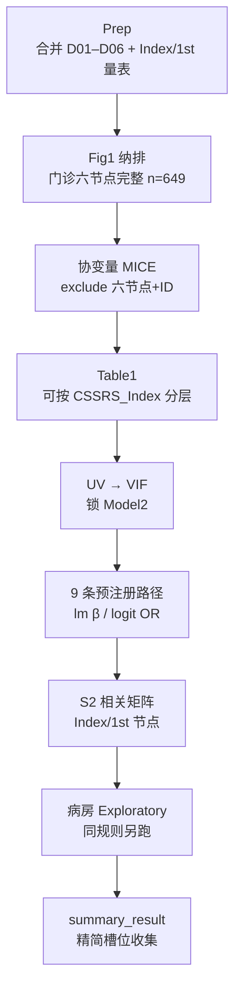

# 分析决策树 — 交叉滞后 · 门诊 HAMD / HAMA / C-SSRS item1（CLPM 做法 B）

> 研究：自杀意念（C-SSRS item1）× 抑郁/焦虑症状 Index→1st  
> 产出根：`\\192.168.68.133\02block_result\43_Suicide\cross-laged_40595747`  
> Prep：`scripts/prep_cross_lagged_suicide_cssrs.R`  
> Config：`config_suicide_clpm.R`（source `config_suicide_clpm_exclusion.R`）  
> Meta：`R/cross_lagged_study_meta.R` → `kind = "suicide_cssrs"`，`grouping = "binary"`  
> Spec：`docs/superpowers/specs/2026-09-20-suicide-cssrs-hama-hamd-clpm-design.md`  
> **禁止**一键 `run_cross_lagged_frailty.R --batch` 冒充本课题成功

## 研究设定

| 项 | 值 |
|---|---|
| 研究类型 | `study_type = "cross_lagged_clpm"`（做法 B；非 frailty 三库） |
| 主队列 | **门诊入组**；六节点完整 **n=649**（`attrition_outpatient.csv`） |
| 探索队列 | 病房入组（同规则；产物标 Exploratory；不进主文） |
| 节点 | `HAMD_Index/1st`、`HAMA_Index/1st`（连续）；`CSSRS_Index/1st`（item1，Yes=1/No=0） |
| 插补 | 六节点任一缺失已删例；**节点禁止 MICE**；仅协变量可插补 |
| 分位闸门 | **无** FI/logistic 分位主分析；meta `grouping=binary` 仅节点口径 |
| 明确不做 | 三库 Pooled、社区 S9–S17.1、CLPN 1000-boot 默认 |

---

## 总览



---

## 阶段 0 — Prep（已落地 Task 2）

| Step | 产物 | 说明 |
|------|------|------|
| 0a | `D04_outpatient_clpm.RData` / `D04_ward_clpm.RData` | `dabiao`；1st 强制读 `*2` 文件 |
| 0b | `attrition_*.csv` / `prep_qc.csv` | 逐步 n；Index≠1st 粗检 |

入口：

```bash
export CROSS_LAGGED_STUDY_ROOT="<研究区根>"
Rscript scripts/prep_cross_lagged_suicide_cssrs.R
```

---

## 阶段 1 — Fig1 纳排（门诊主文）

| Step | 规则 | 门诊 n_remain |
|------|------|---------------|
| has_ID | 非缺失 `新编号`/`ID` | 1422 |
| group_门诊入组 | `patient_group == 门诊入组` | 1101 |
| six_nodes_complete | 六节点 complete.cases | **649** |

病房同表另存；脚注写 Exploratory。

---

## 阶段 2 — 协变量插补

| 项 | 要求 |
|----|------|
| Block | `imputation`（或薄脚本等价） |
| `exclude_from_mice_cols` | 六节点 + ID + 原始量表副本（见 exclusion 片段） |
| `analysis_exclusion` | Task 3 `disease_vars` / `protect_vars` |
| 节点 | **禁止**进入 MICE；已 listwise |

---

## 阶段 3 — Table1

| 项 | 要求 |
|----|------|
| 分层 | 可选按 `CSSRS_Index`（总体 + 分层附录） |
| 变量池 | `covariate_candidate_vars`（排除 disease_vars / 设计列） |
| 节点列 | 可描述 Index 分布；不进 UV 协变量池（protect） |

---

## 阶段 4 — UV / VIF → 锁 Model2

| Step | 说明 |
|------|------|
| UV | 候选 = Table1 / `covariate_candidate_vars`；P&lt;0.1 入屏 |
| VIF | screen → final；共线踢除（如 `CGI_severiry_index` 慎用） |
| 锁定 | 写出 Model1 / Model2；后续 9 路径统一控 Model2 |

脚本意向：`run/cross_lagged/run_suicide_clpm_covariates.R`（Task 5）。

---

## 阶段 5 — 9 条预注册路径（主表）

控制锁定 Model2 后估计：

**自回归（3）**

- `HAMD_Index → HAMD_1st`（lm，标准化 β）
- `HAMA_Index → HAMA_1st`（lm）
- `CSSRS_Index → CSSRS_1st`（logistic，OR）

**交叉滞后（6）**

- `HAMD_Index → CSSRS_1st`（控 HAMA_Index、CSSRS_Index）
- `HAMA_Index → CSSRS_1st`（控 HAMD_Index、CSSRS_Index）
- `CSSRS_Index → HAMD_1st`（控 HAMD_Index、HAMA_Index）
- `CSSRS_Index → HAMA_1st`（控 HAMA_Index、HAMD_Index）
- `HAMD_Index → HAMA_1st`
- `HAMA_Index → HAMD_1st`

连续终点 → lm β；`CSSRS_1st` → logit OR。主文报告上述 9 条；其余探索并标注。

脚本意向：`run/cross_lagged/run_suicide_clpm_paths.R`（Task 6）。

---

## 阶段 6 — S2 相关 + Fig2 路径图

| 槽位 | 内容 |
|------|------|
| S2 | Index/1st 六节点相关矩阵 |
| Fig2 | 自回归 + 显著交叉滞后路径示意 |
| S1 | 插补前后协变量；节点未参与插补说明 |

---

## 阶段 7 — 病房 Exploratory

- 切换 `rawdata_path` → `D04_ward_clpm.RData`（六节点完整 n=102）
- 同 UV/VIF/9 路径口径
- 表/图文件名与脚注标 **Exploratory**；不与门诊主表混放

---

## 阶段 8 — summary 收集

精简槽位强制：Fig1、Table1、主路径表、Fig2、S1、S2、（可选）S3 病房、README。  
**不做** frailty 默认空壳（Pooled / S9–S17.1 / CLPN boot）。

---

## meta 验收

```r
source("R/cross_lagged_study_meta.R")
m <- cross_lagged_study_meta("<43_Suicide 或含 config_suicide_clpm.R 的研究根>")
stopifnot(identical(m$kind, "suicide_cssrs"), identical(m$grouping, "binary"))
```

---

## 开跑门控

用户未明确说「可以跑 / 开跑」前：只落地 prep/config/脚本；**禁止**全量插补与路径估计。
