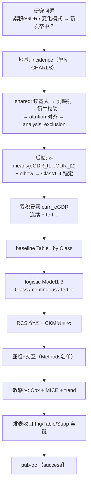

# 分析决策树 — CKM 累积 eGDR × k-means × 新发卒中（CHARLS）

> 对抗阅读：`paper_022` Q1–Q8（labels 均 validate PASS，score 8–10）  
> 地基判定（用户确认 **A**）：**发病 incidence** + 方法后缀 **cum_egdr_kmeans**（3B）  
> 数据：`\\192.168.68.133\02block_result\46_CKM\累计暴露聚类_41654871\data`（主件 `4d_纵向分析宽表_4983.csv`）  
> 文献：Wang et al., Cardiovasc Diabetol 2026;25:78  
> 拟定工程：`Decisiontree` 本文件 → template/config → `run/cum_egdr_kmeans_ckm/` → `Blocks/76_cum_egdr_kmeans_ckm_full/`  
> **状态：已试跑成功（仅 eGDR；串行；文献固定协变量；无 UV/VIF）**  
> 产出：`G:/02block_result/46_CKM/累计暴露聚类_41654871/by_unit/【success】eGDR/`  
> 质控：`reports/pub_qc_2026-09-30_ckm_cum_egdr.md`（WARN）
> 已确认：① 本跑仅 eGDR；② 年龄=**60**；③ cum=**×3**；④ 固定 Model2/3，不做单因素/VIF

---

## 0. 对抗阅读 → 套路约束（chosen 摘要）

| Q | 对套路的硬约束 |
|---|---|
| Q1 | 主亚型 K=4：k-means + elbow/目视拐点；类名解释性；低 eGDR 轨迹=高风险需锚定；三分位组数先验、切点样本依赖 |
| Q2 | 单终点卒中；多重比较压力来自 暴露编码×模型×亚组；原文未报告多重比较校正 |
| Q3 | 主分析 logistic；Cox/MICE=敏感性；勿用 LCA/LCMM 冒充 |
| Q4 | Model1–3 递进呈现；选择机制原文未明示预注册；无 VIF 报告则可选做诊断但不伪造原文有 |
| Q5 | 主报告 OR；CHARLS 复杂抽样但主分析按原文走未加权；CC + MICE(m=5) 敏感 |
| Q6 | 敏感性三角：三分位趋势 / MICE / Cox；RCS 属主分析非线性 |
| Q7 | 方向在已报告口径可对齐；不宣称覆盖竞争风险等未建模局限 |
| Q8 | 用户工程=发病地基+后缀；发表键对齐；数字受 N/标签置换限制；禁 52_LCMM 冒充 |

---

## 1. 总览



---

## 2. 复用 vs 新建

| 能力 | 来源 | 动作 |
|------|------|------|
| 纳排/流程图 | `00_attrition` + 交付标志列 | 复用；人数以本数据口径脚注 |
| 列映射/清洗/插补 | incidence 前缀 | 复用 |
| Table1 / logistic / RCS / 亚组 | `04_baseline` `11_logistic` `15_rcs` `18_subgroup` | 复用 |
| Cox 敏感性 | `10_cox` | 复用为 sensitivity，不改地基 |
| MICE | `03_imputation` | 复用敏感性路径 |
| k-means + elbow + 轨迹面板 Fig2 | **无整包**（`52` 为 LCMM；`48` 为 Kml3D） | **新建** `76_cum_egdr_kmeans_ckm_full` |
| 累积 eGDR 公式/三分位 | 可小函数进 76 或 index 扩展 | 新建/挂接 |

---

## 3. Batch 并行设计（单库 · 对齐发病多指标）

| 层 | 内容 |
|----|------|
| **shared** | 读 4d → 列映射 → 纳排/attrition → analysis_exclusion →（共享衍生） |
| **worker** | **每个复合指标一个 worker**（`index_vars` / fail_policy=continue），类似 `incidence_*_batch` |
| **深度分层** | `eGDR`：完整文献深度（两波 k-means + cum×3 + Class/连续/三分位 + RCS 面板 + 亚组 + Cox/MICE） |
| | 其它可算指标：基线暴露 + logistic Model1–3 + RCS + 亚组 + 敏感性（无两波则不做 k-means 累积） |

指标池草案：`reports/ckm_stroke_composite_index_pool.md`（待你确认名单）。

CLI：`--shared-only` → `--workers N`；Rscript  
`"/mnt/c/Program Files/R/R-4.5.1/bin/x64/Rscript.exe"`。

---

## 4. 发表键对照清单（一个不能少）

### 正文

| 文献 | 产出键 / 说明 |
|------|----------------|
| Fig.1 Flowchart | 纳排图；脚注本数据 N 与原文差 |
| Fig.2A Elbow | WCSS vs k |
| Fig.2B 轨迹均值 | 四类两时点均值 |
| Fig.2C 分布 | 两时点类内分布 |
| Fig.3A–C RCS | 全体 / CKM0–2 / 3–4 |
| Table 1 | 基线按 Class |
| Table 2 | logistic：Class + continuous + tertile，Model1–3 |
| Table 3 | 亚组（Class vs ref） |

### 补充 MOESM1

| 文献 | 产出键 |
|------|--------|
| Table S1 | Cox：Class + cum + tertile |
| Table S2 | Cox 亚组 |
| Table S3 | Cox after MICE |
| Table S4 | logistic after MICE |
| Fig.S1 | RCS（HR 口径，若 Cox） |
| Fig.S2 | 累积 eGDR 亚组（HR） |
| Fig.S3 | 累积 eGDR 亚组（OR） |

四目录：`Figures/{pdf,png,tiff,image_information}`。

---

## 5. 写 config 前门控（确认后执行）

1. 列审阅 skill → `Data/_column_review.md` + `disease_vars`（卒中/CKM 成分泄漏）  
2. 年龄亚组：原文 **60**（与项目默认 65 冲突）→ **需你拍板**  
3. 累积暴露乘子：公式 ×3 vs Table1 均值张力 → 主口径按公式，敏感性可选 ×4  
4. k-means：标准化 / seed / nstart 写入 config（原文未给则固定可复现默认并脚注）  
5. 飞书：base `RBjfb2iwmamW14s4WhKcS7kwnie` + `run/feishu/`

---

## 6. 门控落盘

| 文件 | 内容 |
|------|------|
| `.../Data/_column_review.md` | 列审阅 + disease_vars |
| `reports/disease_age_cutoff_ckm_stroke_charls.md` | 年龄=60 依据 |
| `reports/ckm_stroke_composite_index_pool.md` | 可算指标池 |

## 7. 工程入口（已落地）

| 件 | 路径 |
|----|------|
| 决策树 | `Decisiontree/decision_tree_cum_egdr_kmeans_ckm.md` |
| 模板 | `configs/templates/config_cum_egdr_kmeans_ckm_batch.template.R` |
| 项目 config | `/mnt/g/02block_result/46_CKM/累计暴露聚类_41654871/configs/config_cum_egdr_kmeans_ckm_batch.R` |
| run | `run/cum_egdr_kmeans_ckm/run_cum_egdr_kmeans_ckm_batch.R` |
| Blocks | `Blocks/76_cum_egdr_kmeans_ckm_full/`（01–07） |
| 助手 | `R/literature_ckm_cum_egdr.R` |
| 飞书 | `run/feishu/run_feishu_mark_cum_egdr_kmeans_ckm.R` |

试跑（需你明确说「试跑」后执行）：

```bash
"/mnt/c/Program Files/R/R-4.5.1/bin/x64/Rscript.exe" \
  run/cum_egdr_kmeans_ckm/run_cum_egdr_kmeans_ckm_batch.R \
  --config "/mnt/g/02block_result/46_CKM/累计暴露聚类_41654871/configs/config_cum_egdr_kmeans_ckm_batch.R" \
  --shared-only
```

## 8. 指标名单（已确认）

- 完整深度：`eGDR`
- 基线并行：`TyG`, `AIP`, `CHG`, `NHHR`, `VAI`, `LAP`, `METSIR`, `SHR`
