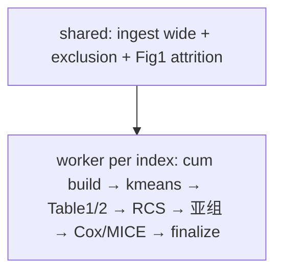

# 分析决策树 — ELSA 累积暴露 k-means × 新发骨质疏松（单库全指标）

> 方法对抗阅读：复用 `paper_022` Q1–Q8（Wang 2026 cum-eGDR×k-means，labels 均 PASS）  
> 课题迁移：用户确认 **仅 ELSA**、丢掉 HRS；**全部双波可算指标全跑**（含 TyG 族事件偏少）  
> 地基：**发病 incidence** + 后缀 **cum_egdr_kmeans**（3A 复用 Blocks/76）  
> 数据：`.../10_osteoporosis/cum_egdr_kmeans_41654871/data/elsa_cum_kmeans_analysis_wide.csv`  
> 波次：W4(2008)=T0 · W6(2012)=T1 风险起点 · W8(2016)=T2 结局；cum×**4**  
> 可行性：`reports/elsa_only_dualwave_index_pool.csv` / `feasibility_hrs_elsa_cum_kmeans.md`  
> **状态：用户授权开跑**

---

## 0. 硬约束（继承 paper_022 + 用户方案）

| 项 | 决定 |
|----|------|
| 队列 | 仅 ELSA 发现；**无外验**（HRS 相邻波血/腰围零重叠） |
| 主暴露 | 连续 cum / 平均；报告每 1 单位 + 每 1 SD |
| 次暴露 | 两波 K-means Class；结局/协变量/ID 不进聚类 |
| K | 仅本库肘部自动选；不按 OP 的 P 值选 K；`force_k=NULL` |
| 协变量 | 固定 Model2/3；不做 UV/VIF |
| 失败策略 | **Table1 暴露组间**（cum×OP）或 **Crude Model1** 不显著 → `【failed】`；Model2/3 不参与成败 |

---

## 1. 指标池（24）

人体测量：BMI, WHtR, WWI, ABSI  
血脂/IR：AIP, TG_HDL_C, NHHR, nonHDL, AIP_WC/BMI/WHtR, RC, eGDR, CMI, VAI  
血糖依赖：TyG 全族, METSIR, SHR, MCMI  

---

## 2. Pipeline

---

## 3. 发表注意

- 无 HRS：不写「双库外验」；可迁移性仅限单库内敏感性  
- Fig1 分母脚注：流程图以 BMI 双波完整为示意；各指标 complete-case N 以 worker 为准  
- Class 参照仍 `Persistent_low`（t1 均值最低类）；骨质疏松语境下低 BMI/低代谢负荷含义与 eGDR 文献不同，表注须写清  
