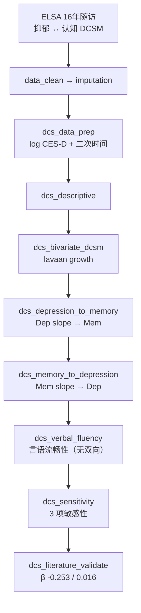

# 分析决策树 — 双向变化分数 / DCSM（Yin 2024 ELSA）

> 配置：`configs/config_dual_change_score_elsa.R`  
> Batch：`configs/config_dual_change_score_elsa_batch.R`  
> 入口：`run/dual_change_score/run_dual_change_score_elsa_batch.R`  
> 并行总入口：`run/study/run_four_target_paper_pipelines_parallel_batch.R`  
> 文献：Yin 2024 *JAMA Network Open* — bivariate dual change score model (DCSM)  
> 飞书：**B25**（结构方程）  
> 文献引擎：`R/literature_dcsm_yin.R`

> 注：已有 `sem_chain_mediation`（Zhu 2025 CHARLS 链式中介，`config_sem_chain_mediation_charls.R`）为另一篇 SEM 文献；本流水线对应 `结构方程.pdf`（Yin DCSM），互不覆盖。

## 研究问题

抑郁症状与记忆是否存在双向变化分数（DCS）关联？言语流畅性是否无显著双向效应？采用 **lavaan growth DCSM**（含二次时间项）估计斜率间耦合。

## 完整流水线（Single）

## Batch 分层

| 层 | Blocks | 说明 |
|----|--------|------|
| **shared** | `data_clean` → `imputation` → `dcs_data_prep` → `dcs_descriptive` | 共享 checkpoint（`shared_ck_alias = dcs_descriptive`） |
| **unit** | 见下表 | 并行 3 路：`Dep_to_Mem` / `Mem_to_Dep` / `Verbal_fluency` |

| Unit | 执行 blocks |
|------|-------------|
| `Dep_to_Mem` | `dcs_bivariate_dcsm` → `dcs_depression_to_memory` → `dcs_sensitivity` → `dcs_literature_validate` |
| `Mem_to_Dep` | `dcs_bivariate_dcsm` → `dcs_memory_to_depression` → `dcs_sensitivity` |
| `Verbal_fluency` | `dcs_verbal_fluency` → `dcs_sensitivity` |

## Block 映射

| Step | Block | 文件 | 主要产出 / 方法 |
|------|-------|------|-----------------|
| 01 | `data_clean` | `Blocks/02_data_clean/` | 清洗后纵向表 |
| 02 | `imputation` | `Blocks/03_imputation/` | 插补后分析集 |
| 03 | `dcs_data_prep` | `68/01block_dcs_data_prep.R` | `log1p(CESD)`、`Time_years`、`Time_sq`、`Age_c` |
| 04 | `dcs_descriptive` | `68/02block_dcs_descriptive.R` | 基线描述与交叉滞后 β |
| 05 | `dcs_bivariate_dcsm` | `68/03block_dcs_bivariate_dcsm.R` | `lavaan::growth` 双变量 DCSM → `Table_DCS_Bivariate.csv` |
| 06 | `dcs_depression_to_memory` | `68/04block_dcs_depression_to_memory.R` | `Table_DCS_Dep_to_Mem.csv` |
| 07 | `dcs_memory_to_depression` | `68/05block_dcs_memory_to_depression.R` | `Table_DCS_Mem_to_Dep.csv` |
| 08 | `dcs_verbal_fluency` | `68/06block_dcs_verbal_fluency.R` | 言语流畅性路径（预期无双向） |
| 09 | `dcs_sensitivity` | `68/07block_dcs_sensitivity.R` | `Table_DCS_Sensitivity.csv`（3 项） |
| 10 | `dcs_literature_validate` | `68/08block_dcs_literature_validate.R` | `Table_DCS_Literature_Validation.csv` |

## 方法要点（阶段二）

| 模块 | 原文对应 | 实现 |
|------|----------|------|
| 抑郁测量 | CES-D | `Dep_log = log1p(CESD_total)` |
| 时间趋势 | 线性 + 二次 | `Time_years`、`Time_sq` |
| 主模型 | Bivariate DCSM | `lavaan::growth`（MLR, FIML）；失败回退 lm 链式 |
| 耦合参数 | 斜率互预测 | `s_cog ~ mem_on_dep*s_dep`；`s_dep ~ cog_on_dep*s_cog` |
| 协变量 | 原文全量 | Age_c, Sex, Education, Wealth, Limiting_illness, Self_rated_health, Smoking, Alcohol, Physical_activity |
| 敏感性 | 3 项 | 排除卒中痴呆、完整病例、替代抑郁切点 |

## 原文对照（`literature_targets`）

| 指标 | 原文目标 | tol |
|------|----------|-----|
| Dep change → Mem change | -0.253 | 15% |
| Mem change → Dep change | 0.016 | 15% |
| Baseline dep → memory | -0.018 | 15% |
| Baseline dep → fluency | -0.009 | 15% |

## Smoke 数据

- `Data/smoke/D01_dual_change_score_elsa.RData`（`DualChangeELSA`）
- 生成：`scripts/create_smoke_four_target_paper_pipelines_data.R`

## 已知局限

- lavaan growth 为 DCSM 近似，非 Mplus 完整二次 DCSM  
- Smoke 小样本下常回退 lm 链式，耦合 β 与原文有偏差  
- 真实 ELSA 数据接入后需重跑 `dcs_bivariate_dcsm` 与 validate
