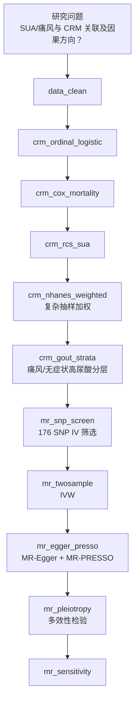

# 分析决策树 — 双库发病 + 孟德尔随机化（SUA/CRM）

> 配置：`configs/config_dual_incidence_mr_crm.R`  
> Batch：`run/dual_incidence_mr/run_dual_incidence_mr_crm_batch.R`  
> 文献：Han 2025 *JAHA* (paper_013)

## 完整流水线

## Block 映射（57）

| Step | Block | 说明 |
|------|-------|------|
| 01 | `crm_ordinal_logistic` | 有序 Logistic（CRM） |
| 02 | `crm_cox_mortality` | 全因死亡 Cox |
| 03 | `crm_rcs_sua` | SUA 剂量反应 RCS |
| 04 | `mr_twosample` | 两样本 IVW MR |
| 05 | `mr_sensitivity` | MR 敏感性 |
| 06 | `mr_snp_screen` | F>10、eaf、Top-176 SNP |
| 07 | `mr_egger_presso` | Egger / PRESSO（Python） |
| 08 | `mr_pleiotropy` | 多效性 Cochran Q 等 |
| 09 | `crm_nhanes_weighted` | NHANES svyolr 加权 |
| 10 | `crm_gout_strata` | 痛风 vs 无症状高尿酸 |

## 飞书

- 工作计划编号：**B13**
- `workplan_code = "B13"`
