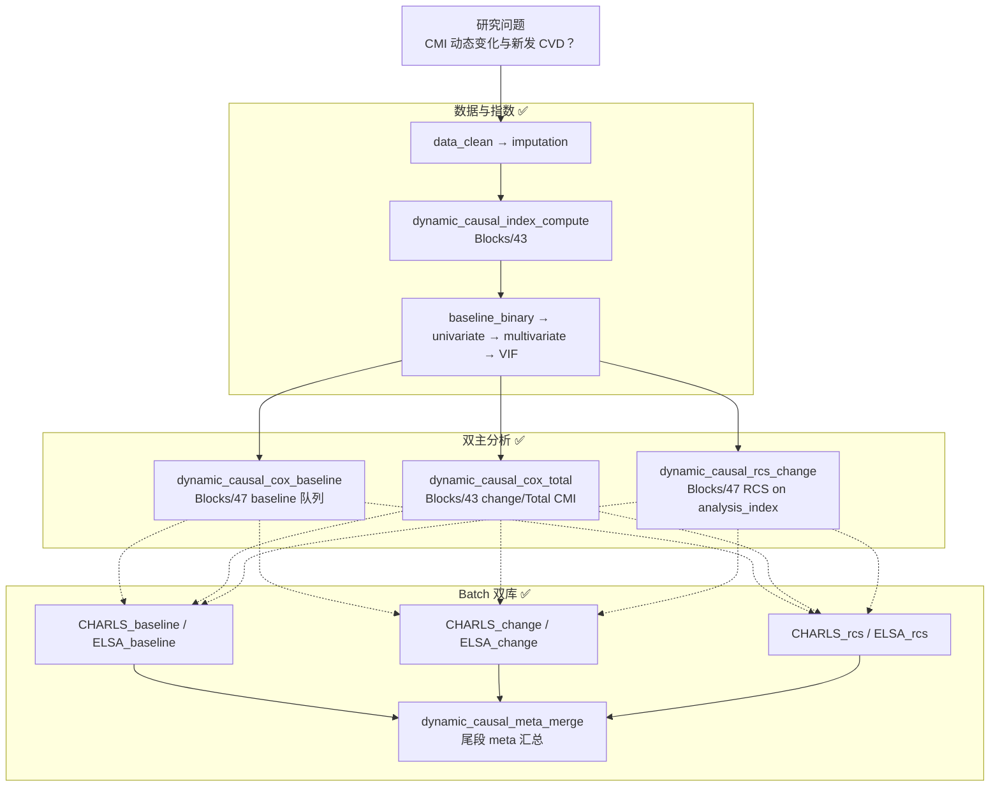

# 分析决策树 — 动态因果（CMI 基线+变化 × 新发 CVD，CHARLS+ELSA）

> 配置：`configs/config_dynamic_causal_dual.R`  
> 运行：`run/dynamic_causal/run_dynamic_causal_dual.R`  
> Batch：`run/dynamic_causal/run_dynamic_causal_dual_batch.R`  
> 文献：Li 2025 *American Journal of Preventive Cardiology* 101046

## 研究设定

| 项 | 值 |
|---|---|
| CMI 公式 | (TG/HDL) × (WC/Height) |
| 暴露 A | **Baseline CMI** 三分位 Cox（原文 CHARLS n≈8059） |
| 暴露 B | **Total CMI** = baseline + wave2（变化队列，n≈4946） |
| 结局 | `CVD_event` + `futime` |
| RCS | CHARLS 非线性（nk 3–4）；ELSA 近似线性（nk=3） |
| 双库 | 分队列 Cox → **meta 合并**（固定/随机效应摘要） |

## 完整流水线

## Block 映射

| Step | Block | 文件夹 | 状态 |
|------|-------|--------|------|
| 1 | `dynamic_causal_index_compute` | `Blocks/43_dynamic_causal/` | ✅ |
| 2 | `dynamic_causal_cox_baseline` | `Blocks/47_dynamic_causal_full/` | ✅ |
| 3 | `dynamic_causal_cox_total` | `Blocks/43_dynamic_causal/` | ✅ |
| 4 | `dynamic_causal_rcs_change` | `Blocks/47_dynamic_causal_full/` | ✅ |
| 5 | `dynamic_causal_meta_merge` | `Blocks/47_dynamic_causal_full/` | ✅ |

## 配置要点

| 键 | 说明 |
|----|------|
| `dynamic_causal$analysis_type` | `baseline` / `change`（单跑两套均执行；batch worker 按 unit 切换） |
| `dynamic_causal$change_sample_frac` | smoke 模拟 change 子样本比例（≈4946/8059） |
| `rcs_prognosis$nk_range` | CHARLS 3–4；ELSA batch unit 强制 nk=3 |
| `study_batch$run_meta_after` | batch 结束后自动跑 meta 尾段 |

## 飞书

- 工作计划编号：**B12**
- `workplan_code = "B12"`

## 与原文差距

- Smoke 数据为合并长表 + 子抽样，非真实 CHARLS/ELSA 原始样本量。
- Meta 为各 unit Cox 表逆方差加权摘要，非 `meta` 包完整森林图流程。
- RCS 接 `rcs_prognosis` 块逻辑，ELSA 线性假设通过 knot 数简化体现。
