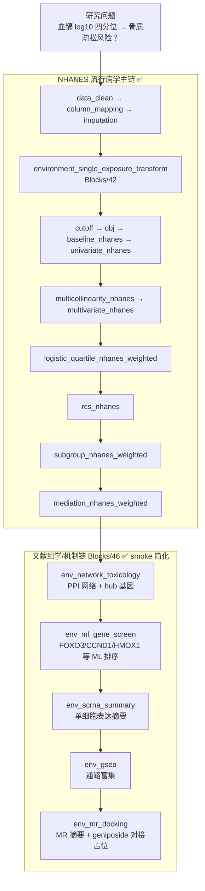

# 分析决策树 — 单环境毒物（血镉 × 骨质疏松，NHANES）

> 配置：`configs/config_environment_cd_osteo_nhanes.R`  
> 运行：`run/environment/run_environment_cd_osteo_nhanes.R`  
> Batch：`run/environment/run_environment_cd_osteo_batch.R`  
> 文献：Li 2025 *Ecotoxicology and Environmental Safety* 118502（镉暴露 × 骨质疏松）

## 研究设定

| 项 | 值 |
|---|---|
| 暴露 | 血镉 `Blood_Cadmium` → log10 四分位 |
| 结局 | `Group`（Osteoporosis / No_Osteoporosis） |
| 数据库 | NHANES 复杂抽样加权 |
| 主分析 | 加权 logistic 四分位 + RCS + 亚组 + 中介（CRP/白蛋白） |
| 生信扩展 | 网络毒理、ML 基因筛选、scRNA、GSEA、MR+分子对接（geniposide） |

## 完整流水线

## Block 映射

| Step | Block | 文件夹 | 状态 |
|------|-------|--------|------|
| 1 | `environment_single_exposure_transform` | `Blocks/42_environment_single/` | ✅ |
| 2–9 | NHANES 发病标准链 | `Blocks/04–20/` | ✅ |
| 10 | `env_network_toxicology` | `Blocks/46_environment_omics/` | ✅ smoke |
| 11 | `env_ml_gene_screen` | `Blocks/46_environment_omics/` | ✅ smoke |
| 12 | `env_scrna_summary` | `Blocks/46_environment_omics/` | ✅ smoke |
| 13 | `env_gsea` | `Blocks/46_environment_omics/` | ✅ smoke |
| 14 | `env_mr_docking` | `Blocks/46_environment_omics/` | ✅ smoke |

## 实现说明

| 模块 | 实现方式 | 与原文差距 |
|------|----------|------------|
| 网络毒理学 | Python `networkx` 构建基因互作网络 | 非 STRING/Cytoscape 全链 |
| ML 筛基因 | `sklearn` 特征重要性 / RF | 非原文完整 LASSO+多算法投票 |
| scRNA-seq | 细胞类型×基因汇总表 | 非 Seurat 全流程 |
| GSEA | 排序基因列表富集 | 可选 `gseapy`，缺省简化通路 |
| MR/对接 | 效应量摘要 + 对接占位 JSON | 非 TwoSampleMR / AutoDock 正式跑 |

## 辅助数据

- Smoke：`Data/smoke/D02_env_cd_gene_expr.csv`、`D02_env_cd_scrna.csv`、`D02_env_cd_gsea_rank.csv`
- Python：`python/block_literature_extensions.py`（经 `R/python_literature.R` 调用）
