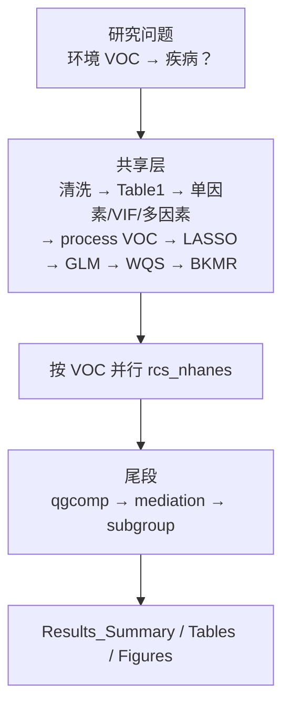

# 分析决策树 — 环境暴露 VOC 批量（environment VOC batch）

> 程序员接口：`medical-blocks-studies`（5006 默认；5003 追加）  
> 运行入口：`run/environment/run_environment_dkd_batch.R`  
> 模板：`configs/templates/config_environment_dkd_batch.template.R`  
> 本文件即环境暴露套路唯一标准决策树（一套路一份）。

## 研究设定

| 项 | 值 |
|---|---|
| 数据 | NHANES 临床 + 尿 VOC（`Data/nhanes/`） |
| 结局 | `Group` 二分类 |
| 暴露 | VOC 混合物（LASSO/GLM/WQS/BKMR）+ 每 VOC 并行 RCS |
| 架构 | **共享层 → VOC 并行 RCS → 尾段 qgcomp/中介/亚组** |

---

## 总览



---

## 共享层（跑 1 次）

| 阶段 | Blocks |
|------|--------|
| 临床筛选 | `data_clean` → `column_mapping` → `imputation` → `obj` → `baseline_nhanes` → `univariate_nhanes` → `multicollinearity_nhanes_screen` → `multivariate_nhanes` → `multicollinearity_nhanes_final` |
| 环境主分析 | `process_environment_data` → `remove_outliers` → `lasso_environment_voc` → `glm_environment_quartile` → `wqs_environment` → `bkmr_fit` → `bkmr_analysis` → `environment_characteristics` → `voc_correlation` |

（部分研究在共享层前还有 `prepare_environment_dkd_data` / LOD / log / clinical_gate / corrplot，见详细决策树。）

---

## VOC 并行层

`pipeline_voc_batch`：每个入选 VOC 跑 `rcs_nhanes`（加权 RCS）。

CLI：`--only-voc BMA,DHBMA` / `--rcs-only`

---

## 尾段

| Block | 说明 |
|-------|------|
| `qgcomp_environment` | Quantile g-computation |
| `mediation_ers_environment` | ERS 中介 |
| `subgroup_environment_or` | Gender / Race / PIR / Smoking 等分层 |

CLI：`--tail-only`（需共享层 + BKMR 检查点已在）

---

## 程序员常用命令

```bat
run_study.bat <研究名> --shared-only
run_study.bat <研究名> --workers auto
run_study.bat <研究名> --only-voc BMA,DHBMA
run_study.bat <研究名> --tail-only
run_study.bat <研究名> --no-skip
```

识别特征：config 含 `voc_col_pattern` / `environment_batch` → 自动 `--routine environment`。

**红线**：亚组 `strata_levels` 必须与数据因子水平完全一致；中介 `AUR` 应为 Albumin/Uric 比，勿与协变量尿酸共线。
