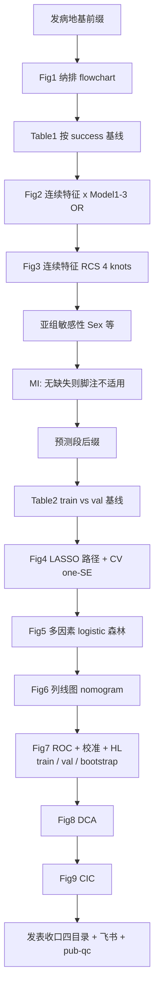

# 分析决策树 — 胆结石碎石成功列线图（gallstone nomogram）

> 文献方法：Chen et al. JAD 2026（DOI 10.1177/13872877261424471）  
> 对抗阅读：`paper_024`（Q1 PASS；Q2–Q8 进行中）  
> 地基：**发病 incidence** + 后缀 **临床预测列线图** → 路径 **3B**  
> 数据：`\\192.168.68.133\02block_result\45_Gallstone\Nomogram_\data`（n=273）  
> 结局：`success`（1=碎石成功，0=否）  
> 用户锁定：无固定复合指标；全部特征进候选池；外验改为 **仅内部 + bootstrap**；Fig2/3 对 **全部连续特征** 出关联/RCS  

**用户已确认（2026-09-30）。已落地 template / 项目 config / Blocks/77 / run / 飞书登记脚本。试跑需再确认。**

---

## 0. 研究设定（已确认）

| 项 | 值 |
|---|---|
| 地基 | 发病（logistic / OR / AUC） |
| 结局 | `success` |
| 暴露策略 | **无固定指数**；关联段逐连续特征；预测段全特征进 LASSO |
| 连续特征（关联+RCS） | `Age, diameter_cm, volume_cm3, ct_min, ct_max, pct_lt40, pct_40_80, pct_gt80, energy_j, shots` |
| 分类特征（基线/亚组/LASSO 候选） | `Sex, shape, color, surface, stone_type` |
| 划分 | 7:3 分层 train/internal val（`train_validation`） |
| 外验 | **不做外库**；Fig7–9 外验面板 → **bootstrap 内部稳健** |
| 并行 | batch：`--shared-only` → workers（按连续特征 job 或单 worker 全链） |

---

## 1. 总流程（两段骨架，对齐文献 Results 顺序）



### Model1–3（关联段 Fig2）— 协变量 = **Age 强制 + 单因素显著**

| 模型 | 校正 |
|---|---|
| Model 1 | **Age 强制**（死规则；不论单因素是否显著）+ 当前连续暴露 |
| Model 2 | Age ∪（人口学候选中 UV→Success 显著，如 Sex） |
| Model 3 | Age ∪（候选池中 UV 显著；剔除当前暴露） |

> 实现：`gallstone_uv_covariate_screen`（shared）→ 写 `Table_UV_covariate_screen.csv` 并回写 `force_model1`/`model2`/`model3`。  
> α 默认 0.05（`gallstone_nomogram$uv_alpha`）。  
> 暴露=Age 时 drop_self 剔除自身，Model1 退化为粗模型。

---

## 2. Block 复用 vs 新建

### ✅ 直接复用（不改旧行为）

| 步骤 | register_block | 路径 |
|---|---|---|
| 纳排记账/流程图骨架 | `attrition` / flowchart | `Blocks/00_attrition/01block_attrition_flowchart.R` |
| 清洗 | `data_clean` | `Blocks/02_data_clean/` |
| 列映射 | `column_mapping` | `Blocks/01_column_mappings/` |
| 疾病列排除门控 | `analysis_exclusion` | `Blocks/03_imputation/03block_analysis_exclusion.R` |
| 插补（本数据无缺失：可 enable 记日志） | `imputation` | `Blocks/03_imputation/` |
| Table1 按结局 | `baseline_binary` | `Blocks/04_baseline/01block_baseline_binary.R` |
| 单因素 | `univariate_incidence_binary` | `Blocks/06_univariate/02block_…` |
| VIF | `multicollinearity` / screen/final | `Blocks/08_vif/` |
| 二分类 logistic（分变量当「指标」循环） | `logistic_binary_glm` | `Blocks/11_logistic/04block_…` |
| RCS | `rcs`（incidence） | `Blocks/15_rcs/02block_rcs_incidence.R` |
| 亚组森林 | `subgroup_incidence` | `Blocks/18_subgroup/02block_…` |
| 7:3 划分 + Table2 风格基线 | `train_validation` | `Blocks/21_train_validation/` |
| LASSO 特征选择 | `feature_selection_lasso` | `Blocks/19_feature_selection/01block_…` |
| 多因素发病 | `multivariate_incidence_binary` | `Blocks/07_multivariate/02block_…` |
| ROC（单模型） | `simple_ROC` | `Blocks/13_roc/02block_…` |
| ROC/校准/DCA 面板 | `performance_ml`（需挂在预测模型结果后） | `Blocks/23_ml_performance/` |
| 动态列线图（可选网页） | `shiny_dynnom` | `Blocks/25_shiny/01block_shiny_dynnom.R` |
| 发表图四目录 | `export_pub_figures` | `R/pub_figure_export.R` |

**关联段并行思路**：把每个连续特征当成一个 batch「指标」job（复用发病 dual-batch 的 index loop 机制），共享层只跑一次清洗/插补。

### ⚠️ 复用但需 config / 薄适配（不改旧课题默认）

| 项 | 说明 |
|---|---|
| `feature_selection_lasso` | 现有偏「重复 CV + 频次截断」；文献要 **单次 10-fold + λ.1se（one-SE）** 与 Fig4 双面板。优先 **config 参数对齐**；不够则在 77 加薄包装，**禁止改坏旧 ML 课题默认** |
| `logistic_binary_glm` + `rcs` | 面向复合指数；本课题用 batch 循环「假指数=连续列名」复用 |
| `performance_ml` | 面向多 ML 模型；列线图单模型可用，但 Fig7 六宫格布局可能要 77 重排 |
| `73` 内 `rms::nomogram` | **逻辑可抄**，不可挂 NAFLD 课题 block 名；抽到 77 通用 |

### ❌ 库内缺口 → 拟新建 `Blocks/77_gallstone_nomogram_full/`（接着 76）

| 新 block（建议名） | 对应文献 | 为何不能只抄旧块 |
|---|---|---|
| `gallstone_data_ingest` | 读 xlsx + Sheet2 词典对齐列名 | 单库临床 xlsx，非 MIMIC dabiao |
| `nomogram_assoc_or_panels` | Fig2 多连续特征×Model1–3 拼图 | 现有 logistic 出表不出文献 Fig2 多面板森林 |
| `nomogram_rcs_multi_panels` | Fig3 多特征 RCS 拼图 | `rcs_incidence` 单指标；需多面板汇总 |
| `nomogram_lasso_onese_panels` | Fig4 路径+one-SE | 文献口径与现有 LASSO 发表图不一致时补 |
| `nomogram_mv_forest` | Fig5 | 可用 multivariate 表，需文献风森林图 |
| `nomogram_rms_plot` | Fig6 | 从 73 抽通用 `rms::lrm`+`nomogram` |
| `nomogram_roc_cal_boot` | Fig7 | train/val + **bootstrap 替代外验**；HL + loess 校准 |
| `nomogram_dca_cic` | Fig8–9 | DCA 可部分借 performance_ml；**CIC 库内无独立发表块** |
| `nomogram_pub_finalize` | 四目录 + 图/表键对齐清单 | 课题收口 |
| （run）`run/gallstone_nomogram/` | batch + worker + 飞书 | 新 routine |

**明确不做 / 降级**

- CHARLS 式外验面板 → 改为 bootstrap（用户已确认）  
- 原文 NHANES 权重 `svyglm` → 本数据无复杂抽样，不用  
- 原文 MI m=5 → 本数据无缺失，脚注「complete-case；MI N/A」  

---

## 3. 建议 pipeline 顺序（确认后落 config）

```text
# shared
gallstone_data_ingest → data_clean → column_mapping → analysis_exclusion
→ imputation(passthrough/ok) → attrition_flowchart

# arm A association（可按连续特征 parallel workers）
baseline_binary
→ univariate_incidence_binary → multicollinearity
→ logistic_binary_glm (Model1–3) → rcs
→ subgroup_incidence
→ nomogram_assoc_or_panels → nomogram_rcs_multi_panels

# arm B prediction（单次）
train_validation (7:3)
→ feature_selection_lasso (+ ones e 适配)
→ multivariate_incidence_binary
→ nomogram_rms_plot
→ nomogram_roc_cal_boot → nomogram_dca_cic
→ nomogram_pub_finalize
```

---

## 4. 发表键对照（文献一个不漏）

| 文献 | 本课题产出键 |
|---|---|
| Fig1 | Flowchart |
| Table1 | baseline_binary by success |
| Fig2 | 连续特征 Model1–3 OR 面板 |
| Fig3 | 连续特征 RCS 面板 |
| Supp 亚组 | Sex 等 subgroup |
| Table2 | train_validation 基线 |
| Fig4 | LASSO |
| Fig5 | 多因素森林 |
| Fig6 | 列线图 |
| Fig7 A–F | ROC+校准（train/val/**bootstrap**） |
| Fig8 A–C | DCA（train/val/bootstrap） |
| Fig9 A–C | CIC（同上） |

---

## 5. 请你确认（确认后才写代码）

- [x] 总流程两段骨架 OK  
- [x] 复用清单 / `77_*` 新建清单 OK  
- [x] 关联 Model1–3 协变量来源 = **单因素显著**（`gallstone_uv_covariate_screen`）OK
- [x] Model1=**Age 强制**；Model2=Age∪UV显著人口学；Model3=Age∪UV显著候选池 OK  
- [x] 亚组至少含 Sex；Age 切点 65（无病种特异文献，默认）  
- [x] 飞书 base：`RBjfb2iwmamW14s4WhKcS7kwnie`  

### 发表图号铁律（2026-09-30 重锁）

| 目录 | 保留图 |
|---|---|
| `by_index/【success】NOMOGRAM/` | **唯一预测套**：Fig1, Fig4–9 |
| 各连续特征 `【success】<feat>/` | **仅** Fig2 Associations / Fig3 RCS / Fig S Subgroup |
| `config$pub$renumber` | **FALSE**（禁止缺号顺延） |

重锁脚本：`run/gallstone_nomogram/relock_figures_lit_numbering.R`
