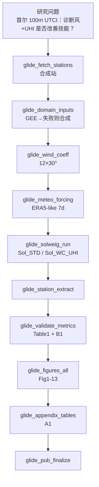

# 分析决策树 — GLIDE-SOL 首尔 100 m CPU smoke（可选 GEE）

> 配置：`configs/config_glide_sol_seoul.R`  
> 运行：`run/environment/run_glide_sol_seoul.R`  
> 文献：Zonato et al. 2026 *Geosci. Model Dev.*（GLIDE-SOL / SOLWEIG-GPU）  
> Blocks：`Blocks/74_glide_sol_full/`  
> Python：`python/block_glide_sol.py`

## 研究设定

| 项 | 值 |
|---|---|
| 城市 | Seoul |
| 分辨率 | 100 m（非原文 2 m） |
| 后端 | CPU diagnostic（非 CUDA SOLWEIG-GPU） |
| 站点 | 合成站 |
| 强迫 | ERA5-like 合成（7 天）；域输入可 GEE |
| 双配置 | Sol_STD vs Sol_WC_UHI |
| 图表 | Fig 1–13；Table 1 / A1 / B1 |
| mirror_pub | FALSE |

## 完整流水线



## Block 映射

| Step | Block | 状态 |
|------|-------|------|
| 01 | `glide_fetch_stations` | ✅ |
| 02 | `glide_domain_inputs` | ✅ GEE 可选 |
| 03 | `glide_wind_coeff` | ✅ |
| 04 | `glide_meteo_forcing` | ✅ |
| 05 | `glide_solweig_run` | ✅ CPU |
| 06 | `glide_station_extract` | ✅ |
| 07 | `glide_validate_metrics` | ✅ |
| 08 | `glide_figures_all` | ✅ |
| 09 | `glide_appendix_tables` | ✅ |
| 10 | `glide_pub_finalize` | ✅ |

## GEE

1. `pip install earthengine-api`（`.venv_ml_pub`）  
2. `earthengine authenticate`（浏览器登录；**勿把密码写入仓库**）  
3. 在 config 填 `glide_sol$gee$project`（GCP 项目 ID）并 `enable=TRUE`  
4. 未认证时自动 **synthetic domain** 回退

## 与原文差距

| 模块 | 本复现 | 原文 |
|------|--------|------|
| 辐射引擎 | CPU 诊断近似 | SOLWEIG-GPU |
| 分辨率 | 100 m | 2 m |
| 城市 | Seoul | Dortmund |
| 验证站 | 合成 | D2R 25 站 |
| 图表编号 | 全覆盖 | Fig1–13 / T1 A1 B1 |

## 常用命令

```bash
cd /mnt/e/01block/01Block-new-Final
export PYTHON=/mnt/e/01block/01Block-new-Final/.venv_ml_pub/bin/python
Rscript run/environment/run_glide_sol_seoul.R
# 或仅 Python smoke：
$PYTHON python/block_glide_sol.py --mode run_all --out-dir Output/GLIDE_SOL_Seoul_100m --gee
```
