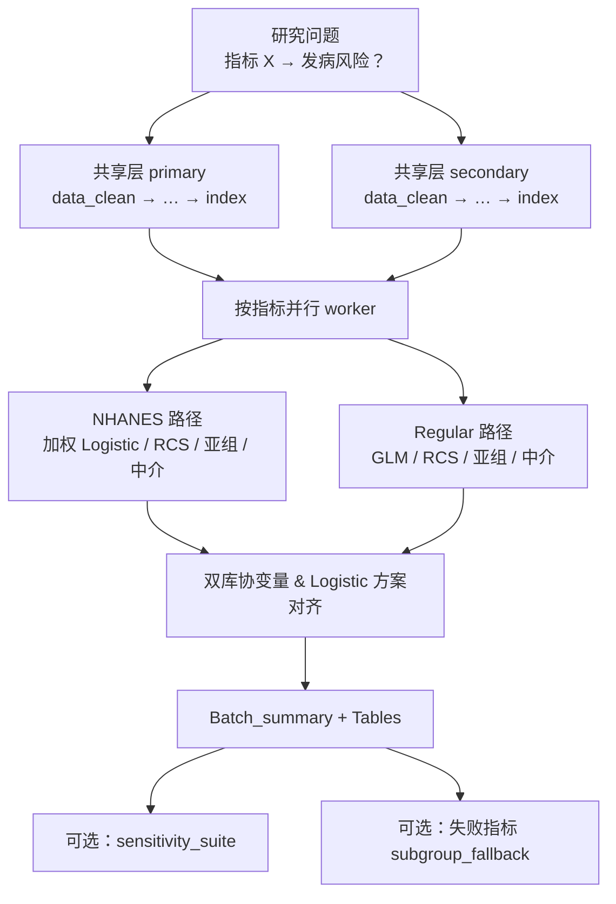

# 分析决策树 — 双库发病批量（incidence dual batch）

> 程序员接口：`medical-blocks-studies`（5001）  
> 运行入口：`run/incidence/run_incidence_dual_batch.R`  
> 薄 config 构建：`configs/study_interface/incidence_dual_batch_build.R`  
> 模板：`configs/templates/config_incidence_dual_batch.template.R`  
> 常用库对：eICU/MIMIC 或 NHANES/MIMIC（由 `dual_db` 决定）

## 研究设定

| 项 | 值 |
|---|---|
| 研究类型 | `project$study_type = "incidence"` |
| 结局 | 二分类（病例 / 对照） |
| 暴露 | 炎症/复合指标（`index` 批量，每指标一 worker） |
| 架构 | **共享层（每库 1 次）→ 指标层（并行）→ 汇总 / 敏感性 / 亚组补救** |

---

## 总览



---

## 共享层（每库各跑 1 次）

| Step | Block | 说明 |
|------|-------|------|
| 01 | `data_clean` | 缺失阈值、可选年龄过滤 |
| 02 | `column_mapping` | 库类型列名映射 |
| 03 | `dual_db_column_harmonize` | 双库列对齐 |
| 04 | `index` | 计算/筛选指标池 |

检查点：`checkpoints/_shared/<库名>/`

CLI：`run_study.bat <研究> --shared-only`

---

## 指标层 — NHANES（`pipeline_nhanes_batch`）


关键块：`univariate_nhanes` → `multicollinearity_nhanes_*` → `logistic_*_nhanes_weighted` → `rcs_nhanes` → `subgroup_nhanes_weighted` → `mediation_nhanes_weighted`

---

## 指标层 — Regular / MIMIC（`pipeline_regular_batch`）

| 阶段 | Blocks |
|------|--------|
| 准备 | `imputation` → `baseline_binary` → `simple_ROC` → `boxplot` | 基线；**不挂** `trim_index_extreme` |
| 协变量 | `univariate_incidence_binary` → `multicollinearity_screen` → `multivariate_incidence_binary` → `…_final` → `dual_db_covariate_harmonize` |
| 主分析 | `logistic_*_glm` → 方案对齐 → `rcs_incidence` → RCS 后 Logistic |
| 扩展 | `subgroup_incidence` → `mediation_incidence` |

---

## 闸门与补救（勿与主亚组混淆）

| 能力 | 配置键 | 用途 |
|------|--------|------|
| Logistic 闸门 | `logistic_gate` | 分离或不显著则降阶：**四分位→三分位→二分位→五分位** |
| 敏感性 | `incidence_batch$sensitivity_suite` | 主分析 **成功** 后轻量：插补后删人，只重跑 Table 1/2；场景 = Table 1 Yes/No（两库 Yes>50）+ 年龄分层；目录 `【success】`/`【failed】`；表 S12/S13 |
| 亚组补救 | `incidence_batch$subgroup_fallback` | 主分析 **失败** 指标换过滤队列重试 |

详见研究区 `docs/reference.md`（若有）或引擎 `skills/deploy-programmer-interface/reference.md`。

---

## 程序员常用命令

```bat
run_study.bat <研究名> --shared-only
run_study.bat <研究名> --workers 4
run_study.bat <研究名> --workers 4 --only-index NLR,SII
run_study.bat <研究名> --sensitivity-only
run_study.bat <研究名> --subgroup-fallback-only
```

产出：`by_index/<指标>/`、`Tables/Batch_summary_all_indices.csv`
