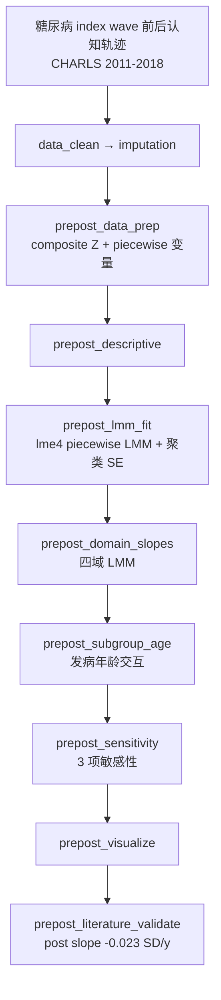

# 分析决策树 — 发病前后认知比较（Chen 2024 CHARLS）

> 配置：`configs/config_incidence_prepost_charls.R`  
> Batch：`configs/config_incidence_prepost_charls_batch.R`  
> 入口：`run/incidence_prepost/run_incidence_prepost_charls_batch.R`  
> 并行总入口：`run/study/run_four_target_paper_pipelines_parallel_batch.R`  
> 文献：Chen 2024 *Neurology* — cognitive trajectories before and after diabetes onset  
> 飞书：**B18**  
> 文献引擎：`R/literature_prepost_chen.R`

## 研究问题

新发糖尿病前后，全局认知与各认知域斜率是否加速下降？发病年龄是否修饰发病后认知衰退？参照组为**无糖尿病组**（`diabetes_grp = 0`），发病组以 **piecewise 时间**（`diabetes_years` / `diabetes_years_after`）刻画发病前后斜率变化。

## 完整流水线（Single）

## Batch 分层

| 层 | Blocks | 说明 |
|----|--------|------|
| **shared** | `data_clean` → `imputation` → `prepost_data_prep` → `prepost_descriptive` | 全样本共享 checkpoint（`shared_ck_alias = prepost_descriptive`） |
| **unit** | 见下表 | 并行 4 路：`Global` / `Episodic_memory` / `Visuospatial` / `Attention_calc` |

| Unit | 执行 blocks |
|------|-------------|
| `Global` | `prepost_lmm_fit` → `prepost_domain_slopes` → `prepost_subgroup_age` → `prepost_sensitivity` → `prepost_visualize` → `prepost_literature_validate` |
| `Episodic_memory` | `prepost_domain_slopes` → `prepost_subgroup_age` |
| `Visuospatial` | `prepost_domain_slopes` → `prepost_subgroup_age` |
| `Attention_calc` | `prepost_domain_slopes` |

## Block 映射

| Step | Block | 文件 | 主要产出 / 方法 |
|------|-------|------|-----------------|
| 01 | `data_clean` | `Blocks/02_data_clean/` | 清洗后宽表 |
| 02 | `imputation` | `Blocks/03_imputation/` | 插补后分析集 |
| 03 | `prepost_data_prep` | `65/01block_prepost_data_prep.R` | composite Z、piecewise 时间变量 → `PrePost_long_ready.csv` |
| 04 | `prepost_descriptive` | `65/02block_prepost_descriptive.R` | 基线描述 |
| 05 | `prepost_lmm_fit` | `65/03block_prepost_lmm_fit.R` | `Table_PrePost_LMM_Global.csv`、`Table_PrePost_Predicted_Trajectory.csv` |
| 06 | `prepost_domain_slopes` | `65/04block_prepost_domain_slopes.R` | `Table_PrePost_Domain_Slopes.csv` |
| 07 | `prepost_subgroup_age` | `65/05block_prepost_subgroup_age.R` | `Table_PrePost_Age_Subgroup.csv` |
| 08 | `prepost_sensitivity` | `65/06block_prepost_sensitivity.R` | `Table_PrePost_Sensitivity.csv`（3 项） |
| 09 | `prepost_visualize` | `65/07block_prepost_visualize.R` | 轨迹图 |
| 10 | `prepost_literature_validate` | `65/08block_prepost_literature_validate.R` | `Table_PrePost_Literature_Validation.csv` |

## 方法要点（阶段二）

| 模块 | 原文对应 | 实现 |
|------|----------|------|
| Composite 认知 | 四域 Z 后平均 | `prepost_chen_build_composite()`：情景/视空间/定向/注意计算 |
| 标准化 | 基线波次 Z-score | `prepost_chen_zscore_baseline()`，参照无糖尿病组 |
| 主模型 | Piecewise LMM | `Global_cognition_z ~ diabetes_grp + time + diabetes_years + diabetes_years_after + covariates + (1+time+diabetes_years_after\|ID)` |
| SE | 个体聚类 | `lme4::lmer`；失败回退 `lm` + `sandwich::vcovCL` |
| 协变量 | Table 2 全量 | Age, Sex, Education, Marital_status, Residential_area, Smoking, Drinking, IADL_score, Hypertension, Hypercholesterol, Lung_disease, Heart_problem, Cancer, Depressive_symptoms |
| 敏感性 | 原文 3 项 | 糖尿病前期 vs 对照 0–2y；wave1–4 delta；主 piecewise LMM |

## 原文对照（`literature_targets`）

| 指标 | 原文目标 | tol |
|------|----------|-----|
| Global post-onset slope | -0.023 SD/y | 60% |
| Visuospatial post slope | -0.036 | 60% |
| Episodic post slope | -0.018 | 60% |
| Attention post slope | -0.017 | 60% |

## Smoke 数据

- `Data/smoke/D01_incidence_prepost_charls.RData`（`PrePostCHARLS`）
- 生成：`scripts/create_smoke_four_target_paper_pipelines_data.R`

## 已知局限

- 随机效应结构与原文 Table 2 交互项未逐系数一一对应  
- Smoke 下斜率为模拟校准，真实 CHARLS 需重跑 validate  
- 真实数据路径待接入（当前 smoke / 用户自有 RData）
