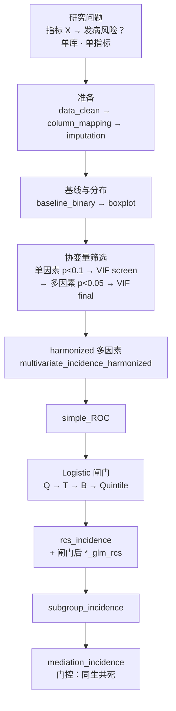
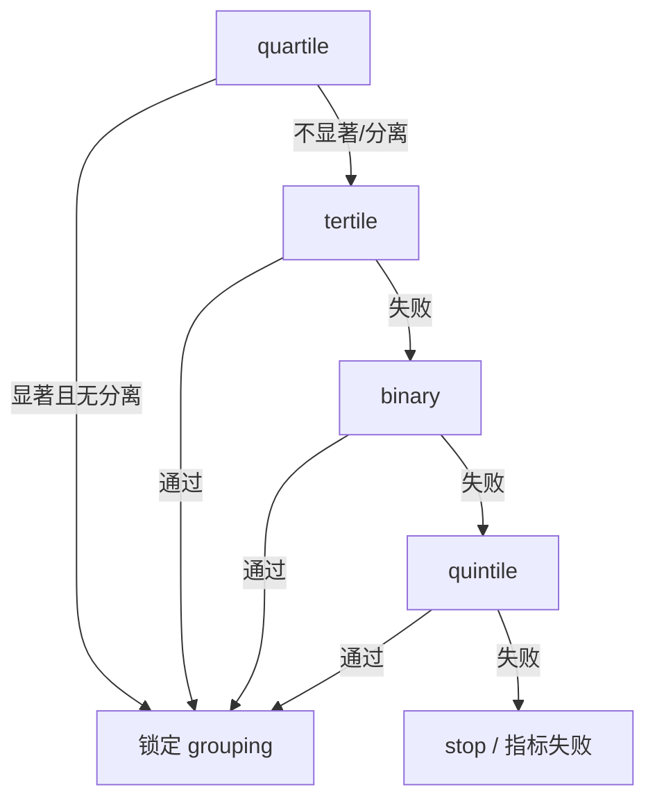

# 分析决策树 — 单库发病（incidence single）

> 运行入口：`run/incidence/run_incidence_single.R`
> 模板：`configs/templates/config_incidence_single.template.R`
> 架构：`dual_db$enable = FALSE`；**无**共享层并行、**无** `by_index` 批量 worker
> 对照母版：双库批量见 `decision_tree_incidence_dual_batch.md`

## 研究设定

| 项       | 值                                                                      |
| -------- | ----------------------------------------------------------------------- |
| 研究类型 | `project$study_type = "incidence"`                                    |
| 结局     | 二分类（`outcome_column` / `Disease`）                              |
| 暴露     | 单一复合指标（`incidence$index_var` / `logistic$index_var`）        |
| 模型     | Logistic GLM（非调查加权；NHANES 加权请走`config_incidence_nhanes*`） |
| 架构     | **单库顺序流水线** → `run_pipeline`                            |

---

## 总览



---

## 阶段一：数据准备

| Step | Block              | 说明                                     |
| ---- | ------------------ | ---------------------------------------- |
| 01   | `data_clean`     | 缺失阈值、可选年龄过滤、`drop_columns` |
| 02   | `column_mapping` | 按`database_type` 列名映射             |
| 03   | `imputation`     | MICE（默认 cart）；Table S1 / 缺失图     |

检查点：`pipeline$checkpoint$dir`（模板示例 `checkpoints/D05_…`）

CLI：

```bash
Rscript run/incidence/run_incidence_single.R --config "<config.R>" --from data_clean --to imputation
```

---

## 阶段二：基线与箱线图

| Block               | 产出要点                            |
| ------------------- | ----------------------------------- |
| `baseline_binary` | Table 1；可`pause_on_table1_fail` |
| `boxplot`         | 暴露/协变量按结局组分面             |

> 单库模板**默认不挂** `index` / `analysis_exclusion` / `attrition_flowchart`。新课题应按铁律补挂：`index` → **`analysis_exclusion`** → `imputation`…，并配置 `disease_vars`（见 workspace rule `disease_component_hard_exclusion`）。

---

## 阶段三：协变量筛选链


规则摘要：

1. 单因素 `p < 0.1` 入屏
2. VIF screen（人体测量可自动消解 Weight/Height 优先于 BMI）
3. 多因素 `p < 0.05` → 写 `Model*Factors`
4. VIF final → harmonized 表（单库无双库对齐，块仍保留兼容）

---

## 阶段四：ROC + Logistic 闸门

| Block                     | 角色                                        |
| ------------------------- | ------------------------------------------- |
| `simple_ROC`            | 多变量 ROC（`covariate_source = locked`） |
| `logistic_quartile_glm` | 主筛：四分位；失败 →`degrade_tertile`    |
| `logistic_tertile_glm`  | 三分位；失败 →`degrade_binary`           |
| `logistic_binary_glm`   | 二分位；失败 →`degrade_quintile`         |
| `logistic_quintile_glm` | 末招；分离/全不显著可 stop                  |

闸门链（与双库 Regular 路径一致）：



`pipeline$logistic_gate$enable = TRUE` 控制是否按闸门裁剪后续分支。

---

## 阶段五：RCS → 亚组 → 中介

| 顺序   | Blocks                                                                                                              |
| ------ | ------------------------------------------------------------------------------------------------------------------- |
| 非线性 | `rcs_incidence` → `logistic_*_glm_rcs`（Q/T/B/Quintile 与闸门对齐）                                            |
| 亚组   | `subgroup_incidence`（`subgroup$required_subgroup_vars`；年龄须 **二分类** `age_cutoff`，禁默认可多档） |
| 中介   | `mediation_incidence`                                                                                             |

### 中介门控（铁律）

- 未达导出门槛：`skip_export_if_ns` → **不导出**中介表、路径图、**实验室关联表**
- 门控失败：`.mi02_unlink_mediation_exports` 清残留
- 禁止 LM 筛中介时提前 `export` 关联表

---

## 完整 Block 序（模板原文）

```text
data_clean
column_mapping
imputation
baseline_binary
boxplot
univariate_incidence_binary
multicollinearity_screen
multivariate_incidence_binary
multicollinearity_final
multivariate_incidence_harmonized
simple_ROC
logistic_quartile_glm
logistic_tertile_glm
logistic_binary_glm
logistic_quintile_glm
rcs_incidence
logistic_quartile_glm_rcs
logistic_tertile_glm_rcs
logistic_binary_glm_rcs
logistic_quintile_glm_rcs
subgroup_incidence
mediation_incidence
```

---

## 与双库批量的差异

| 维度              | 单库`incidence_single`        | 双库`incidence_dual_batch`                  |
| ----------------- | ------------------------------- | --------------------------------------------- |
| 入口              | `run_incidence_single.R`      | `run_incidence_dual_batch.R`                |
| 库数              | 1                               | 主/次两库                                     |
| 指标              | 单指标（`--only-index` 可改） | `by_index` 并行 worker                      |
| 共享层            | 无                              | 每库`data_clean→…→index`                 |
| 加权              | 否（GLM）                       | NHANES 路径有加权块                           |
| 敏感性 / fallback | 模板默认无                      | `sensitivity_suite` / `subgroup_fallback` |
| code 包           | 非 dual-batch finalize 路径     | 成功指标强制`code/` 包                      |

---

## 程序员常用命令

```bash
# 全流水线
Rscript run/incidence/run_incidence_single.R --config "<path/to/config.R>"

# 换暴露指标（不改 config 文件）
Rscript run/incidence/run_incidence_single.R --config "<config.R>" --only-index NLR

# 从某块续跑 / 截断
Rscript run/incidence/run_incidence_single.R --config "<config.R>" --from logistic_quartile_glm
Rscript run/incidence/run_incidence_single.R --config "<config.R>" --from rcs_incidence --to mediation_incidence

# 只跑指定块
Rscript run/incidence/run_incidence_single.R --config "<config.R>" --only subgroup_incidence,mediation_incidence
```

产出：`project$output_dir` 下 `stepNN_<block>/`、库级 `Tables/` / `Figures/`（若 `mirror_pub_outputs_to_root`）。

---

## 新课题挂接检查清单

- [ ] 已按 `skills/review-raw-covariate-columns` 审列并写 `disease_vars`
- [ ] pipeline 含 `analysis_exclusion`（疾病变量 / 指标组成硬排除）
- [ ] `subgroup$age_cutoff` 二分类 + `level_order$Age_Group` 两级一致
- [ ] 中介 skip 时无 Associations / Path diagram 残留
- [ ] 分位仅由 Logistic 闸门决定，下游表不写死其它 grouping
