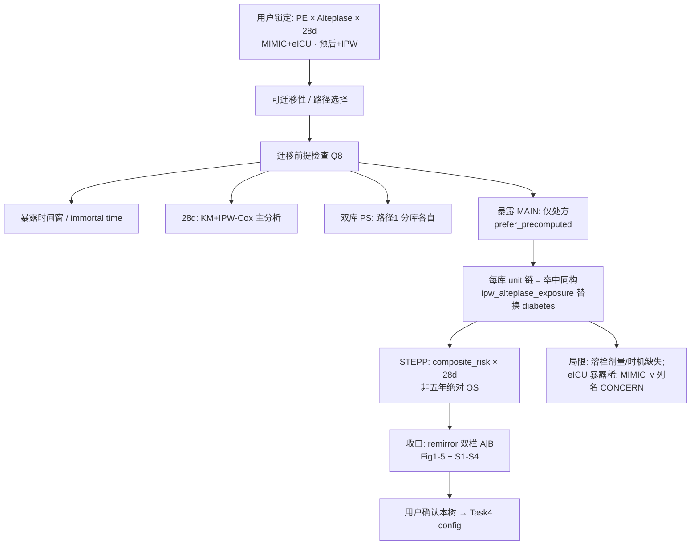

# 分析决策树 — IPW 肺栓塞 × 阿替普酶（28天）· 双库路径 1

> **待用户确认后方可 Task 4 写项目 config**（本文件供 controller 展示）  
> 程序员入口（Task 4 后）：`…/Medication_regimen_model_alteplase_ipw/config_*.R` + `run/ipw_pe_alteplase/`  
> 方法学：Jin 2026（用药模型三分）；暴露 **Alteplase = 仅处方**（敏感性可开处方∪输液）；结局 **28 天全因死亡**  
> 地基：**预后 + IPW**（放疗→阿替普酶；OS→28d）— 用户已确认  
> 产物对齐：`11_ischemic stroke/Medication_regimen_model_42118193` + Jin 图/表键  
> 规格：`docs/superpowers/specs/2026-10-09-pe-alteplase-ipw-dual-db-design.md`  
> 对抗阅读：`adversarial_lit_reading/labels/yaoyong_moxing_sanfen_Q{4,5,8}_training.jsonl`

---

## 0. 用户确认清单（Step 5 → Task 4 门控）

请逐项确认后再写 config / `--shared-only`：

- [ ] **地基**：预后 + IPW；放疗→阿替普酶；OS→28d（已锁定）
- [x] **暴露 MAIN**：`Alteplase = 仅处方`（MIMIC `ymtmd` / eICU `gy`；宽表 n=425/70；块 `prefer_precomputed=TRUE`）— 用户 2026-10-09 锁定
- [x] **可选敏感性**（后开）：处方∪输液（`Alteplase_union`；避开 MIMIC 输液列争议时可不做）
- [x] **路径 1**：MIMIC / eICU **各跑完整 Jin IPW 链**，再双栏拼图（不合并队列单 PS）
- [x] **STEPP**：保留；横轴 = 本库 `composite_risk`（VIF→Model2→Cox LP，**不含** Alteplase）
- [x] **disease_vars 草案**（Task 2）：`c("Ddimer", "Fibrinogen", "TT")`
- [x] **protect_vars**：`Alteplase`, `surv_time_28d`, `surv_event_28d`, `composite_risk`
- [x] **发表键齐全**：Fig1–5、S1–S4、Table1、S1–S4 + Sens(Cox/Overlap)（见 §4）— 对齐 Jin+卒中一个不能少
- [x] **MIMIC 输液列**语义风险：主分析已避开（仅处方）；并集仅敏感性
- [x] **决策树确认**（用户锁定仅处方后视为确认；可开 Task 4）

---

## 1. 对抗阅读 chosen 摘要（须绑定）

| Q | chosen 结论（摘要） | 对本课题落点 |
|---|---------------------|--------------|
| **Q4** | PS logistic 为固定调整集呈现；未报告 UV-p/逐步/LASSO/DAG/VIF；eleven vs nine 张力；多重比较未校正已明示 | 引擎仍走 **UV(P&lt;0.10)→VIF→Model2→PS**（卒中定稿）；Methods 写「工程筛序」≠原文宣称先验锁定 |
| **Q5** | IPW 条件可交换性；主分析完整病例；加权=处理 IPW 非 survey；PH/重叠/截尾未报告；敏感性九因子≠主十一因子 | 主链完整病例/插补口径写清；敏感性 Cox + 重叠权重；双库各自 PS；脚注披露未做 PH 检验若未补 |
| **Q8** | 地基预后+IPW；IPW/SMD/双轨 **条件性**复用；须过暴露时间窗/immortal time、28d 模型、双库 PS；PS/亚组改 PE-ICU；STEPP 五年 OS 不适用原样；溶栓剂量时机缺失高危 | 路径 1 + 28d Cox/KM；STEPP 改 28d×`composite_risk`；暴露**仅处方** + 局限脚注 |

---

## 2. Mermaid（迁移与流水线）



### 共享层（每库）
`data_clean → column_mapping`（`index` 关闭）

### 主链（unit = main；每库各一次）
```text
imputation
→ ipw_alteplase_exposure          # 替换 ipw_diabetes_exposure
→ analysis_exclusion              # allow_no_index; disease_vars=Ddimer/Fibrinogen/TT
→ univariate_prognosis
→ multicollinearity_screen
→ ipw_jin_composite_risk          # Model2 → composite_risk
→ iptw_balance → iptw_association
→ ipw_diabetes_flowchart          # Fig1（块名沿用 69）
→ ipw_weighted_km_pub             # Fig2 + S3
→ subgroup_iptw_weighted
→ subgroup_treatment_forest       # Fig3
→ ipw_subgroup_km_pub             # Fig4 age KM
→ stepp_prognosis                 # Fig5; index_var=composite_risk
→ cox_binary                      # Sens MV Cox
→ ipw_overlap_weights             # Sens overlap
→ ipw_surv_calibration_roc        # Fig S4 + Uno S1
→ ipw_literature_targets
→ ipw_pub_export
→ （课题）remirror_dual_panel_figures + pub_figure 四目录
```

---

## 3. 暴露 / 结局 / 排除（引擎契约）

| 项 | 锁定值 |
|----|--------|
| Block | `ipw_alteplase_exposure`（`Blocks/69_…/10block_ipw_alteplase_exposure.R`） |
| `prefer_precomputed` | **TRUE**（默认）：校验 `Alteplase∈{0,1}`；`surv_*` 已有则规范编码，缺失才从 `hosp_survival_day` / `death_within_hosp_28days` 派生 |
| MAIN | 仅处方（宽表：MIMIC **425**/1621；eICU **70**/1721）；`Alteplase_union` 留作敏感性 |
| SA（可选） | rx-only — 不进默认 pipeline |
| 时间/事件 | `surv_time_28d` / `surv_event_28d`；`followup_days=28` |
| disease_vars | `c("Ddimer","Fibrinogen","TT")`（Task 2 草案；cite 列审阅） |
| protect_vars | `Alteplase`, `surv_time_28d`, `surv_event_28d`, `composite_risk` |

数据：`/mnt/g/02block_result/47_PE/Medication_regimen_model_alteplase_ipw/data/D01_analysis_{MIMIC,eICU}.RData` 对象 `baseline`。

---

## 4. 发表产出清单（一个不能少）

对齐 Jin + 卒中 `Medication_regimen_model_42118193` / `ipw_literature_targets` 键：

### 4.1 每库 `by_unit/【success】…`

| 键 | 角色 |
|----|------|
| `Figure_1_Flowchart` | 纳排 flowchart |
| `Figure_2_IPW_KM` | IPW-weighted KM（by Alteplase） |
| `Figure_3_Subgroup_Forest` | 亚组森林 + P-interaction |
| `Figure_4_Subgroup_KM` | 年龄亚组 KM |
| `Figure_5_STEPP` | STEPP × composite_risk |
| `Figure_S1_Missing` | 缺失概览 |
| `Figure_S2_PS_SMD` | PS + SMD Love |
| `Figure_S3_Unweighted_KM` | 未加权 KM |
| `Figure_S4_Calibration_ROC` | 校准 + ROC @28d |
| `Table_1_Baseline_IPW` | sIPTW 基线 |
| `Table_S1_Uno_Cindex` | Uno C-index @28d |
| `Table_S2_MI_Baseline` | 插补前后基线 |
| `Table_S3_Univariate` | 单因素 |
| `Table_S4_VIF` | VIF |
| Sens | `Table_Sens_Multivariable_Cox`；`Table_Sens_Overlap_Weights` |

审计：`ipw_literature_targets` → `Literature_targets_audit.csv`（`all_found`）。

### 4.2 双库拼图（路径 1 收口）

- Fig1–5、S1–S4 → **A=MIMIC | B=eICU** 写入课题根 `Figures/`（`pdf/png/tiff/image_information`）
- 表：**不拼**；两库各一套 Table1/S1–S4，角色同号
- 脚本（Task≥5）：`run/ipw_pe_alteplase/remirror_dual_panel_figures.R`

---

## 5. 与卒中定稿差异（仅这些）

| | 卒中 Jin IPW | 本课题 PE |
|--|--------------|-----------|
| 暴露块 | `ipw_diabetes_exposure` | **`ipw_alteplase_exposure`** |
| 暴露列 | `Diabetes_HbA1c` | **`Alteplase`** |
| 库 | 单库 MIMIC | **路径 1：MIMIC + eICU + remirror** |
| disease_vars | 卒中/HbA1c 泄漏集 | **Ddimer / Fibrinogen / TT** |
| 其它 unit blocks | 同序 | **同序** |

---

## 6. 确认签名栏

```text
用户确认决策树日期: ________
确认人: ________
可进入 Task 4 写 config: [ ] YES
备注: ________
```
