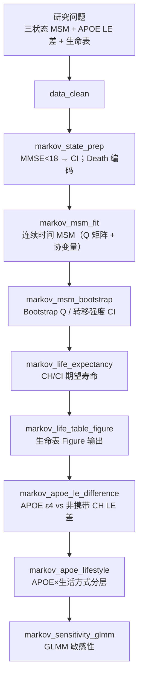

# 分析决策树 — CLHLS 三状态 Markov 认知

> 配置：`configs/config_markov_cognitive_clhls.R`  
> Batch：`configs/config_markov_cognitive_clhls_batch.R` → `run/markov_cognitive/run_markov_cognitive_clhls_batch.R`  
> 并行总入口：`run/study/run_four_new_paper_pipelines_parallel_batch.R`  
> 文献：Ren 2025 *Alzheimers Dement* e70090 — N=6488  
> 工具：`R/markov_msm_utils.R`（依赖 `msm` 包）

## 研究问题

连续时间三状态 Markov（CH / CI / Death）下，**APOE ε4 携带者 vs 非携带者**的认知健康（CH）期望寿命差是多少？生活方式与敏感性如何？

## 完整流水线（Single）

## Batch 分层

| 层 | Blocks | 说明 |
|----|--------|------|
| **shared** | `data_clean` → `markov_state_prep` → `markov_msm_fit` → `markov_msm_bootstrap` | 全样本 MSM + Bootstrap |
| **unit** | `markov_life_expectancy` → `markov_life_table_figure` → `markov_apoe_le_difference` → `markov_apoe_lifestyle` → `markov_sensitivity_glmm` | 并行 4 路：APOE_High / APOE_Low / Lifestyle_High / Lifestyle_Low |

## Block 映射

| Step | Block | 文件 | 主要产出 |
|------|-------|------|----------|
| 01 | `data_clean` | `Blocks/02_data_clean/` | 纵向 CLHLS 清洗 |
| 02 | `markov_state_prep` | `59/01block_markov_state_prep.R` | CH / CI / Death；5 项生活方式评分 |
| 03 | `markov_msm_fit` | `59/02block_markov_msm_fit.R` | `Table_Markov_MSM_Qmatrix.csv`、`Table_Markov_MSM_HazardRatios.csv` |
| 04 | `markov_msm_bootstrap` | `59/05block_markov_msm_bootstrap.R` | `Table_Markov_MSM_Bootstrap_CI.csv` |
| 05 | `markov_life_expectancy` | `59/03block_markov_life_expectancy.R` | 分状态期望寿命 |
| 06 | `markov_life_table_figure` | `59/06block_markov_life_table_figure.R` | 生命表 Figure（对齐原文） |
| 07 | `markov_apoe_le_difference` | `59/07block_markov_apoe_le_difference.R` | `Table_Markov_APOE_CH_LifeExpectancy_Diff.csv` |
| 08 | `markov_apoe_lifestyle` | `59/04block_markov_apoe_lifestyle.R` | APOE×生活方式分层 |
| 09 | `markov_sensitivity_glmm` | `59/08block_markov_sensitivity_glmm.R` | GLMM 敏感性 |

## 状态与协变量

| 项目 | 配置键 | 默认 |
|------|--------|------|
| 状态 | `Cognitive_state` | CH（MMSE≥18 且无痴呆）/ CI（MMSE&lt;18 或痴呆）/ Death |
| CI 切点 | `ci_cutoff` | 18 |
| APOE | `APOE_carrier` | e4 携带 vs 非携带 |
| 生活方式 | `lifestyle_vars`（5 项） | 评分≥4 → High |
| Bootstrap | `bootstrap_R` | 100（smoke 下 ≤50） |

## 数据与 Smoke

- 原始：`Data/smoke/D01_markov_cognitive_clhls.RData`（对象 `MarkovCLHLS`）
- 生成：`scripts/create_smoke_four_new_paper_pipelines_data.R`

## 飞书

- 工作计划编号：**B31**
- `workplan_code = "B31"`
