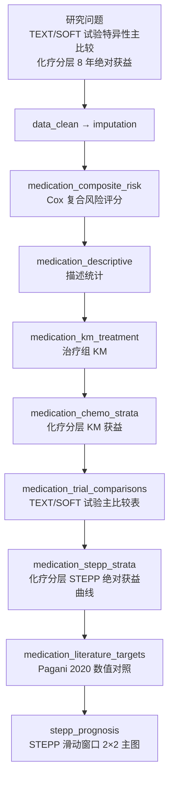

# 分析决策树 — TEXT/SOFT 用药方案 STEPP

> 配置：`configs/config_medication_regimen_text_soft.R`  
> Batch：`configs/config_medication_regimen_text_soft_batch.R` → `run/medication_regimen/run_medication_regimen_text_soft_batch.R`  
> 并行总入口：`run/study/run_four_new_paper_pipelines_parallel_batch.R`  
> 文献：Pagani 2020 *J Clin Oncol* — TEXT/SOFT 辅助内分泌  
> 工具：`R/medication_text_soft_utils.R`

## 研究问题

高复发风险患者升级为依西美坦+OFS 的 **8 年无远处复发率**与**绝对获益**是多少？TEXT 与 SOFT 试验、化疗分层下的主比较分别如何？

## 完整流水线（Single）

## Batch 分层

| 层 | Blocks | 说明 |
|----|--------|------|
| **shared** | `data_clean` → `imputation` → `medication_composite_risk` → `medication_descriptive` → `medication_chemo_strata` → `medication_trial_comparisons` → `medication_stepp_strata` → `medication_literature_targets` | 全样本一次 |
| **unit** | `medication_km_treatment` → `stepp_prognosis` | 并行 3 路：`TEXT_Chemo` / `SOFT_Chemo` / `No_Chemo` |

## Block 映射

| Step | Block | 文件 | 主要产出 |
|------|-------|------|----------|
| 01 | `data_clean` | `Blocks/02_data_clean/` | 清洗后 TEXT/SOFT 宽表 |
| 02 | `imputation` | `Blocks/03_imputation/` | `D01_AfterMI_Data.RData` |
| 03 | `medication_composite_risk` | `58/01block_medication_composite_risk.R` | `Table_Medication_CompositeRisk_Cox.csv` |
| 04 | `medication_descriptive` | `58/02block_medication_descriptive.R` | 基线描述表 |
| 05 | `medication_km_treatment` | `58/03block_medication_km_treatment.R` | 治疗组 KM 曲线 |
| 06 | `medication_chemo_strata` | `58/04block_medication_chemo_strata.R` | 化疗分层 KM |
| 07 | `medication_trial_comparisons` | `58/05block_medication_trial_comparisons.R` | `Table_Medication_TEXT_SOFT_Trial_Comparisons.csv`（8 年 freedom + 绝对获益） |
| 08 | `medication_stepp_strata` | `58/06block_medication_stepp_strata.R` | 分层 STEPP 窗口绝对获益 |
| 09 | `medication_literature_targets` | `58/07block_medication_literature_targets.R` | 原文目标值对照 |
| 10 | `stepp_prognosis` | `Blocks/32_stepp/`（复用） | STEPP 2×2 主图 PDF |

## 关键比较（预设于 block 07/08）

| 标签 | 筛选 | ref → alt |
|------|------|-----------|
| `TEXT_Chemo_ExeOFS_vs_TamOFS` | TEXT + 化疗 | Tamoxifen_OFS → Exemestane_OFS |
| `SOFT_ChemoPremeno_ExeOFS_vs_Tam` | SOFT + 化疗 | Tamoxifen → Exemestane_OFS |
| `SOFT_ChemoPremeno_TamOFS_vs_Tam` | SOFT + 化疗 | Tamoxifen → Tamoxifen_OFS |
| `NoChemo_ExeOFS_vs_Tam` | 无化疗 | Tamoxifen → Exemestane_OFS |

## 数据与 Smoke

- 原始：`Data/smoke/D01_medication_regimen_text_soft.RData`（对象 `MedicationTEXTSOFT`）
- 生成：`scripts/create_smoke_four_new_paper_pipelines_data.R`

## 飞书

- 工作计划编号：**B30**
- `workplan_code = "B30"`
