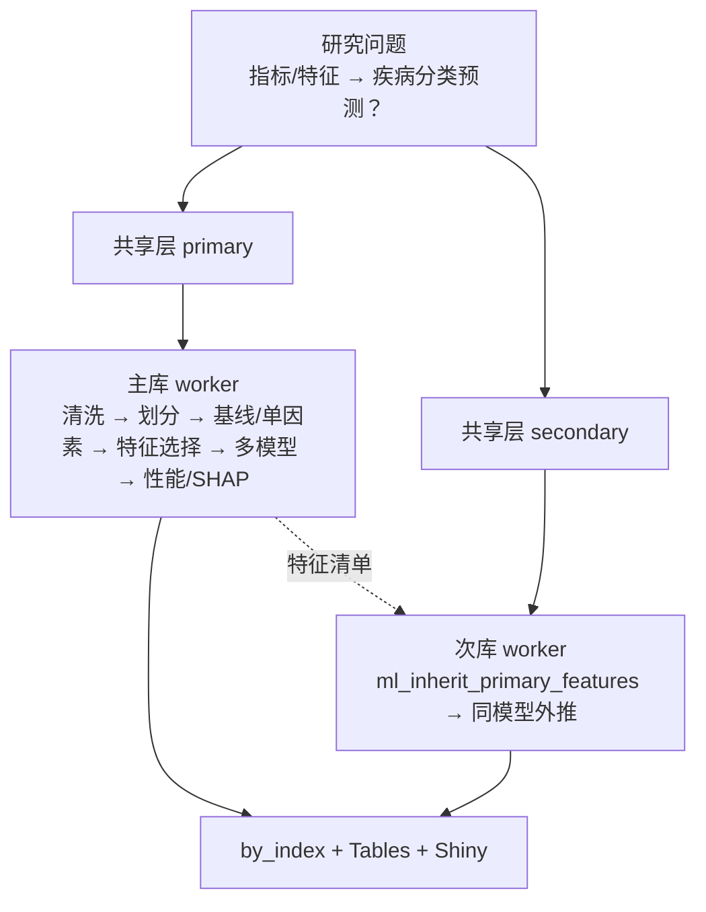

# 分析决策树 — ML 双库批量（ml dual batch）+ 外部验证模式

> 程序员接口：`medical-blocks-studies`（5003）
> 运行入口：`run/ml/run_ml_dual_batch.R`（双库批量）/ 研究目录 `run_ml_external_validation.R`（外部验证）
> 薄 config 构建：`configs/study_interface/ml_dual_batch_build.R`
> Pipeline：`configs/study_interface/ml_dual_batch_pipelines.R`
> 常用库对：CHARLS + ELSA（也可 NHANES + MIMIC、MIMIC + eICU，由 `.study` / `dual_db` 决定）

---

## ★ 第一步：选哪种模式？（关键决策点）

| 问题 | 选【双库批量】 | 选【外部验证模式】 |
|---|---|---|
| 训练/验证如何划分？ | **每个库各自内部 7:3 拆分**，各自训练独立模型；次库仅继承主库**特征清单** | **A 库 100% 训练 → B 库 100% 验证**（一个模型跨库外推） |
| 典型场景 | 同源队列内部开发+验证（CHARLS→ELSA 复现特征） | **跨数据库外部验证**（MIMIC 开发 → eICU 验证） |
| 入口 | `run_study.bat <研究> --workers 2` | `Rscript run_ml_external_validation.R`（研究目录内） |
| 引擎能否原生支持？ | ✅ 原生 | ❌ 原生不支持（见下），需手动驱动 |

**判断口诀**：要的是"同一套数据里拆 train/test"→ 双库批量；要的是"一库全训、另一库全验"→ 外部验证模式。

> ⚠️ 为什么外部验证不能直接用 `run_study.bat` 双库批量？
> 双库批量引擎对【每个库各自内部 7:3 拆分】并各自训练独立模型；次库只继承主库的**特征清单**，
> **不继承已拟合模型**；且 `train_validation` 块强制 `train_ratio∈(0,1)`（不能=1）。
> 因此原生双库做不到"MIMIC 全集训练 → eICU 全集验证"。

---

## 研究设定

| 项 | 值 |
|---|---|
| 研究类型 | 多为 `incidence` 二分类；亦可 prognosis 上游 |
| 暴露 | `index_vars` / `index_group` |
| 结局列 | `outcome_column`（Factor），`analysis_group`→1，`reference_group`→0 |

---

## 模式 A — 双库批量（internal，每库各自拆分）

### 架构
**共享层 → 主库选特征+建模 → 次库继承特征外推 → 汇总**



### 共享层（每库 1 次）
`data_clean` → `column_mapping` → `dual_db_column_harmonize` → `index`
CLI：`run_study.bat <研究> --shared-only`

### 主库（Regular 示例：CHARLS）
| 阶段 | Blocks |
|------|--------|
| 头 | `train_validation` → `imputation`（`fit_on=train`；不挂 trim） |
| 基线 | `baseline_binary` → `simple_ROC` → `boxplot` |
| 统计上游 | `univariate_incidence_binary` → `multicollinearity_screen`（预后则为 `univariate_prognosis`） |
| ML 尾 | `ml_feature_selection_bundle` → `ml_models_bundle` → `performance_ml` → `supplementary_ml` → `shap` → `shiny_ml_app` |

若主库为 NHANES：基线改为 `cutoff` → `obj` → `baseline_nhanes`，上游用 `*_nhanes` 系列。

### 次库（外推）
| Step | Block | 说明 |
|------|-------|------|
| 01–04 | clean / map / harmonize / index | 与主库同构准备 |
| 05–06 | `train_validation` → `imputation` | 不修剪指标极端值 |
| 07 | **`ml_inherit_primary_features`** | **继承主库入选特征，禁止重新海选** |
| 08–11 | `train_validation` → `ml_models_bundle` → `performance_ml` → `supplementary_ml` → `shap` | 外推验证 |

### 常用命令
```bat
run_study.bat <研究名> --shared-only
run_study.bat <研究名> --workers 2
run_study.bat <研究名> --workers 2 --only-index Leisure_activities
run_study.bat <研究名> --no-skip
```
产出：`by_index/<指标>/<库>/`、性能表、SHAP 图、可选 Shiny。

---

## 模式 B — 外部验证模式（A 库 100% 训练 → B 库 100% 验证）

> 范例：研究 `03_pancreatic cancer` — MIMIC 全集训练 → eICU 全集验证（院内 28 天死亡）。
> 落地文件：研究目录下 `config.R` + `run_ml_external_validation.R`（+ 可选 `run_shap_xgboost.R`）。

### 何时用
- 跨数据库**外部验证**（external validation）：开发集与验证集来自不同数据库。
- 需要一个模型在 A 库拟合后，原样拿到 B 库上评估（不做 B 库内部拆分、不重新拟合）。

### 实现思路（绕开双库编排，手动驱动引擎）
不调用 `run_ml_dual_batch` / `run_pipeline`，而是：
1. `source(R/utils.R)` + `source(R/pipeline_runner.R)` + `R/ml_dual_pipeline_helpers.R` + `R/dual_db_harmonize.R` + `configs/indices/composite_index_vars.R`
2. `source(研究目录/config.R)`（复用薄 config 构建器拿到 fully-wired `config`）
3. `ctx <- init_ctx(config)`
4. **手动装载** `ctx$data$train`=A 库全集、`ctx$data$test`=B 库全集、`ctx$data$imputed`=A 库全集（模型块用它校验结局列/特征）
5. **预建 `Group` 结局因子列**（levels=`c(reference_group, analysis_group)`）—— 正常由 `train_validation` 生成，此处手动建
6. 设 `ctx$results$feature_selection_final` = 固定特征清单
7. `setwd(engine_root)` ← **必须**：SHAP 块在 *source 期* 用 `getwd()` 定位 `Blocks/17_shap/00shap_router.R`（`01block_shap.R:951`）
8. 依次 `pipeline_source_block(root, tag)` + `run_block(ctx, tag)`：
   `ml_models_bundle` → `performance_ml` → `supplementary_ml` → `shap`
   （`ml_models_bundle` 内部已串联各 `ml_*` 子块 + `ml_aggregate`）

### config.R 关键设置（外部验证）
- `.study`：`primary`=A 库（训练）、`secondary`=B 库（验证）；`outcome_column`、`analysis_group`/`reference_group`、`index_vars`。
- `primary_name` 勿用 `"MIMIC"`：引擎次库槽位有遗留目录回退 `_shared/mimic`，Windows 大小写不敏感 → 主库 `_shared/MIMIC` 与之撞库 → 次库被误判"已存在"跳过。改用 `"MIMIC_IV"`（lower=`mimic_iv`≠`mimic`）。
- 纯 ML 无时间列：清空 `config$survival$time_var/event_var`（疾病预设会塞占位符 `futime`）→ `has_time=FALSE`，避免时间泄漏与 cox 步骤。
- `config$ml_models$methods`：在 `source(builder)` **之后**赋值（构建器 line103 会重置为默认）。
- 标志 `config$.run_mode <- "external_validation"`、`config$.external_validation_features`（固定 9 特征）供脚本消费。

### ★ 引擎契约 gotchas（外部验证踩坑）
1. **`Group` 是结局列，不是 train/test 标记**。模型块做 `df[, c("Group", feats)]`（如 `03block_ml_xgboost.R:158-162`）；`ctx$data$train`/`test` 各自含 `Group`（结局 0/1）+ 特征列。
2. **`train_ratio` 必须 ∈ (0,1)** → 无法用 `train_validation` 做 100% 训练；故外部验证**跳过** `train_validation`，手动赋 `ctx$data$train/test`。
3. **`ctx$data$imputed` 必须含结局列**：模型块读 `imputed` 校验 `outcome_column` 是否存在、特征是否在列。设 `imputed`=A 库全集即可。
4. **performance_ml 在 incidence 分支只用 `train$Group`/`test$Group`**（不依赖 imputed 对齐，`01block_performance_ml.R:292`）→ 外部验证下 train/test 来自不同库也能正确评估。
5. **SHAP 块的 `getwd()` 依赖**：source 块前必须 `setwd(engine_root)`，否则 `00shap_router.R` 找不到。
6. **SHAP 模型固定为 XGBoost**：`config$shap$ml_model <- "xgboost"`。若用 `"auto"` 且最优模型是黑盒基础模型（TablCL_v2/TabPFN 等，非 tree-SHAP-capable），引擎会**回退用 xgboost 算 TreeSHAP 却仍标题为该黑盒模型**（method=`venn_xgb_shapviz`），造成图名误导。显式指定 xgboost 即可正确标注。

### 运行命令（Windows 原生 R 4.5.1）
```bat
cd "G:\DockerHome\5003\medical-blocks-studies\studies\03_pancreatic cancer"
:: 全流程：15 模型训练(MIMIC)+评估(eICU) + 性能图 + SHAP
"C:\Program Files\R\R-4.5.1\bin\x64\Rscript.exe" run_ml_external_validation.R
:: （可选）只重跑 SHAP，复用已训练模型，固定 XGBoost TreeSHAP
"C:\Program Files\R\R-4.5.1\bin\x64\Rscript.exe" run_shap_xgboost.R
```
产出（`Output_ML_external_validation/`）：
- `step17_ml_aggregate/ml_eval_all.csv` — 各模型 train(MIMIC)/test(eICU) 指标宽表
- `Tables/` — 性能宽表、超参数、Log-Loss、DeLong、NRI/IDI
- `Figures/` — 多模型 ROC/DCA/校准、平行线、CV 箱线图、**SHAP(XGboost) 蜂群/瀑布/依赖图**
- `ctx_external_validation.rds` — 含全部已拟合模型，可供 `run_shap_xgboost.R` 复用

---

## 程序员注意（两种模式通用）

1. `.study` 块只改疾病、库路径、指标、结局；勿手改 pipeline blocks 顺序（pipeline 完整性守卫会 abort）。
2. 次库成败依赖主库特征清单；主库失败时次库通常无法继承（仅模式 A）。
3. `feishu_enable` 程序员侧建议 `FALSE`。
4. TabPFN 系列未接受 priorlabs 许可会 tryCatch 静默跳过（非致命），实际模型数可能少于 16。
5. ML 与生存两套 routine 共用 `checkpoints/_shared` 但 index 步不同，**串行**运行勿并发。
