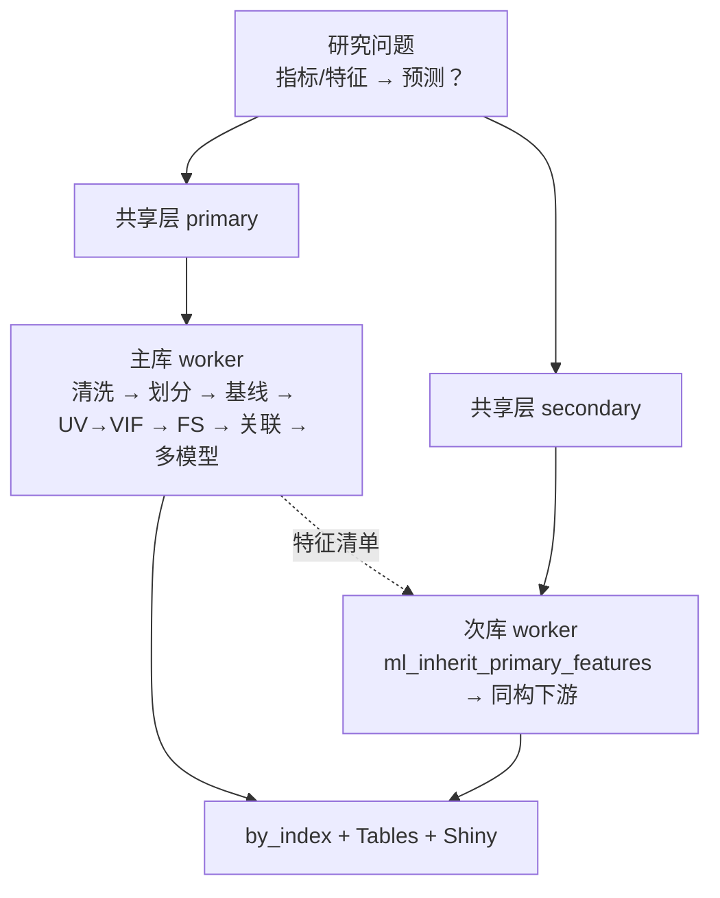
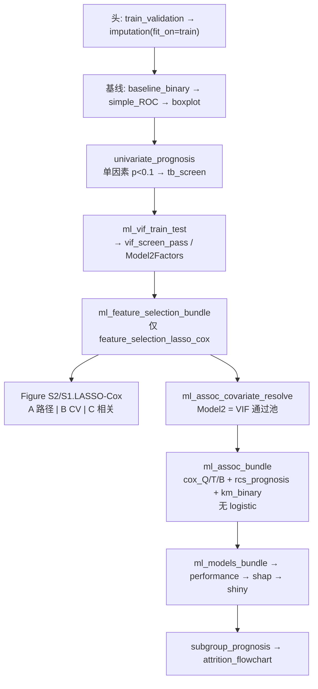

# 分析决策树 — ML 双库批量（ml dual batch）+ 外部验证模式

> 程序员接口：`medical-blocks-studies`（5003）
> 运行入口：`run/ml/run_ml_dual_batch.R`（双库批量）/ 研究目录 `run_ml_external_validation.R`（外部验证）
> 薄 config 构建：`configs/study_interface/ml_dual_batch_build.R`
> Pipeline：`configs/study_interface/ml_dual_batch_pipelines.R`
> 常用库对：CHARLS + ELSA（也可 NHANES + MIMIC、MIMIC + eICU，由 `.study` / `dual_db` 决定）

---

## ★ 第零步：发病预测 vs 预后预测

| | **发病 / 分类 ML** | **预后 ML（本树重点分支）** |
|---|---|---|
| `.study$study_type` | `incidence`（默认） | **`prognosis`** |
| 时间列 | 可不配 | 必填 `survival$time_var` / `event_var`（或 `.study$time_var` / `event_var`） |
| 统计上游 | `univariate_incidence_binary` → `ml_vif_train_test` | **`univariate_prognosis` → `ml_vif_train_test`** |
| 特征选择 | 多方法（LASSO→…）或 LASSO-first | **仅 `feature_selection_lasso_cox`（LASSO-Cox）** |
| 特征选择图 | S2A/S2B 或韦恩 | **A 路径 + B CV 偏差 + C 相关热图拼图**（`Figure S2/S1.LASSO-Cox.pdf`） |
| 关联表 | Logistic（可选带时间再挂 Cox） | **仅 Cox**（无 logistic 闸门） |
| Cox 协变量 | 默认：Age + UV显著且未进 ML | **Age +「单因素→VIF」通过池**（`model2_from_vif_pass=TRUE`） |

覆盖函数：`ml_dual_apply_prognosis_ml_overrides()`（仅 `study_type=prognosis` 时由 build 自动调用）。

---

## ★ 第一步：选哪种模式？（关键决策点）

| 问题 | 选【双库批量】 | 选【外部验证模式】 |
|---|---|---|
| 训练/验证如何划分？ | **每个库各自内部 7:3 拆分**，各自训练独立模型；次库仅继承主库**特征清单** | **A 库 100% 训练 → B 库 100% 验证**（一个模型跨库外推） |
| 典型场景 | 同源队列内部开发+验证（CHARLS→ELSA 复现特征） | **跨数据库外部验证**（MIMIC 开发 → eICU 验证） |
| 入口 | `run_study.bat <研究> --workers 2` | `Rscript run_ml_external_validation.R`（研究目录内） |
| 引擎能否原生支持？ | ✅ 原生 | ❌ 原生不支持（见下），需手动驱动 |

**判断口诀**：要的是"同一套数据里拆 train/test"→ 双库批量；要的是"一库全训、另一库全验"→ 外部验证模式。

> ⚠️ 为什么外部验证不能直接用 `run_study.bat` 双库批量？
> 双库批量引擎对【每个库各自内部 7:3 拆分】并各自训练独立模型；次库只继承主库的**特征清单**，
> **不继承已拟合模型**；且 `train_validation` 块强制 `train_ratio∈(0,1)`（不能=1）。
> 因此原生双库做不到"MIMIC 全集训练 → eICU 全集验证"。

---

## 研究设定

| 项 | 值 |
|---|---|
| 研究类型 | `incidence`（分类）或 **`prognosis`（预后）** |
| 暴露 | `index_vars` / `index_group` |
| 结局列 | `outcome_column`（Factor），`analysis_group`→1，`reference_group`→0 |
| 预后时间 | `survival$time_var` / `event_var`（如 `futime` / `fustatus`） |

---

## 模式 A — 双库批量（internal，每库各自拆分）

### 架构
**共享层 → 主库选特征+建模 → 次库继承特征外推 → 汇总**



### 共享层（每库 1 次）
`ml_id_deduplicate` → `data_clean` → `column_mapping` → `dual_db_column_harmonize` → `index`  
CLI：`run_study.bat <研究> --shared-only`

---

### ★ 预后主库链（`study_type = "prognosis"`）



| 阶段 | Blocks | 铁律 |
|------|--------|------|
| 头 | `train_validation` → `imputation` | 不挂 `trim_index_extreme` |
| 基线 | `baseline_binary` → `simple_ROC` → `boxplot` | — |
| 统计上游 | **`univariate_prognosis` → `ml_vif_train_test`** | **Cox / LASSO 候选 = 单因素→VIF** |
| 特征选择 | `ml_feature_selection_bundle` → **仅 `lasso_cox`** | 不跑 Boruta/RF/共识 |
| 协变量 | `ml_assoc_covariate_resolve` | `model2_from_vif_pass=TRUE`；可含已进 ML 的变量；排除暴露 |
| 关联 | `ml_assoc_bundle` | **Cox only**（`gate_enable=FALSE`） |
| ML 尾 | `ml_models_bundle` → `performance_ml` → `supplementary_ml` → `shap` → `shiny_ml_app` → `subgroup_prognosis` → `attrition_flowchart` | **默认模型见下表**；性能图出分面校准 + 合并 DCA |

**预后默认 ML 模型**（`ml_dual_apply_prognosis_ml_overrides`）：

| Tag | 显示名 | 说明 |
|-----|--------|------|
| `xgbsurv` | XGBoost-Cox | 文献主模型 |
| `coxboost` | CoxBoost | 似然提升 |
| `gbmsurv` | GBM-Cox | gbm coxph |
| `rsf` | Random survival forest | RSF |
| `ridge_cox` | Ridge-Cox | glmnet α=0（小样本友好） |
| `enet_cox` | ElasticNet-Cox | glmnet α=0.5（小样本友好） |
| `survivalsvm` | SurvivalSVM | **小样本补充** |
| `mboost_cox` | mboost-Cox | **高维/小样本补充** |

性能图（预后）：`Figure. Prognosis calibration faceted.pdf`（A 分面校准）+ `Figure. Prognosis DCA combined.pdf`（B 合并 DCA）。

**时间窗 `surv_horizon`（写 config 必查数据）**：
- 默认 `NULL`/`auto`：跑 `performance_ml` 时按 `time_var` 列名与分布推断（如 `*_28d`→28 天；月随访→12/36/60）
- 本仓库 ICU 预后模板多为 **28 天行政截尾**，不是文献图里的 60 月
- 显式写法：`config$performance_ml$surv_horizon <- 28`；单位 `surv_horizon_unit = "day"|"month"`

**`.study` 最小示例（预后）**：
```r
.study <- list(
  study_type = "prognosis",
  time_var = "futime",
  event_var = "fustatus",
  # ... disease / 双库路径 / index_vars ...
)
```

---

### 发病主库链（`study_type = "incidence"`，对照）

| 阶段 | Blocks |
|------|--------|
| 头 | `train_validation` → `imputation` |
| 基线 | `baseline_binary` → `simple_ROC` → `boxplot` |
| 统计上游 | `univariate_incidence_binary` → `ml_vif_train_test` |
| ML 尾 | `ml_feature_selection_bundle`（多方法/LASSO-first）→ `ml_assoc_covariate_resolve` → `ml_assoc_bundle`（logistic）→ `ml_models_bundle` → … → `subgroup_incidence` + `subgroup_prognosis` |

若主库为 NHANES：基线改为 `cutoff` → `obj` → `baseline_nhanes`，上游用 `*_nhanes` 系列。

### 次库（外推，发病/预后同构）
| Step | Block | 说明 |
|------|-------|------|
| 头+基线 | 同主库 | — |
| 继承 | **`ml_inherit_primary_features`** | **禁止重新海选** |
| 下游 | `ml_assoc_covariate_resolve` → `ml_assoc_bundle` → ML 尾 → 亚组 | 与主库同构 |

### 常用命令
```bat
run_study.bat <研究名> --shared-only
run_study.bat <研究名> --workers 2
run_study.bat <研究名> --workers 2 --only-index Leisure_activities
run_study.bat <研究名> --no-skip
```
产出：`by_index/<指标>/<库>/`、性能表、SHAP 图、预后另有 `Figure S1/S2.LASSO-Cox.pdf`。

---

## 模式 B — 外部验证模式（A 库 100% 训练 → B 库 100% 验证）

> 范例：研究 `03_pancreatic cancer` — MIMIC 全集训练 → eICU 全集验证（院内 28 天死亡）。
> 落地文件：研究目录下 `config.R` + `run_ml_external_validation.R`（+ 可选 `run_shap_xgboost.R`）。

### 何时用
- 跨数据库**外部验证**（external validation）：开发集与验证集来自不同数据库。
- 需要一个模型在 A 库拟合后，原样拿到 B 库上评估（不做 B 库内部拆分、不重新拟合）。

### 实现思路（绕开双库编排，手动驱动引擎）
不调用 `run_ml_dual_batch` / `run_pipeline`，而是：
1. `source(R/utils.R)` + `source(R/pipeline_runner.R)` + `R/ml_dual_pipeline_helpers.R` + `R/dual_db_harmonize.R` + `configs/indices/composite_index_vars.R`
2. `source(研究目录/config.R)`（复用薄 config 构建器拿到 fully-wired `config`）
3. `ctx <- init_ctx(config)`
4. **手动装载** `ctx$data$train`=A 库全集、`ctx$data$test`=B 库全集、`ctx$data$imputed`=A 库全集（模型块用它校验结局列/特征）
5. **预建 `Group` 结局因子列**（levels=`c(reference_group, analysis_group)`）—— 正常由 `train_validation` 生成，此处手动建
6. 设 `ctx$results$feature_selection_final` = 固定特征清单
7. `setwd(engine_root)` ← **必须**：SHAP 块在 *source 期* 用 `getwd()` 定位 `Blocks/17_shap/00shap_router.R`
8. 依次 `pipeline_source_block(root, tag)` + `run_block(ctx, tag)`：
   `ml_models_bundle` → `performance_ml` → `supplementary_ml` → `shap`

### config.R 关键设置（外部验证）
- `.study`：`primary`=A 库（训练）、`secondary`=B 库（验证）；`outcome_column`、`analysis_group`/`reference_group`、`index_vars`。
- `primary_name` 勿用 `"MIMIC"`：改用 `"MIMIC_IV"`。
- 纯分类 ML：可清空 `survival$time_var/event_var`；**预后外部验证**须保留时间列并建议先跑 LASSO-Cox 定特征。
- `config$ml_models$methods`：在 `source(builder)` **之后**赋值。

### 运行命令（Windows 原生 R）
```bat
cd "G:\DockerHome\5003\medical-blocks-studies\studies\03_pancreatic cancer"
"C:\Program Files\R\R-4.5.1\bin\x64\Rscript.exe" run_ml_external_validation.R
```

---

## 程序员注意（两种模式通用）

1. `.study` 块只改疾病、库路径、指标、结局、`study_type`；勿手改 pipeline blocks 顺序。
2. 预后必须 `study_type = "prognosis"`，否则不会挂 LASSO-Cox / UV→VIF Cox 铁律。
3. 次库成败依赖主库特征清单；主库失败时次库通常无法继承（仅模式 A）。
4. `feishu_enable` 程序员侧建议 `FALSE`。
5. 预后默认跑生存八模型；SHAP **固定解释验证集最优模型**（`shap$ml_model=auto` + `force_kernel_best_model=TRUE`），不回退 xgboost 画图。
6. ML 与生存两套 routine 共用 `checkpoints/_shared` 但 index 步不同，**串行**运行勿并发。
