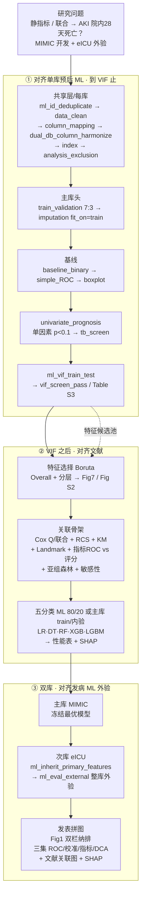
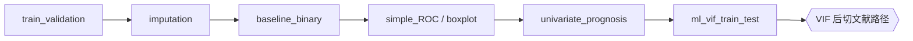
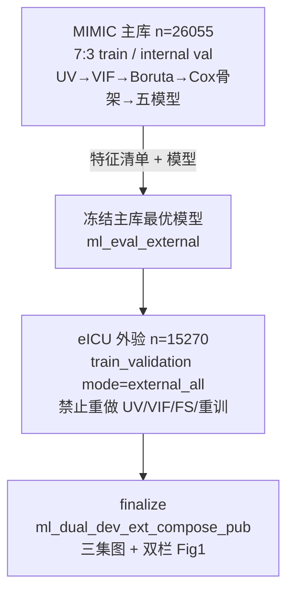

# 分析决策树 — 双库预后 ML（AKI 院内 28 天死亡 · 静指标）+ 文献对齐 + 外验

> 课题：`17_AKI_院内28天死亡预测预后_静`（5003）  
> 数据：`studies/17_AKI_院内28天死亡预测预后_静/data/D01_data_{MIMIC,EICU}.RData`  
> 文献骨架：*Cardiovasc Diabetol* 2025;24:199（SHR+GV → ASCVD 28/90 天死亡；Boruta + 五分类 ML + SHAP）  
> 方案：`静老师-方案设计-机器学习建模.docx`（迁到 **AKI**，加 **eICU 外验**）  
> 对齐母版：  
> - **到 VIF**：单库预后 ML（`decision_tree_ml_dual_batch.md` 预后主库链）  
> - **VIF 之后**：文献正文 + 补充全部产物  
> - **双库编排 / ML 图表逻辑**：双库发病 ML `12_AKI`（`split_mode=dev_internal_ext`）  
> 引擎入口：`run/ml/run_ml_dual_batch.R` + 预后 `study_type=prognosis`；已支持 `combo_loop` + `dev_internal_ext`  
> 写 config 前铁律：`.cursor/rules/ml_config_novelty_dual_composite.mdc`

---

## ★ 落地状态（2026-09-16）

| 卡点 | 产物 | 状态 |
|---|---|---|
| 双库列名统一 | `Data/_dual_column_harmonize.md` + `.csv` | 已清 |
| 列审阅 / disease_vars | `Data/_column_review.md` | 已清（`Acute_Renal_Failure`） |
| 仅复合指标 Pool | `Data/_pool_a0.txt`（57 个双库可算） | 已清；禁 HDL/LDL/HbA1c 轴 |
| PubMed 双组合查新 | `reports/pubmed_novelty_AKI_dual_composites_2026-09-15.md` | Top10 已确认 |
| 引擎 combo_loop / 预后 dev_ext | `R/ml_dual_batch_runner.R` / `R/ml_dual_dev_ext.R` | 已落地 |
| 联合暴露 | Group1–4（双指标各按中位数高/低）Cox + KM | 已落地 |
| 文献补充 | APSIII 对照 ROC；第7天 Landmark（Diabetes 分层） | 已落地 |
| 全量运行 | `by_index/【success】<A+B>/` | **10/10 success；0 failed** |

顺序：列名对齐 → 审列 → Pool → PubMed 锁 10 对 → **用户确认** → 写 config → shared-only → workers。

---

## 研究设定（已核对数据）

| 项 | 值 |
|---|---|
| 研究类型 | **预后** `study_type = "prognosis"` |
| 主库（人多） | **MIMIC** `n=26055`，死亡 `DN=1`：**4144**（15.9%）；`futime` 行政截尾 **≤28 天** |
| 外验库（人少） | **eICU** `n=15270`，死亡 **2997**（19.6%）；同样 ≤28 天截尾 |
| 结局 | `DN`（0/1）+ `futime`（天）；分析名建议映射 `fustatus`/`futime` 或 config 直指 `DN` |
| 暴露 | **10 个双复合指标组合**（仅复合指标库；见查新报告 Top10）；禁原始单列、禁 SHR/GV/HbA1c 轴 |
| 慢性背景分层 | 文献 = NGR/Pre-DM/DM；本课题按方案做「慢性/基线表型」分层（决策点 D2） |
| 划分 | **`dev_internal_ext`**：主库 7:3 开发+内验；eICU **整库外验**、冻结主库模型 |

**铁律**：主库必须是更大 N → MIMIC_IV = primary，eICU = secondary（与 `12_AKI` 发病 ML 一致）。

---

## ★ 关键决策点（写 config 前必须拍板）

| ID | 问题 | 推荐默认 | 备选 / 风险 |
|---|---|---|---|
| **D1** | 主暴露指标是什么？ | **查新锁定的 10 个双复合组合**（`combo_loop`）；每 job=`A_B` | 禁止 SHR+GV（eICU 无 HbA1c）；禁止原始单列 |
| **D2** | 慢性背景分层变量？ | 有 HbA1c/糖尿病史时对齐文献 NGR/Pre-DM/DM；否则用 `Diabetes`±其它基线表型 | 分层后每层事件数不足则只做 Overall + 1～2 层 |
| **D3** | VIF 后特征选择？ | **对齐文献 = Boruta**（Overall + 分层 Fig7/S2） | 引擎预后默认 **仅 LASSO-Cox**；选文献则 config 覆盖 `feature_selection$methods`，勿默默走 LASSO |
| **D4** | ML 模型族？ | **对齐文献五模型**：LR / DT / RF / XGBoost / LightGBM（28 天死亡当分类） | 引擎预后默认生存八模型；本课题按用户要求 **文献优先**；C-index/校准可作补充表 |
| **D5** | 关联分析 Model？ | **Cox 原文三层**：Model1 未调整 → Model2 Age+Sex → Model3 = `clinical_covariates ∩ UV ∩ VIF&lt;5`（`assoc_covariate$scheme="literature_m123"`） | 禁止整池 VIF 当 Model3；禁止写死与名单冲突的 `model1/2_factors`；全局默认铁律（Age+UV→VIF）仅用于非本套路课题 |
| **D6** | 图号冲突怎么编？ | **主文两套并存**：关联图跟文献 Fig2–6；ML 性能图跟双库发病 **三集 Fig（ROC/校准/指标/DCA）**；SHAP/亚组跟发病 Fig7/8 逻辑 | 见下文「发表图号对照表」 |
| **D7** | 引擎缺口？ | 已扩展 `ml_dual_is_dev_ext_mode()` 支持 prognosis，并由 `ml_eval_external` 冻结主库五模型评估 eICU | 已完成 |

---

## 总览



---

## ① 到 VIF：与单库预后 ML 对齐（禁止分叉）

对照：`ml_dual_primary_ml_stat_upstream_blocks()` + `decision_tree_ml_dual_batch.md` 预后主库链。

| 阶段 | Blocks | 铁律 |
|------|--------|------|
| 共享 | `ml_id_deduplicate` → `data_clean` → `column_mapping` → `dual_db_column_harmonize` → `index` | 双库列名对齐；Gate A 剔除次库独有展示列（若上 Table1） |
| 排除 | **`analysis_exclusion`** | 先审列落盘 `Data/_column_review.md`；疾病泄漏 / 指标成分不进协变量池 |
| 头 | `train_validation` → `imputation(fit_on=train)` | **不挂** `trim_index_extreme`；划分在插补前 |
| 基线 | `baseline_binary` → `simple_ROC` → `boxplot` | 主库另出 train/内验基线表（发病 `dev_ext` 口径） |
| 上游 | **`univariate_prognosis` → `ml_vif_train_test`** | Cox 单因素 → VIF；**验证集禁止另做一套 VIF** |



---

## ② VIF 之后：对齐文献（正文 + 补充全要）

### 2.1 文献方法映射 → 本课题

| 文献做法 | 本课题落地 |
|---|---|
| 缺失 ≥20% 删变量；&lt;20% MI | 插补块 + 缺失筛；与引擎 `imputation` 一致，**仅 train 拟合** |
| VIF&gt;5 排除（Table S3） | `ml_vif_train_test`（阈值按 config，默认与预后共享覆盖对齐） |
| Boruta 特征选择 | **覆盖**预后默认 LASSO-Cox；出 Fig7（分层）+ Fig S2（Overall） |
| 80% / 20% 划分 | 主库 `train_validation` 7:3（与双库发病一致；内验≈文献 test） |
| 五模型 LR/DT/RF/XGB/LGBM | `ml_models$methods` 配分类五模型；结局 = 28 天死亡 |
| SHAP 解释最优模型 | `shap` + `force_kernel_best_model=TRUE`（防偷换模型） |
| Cox / KM / RCS / Landmark / 森林 / 敏感性 | `ml_assoc_bundle`（Cox）+ `rcs_prognosis` + `km_*` + Landmark 块/脚本 + `subgroup_prognosis` + 敏感性表 |
| 原文无外验 | **本课题加** eICU（方案要求） |
| 原文无 DCA/校准 | 双库发病 ML 主文有校准/DCA → **按发病逻辑出三集图**（比文献多，允许） |

### 2.2 文献产物 checklist（必须有对应落盘）

#### 主文 Tables
| 文献 | 本课题 |
|---|---|
| Table 1 基线（28 天死/活） | Table 1；另按 `dev_ext` 出 train vs 内验基线；外验单独 S 表 |
| Table 2 联合分组 × Cox Model1–3（Overall+分层） | Table 2（指标联合 × 死亡） |

#### 主文 Figures
| 文献 | 本课题角色 |
|---|---|
| Fig.1 纳排 | **Figure 1** 双栏 MIMIC \| eICU（发病双库拼图逻辑） |
| Fig.2 KM | **Figure 2** KM（分位/联合 × 背景分层） |
| Fig.3 RCS | **Figure 3** RCS（P-overall / P-nonlinear） |
| Fig.4 指标 ROC vs 评分 | **Figure 4** 或 Table S5 同源；对照 SOFA/APSIII/SAPSII/GCS 等 **数据里有的评分** |
| Fig.5 Landmark | **Figure 5** Landmark（切点与高危层需写清） |
| Fig.6 亚组森林 | 关联亚组 → 与 ML Fig8 亚组分工见下 |
| Fig.7 Boruta | **特征选择图**（对应发病双库的 Fig2 FS 槽，或独立 S 图+主文） |
| Fig.8 ML ROC + SHAP | **并入三集 ML 面板 + SHAP**（见 ③） |

#### 补充 Tables S1–S11
| 文献 | 本课题 |
|---|---|
| S1 ICD/入选定义 | AKI 入选/ICD 或队列定义表 |
| S2 单因素 | UV Cox 表 |
| S3 VIF | `ml_vif_train_test` 导出 |
| S4 分位指标 × Cox | 单指标三分位/四分位关联 |
| S5 判别力数值 | 对应 Fig4 |
| S6–S8 PH 检验 | 分层 PH 表 |
| S9–S10 敏感性 | 排除低血糖/完整病例等（按 AKI 可解释规则改） |
| S11 五模型全指标 | Overall + 分层；**并加外验列/表** |

#### 补充 Figures S1–S5
| 文献 | 本课题 |
|---|---|
| S1 PH 趋势 | 同 |
| S2 Overall Boruta | 同 |
| S3 Overall 五模型 ROC | 可与三集 Fig 合并，避免重复主文 |
| S4–S5 个例 SHAP/推理 | 最优模型个例解释 |

---

## ③ 双库：对齐双库发病 ML（`12_AKI` / `dev_internal_ext`）



| 规则 | 发病 `12_AKI` | 本课题预后 |
|---|---|---|
| `split_mode` | `dev_internal_ext` | **同** |
| 主库更大 N | MIMIC 6553 &gt; eICU 2190 | MIMIC 26055 &gt; eICU 15270 |
| 次库 | 不跑 UV/VIF/FS；`ml_inherit_primary_features` + `ml_eval_external` | **同构**（须先打开预后下的 dev_ext 闸门） |
| 主库 FS/模型 | 仅 train | **同** |
| 发表 scheme | `pub_figure_scheme = ml_dual_dev_ext` | **同逻辑**（预后变体） |

### 双库发病式 ML 主文图逻辑（本课题采用）

| 图号 | 发病双库 `ml_dual_dev_ext` | 本课题（预后 + 文献） |
|---|---|---|
| Figure 1 | 双栏 Flowchart | 同（MIMIC + eICU） |
| Figure 2 | 特征选择（LASSO） | **Boruta**（文献 Fig7；Overall 可放 S） |
| Figure 3 | 三集 ROC | 开发 train / 内验 / **eICU 外验** ROC |
| Figure 4 | 三集校准 | 同（文献无，按发病逻辑保留） |
| Figure 5 | 三集指标（AUC/Sens/Spec/F1±CI） | 同；对齐文献 Table S11 指标 |
| Figure 6 | 三集 DCA | 同（文献无，按发病逻辑保留） |
| Figure 7 | SHAP | 文献 Fig8 D–I + S4/S5 |
| Figure 8 | 亚组 | ML/临床亚组森林；与文献 Fig6 合并或一文一图避免撞车 |

### 文献关联图安放（避免与三集 Fig3–6 撞号）

推荐 **主文前半关联、后半 ML**（与文献叙述顺序一致）：

| 建议编号 | 内容 | 来源 |
|---|---|---|
| Fig 1 | 双库纳排 | 发病双库 |
| Fig 2 | KM | 文献 |
| Fig 3 | RCS | 文献 |
| Fig 4 | 指标 vs 传统评分 ROC | 文献 |
| Fig 5 | Landmark | 文献 |
| Fig 6 | 关联亚组森林 | 文献 Fig6 |
| Fig 7 | Boruta | 文献 / 发病 Fig2 槽 |
| Fig 8 | 三集 ROC（或 8A–C） | 发病三集 |
| 补充主文或 Fig 9–11 | 三集校准 / 指标 / DCA | 发病 Fig4–6 |
| 另图或 Fig 12 | SHAP | 发病 Fig7 |
| 补充 | PH、敏感性、VIF、单因素、外验基线、超参 | 文献 S 表 + 发病 S 表 |

> 若期刊限主文 8 图：优先保留 **1 纳排 + 2 KM + 3 RCS + 4 三集ROC + 5 SHAP + 6 森林**；Landmark / 评分 ROC / 校准 / DCA 进补充（但仍须全部产出）。

---

## 次库 worker 链（外验）

| Step | Block | 说明 |
|------|-------|------|
| 头 | `train_validation(mode=external_all)` | 整库当外验，不拆分 |
| 插补 | `imputation` | 用主库模型套用 / 外验 S1 基线 |
| 继承 | **`ml_inherit_primary_features`** | 禁止重新 Boruta/VIF |
| 关联 | `ml_assoc_*`（可选） | 外验可只出描述+性能，Cox 是否重估写进 config |
| 评测 | **`ml_eval_external`** | 冻结模型；`ml_models`/`performance_ml`/`shap` 在次库关掉 |
| 汇总 | finalize 三集拼图 | 对齐 `ml_dual_dev_ext_compose_pub` |

---

## 协变量与排除（本套路 · 文献 Table2 Model1–3）

1. **到 VIF**：单因素预后 → `vif_screen_pass` = Boruta 候选池；**同时**作为 Model3 交集输入（不是整池进 Cox）。  
2. **`assoc_covariate$scheme = "literature_m123"`**（本套路必开；全局 ML 默认铁律勿改）：
   - **Model 1**：未调整  
   - **Model 2**：仅 Age + Sex/Gender（`sex_var`）  
   - **Model 3**：Model2 ∪ (**`clinical_covariates` ∩ UV-sig ∩ VIF-pass**)；缺名单或交集空 → 硬停  
   - 配置片段：[`configs/ml_literature_aki_dev_ext_assoc_overrides.R`](../configs/ml_literature_aki_dev_ext_assoc_overrides.R)  
3. **`analysis_exclusion`**：AKI 预后队列仍须审列；**禁止**把结局泄漏/`disease_vars`（如 `Acute_Renal_Failure`）写入 `clinical_covariates`。  
4. **评分共线**：对照评分（APSIII/OASIS/GCS）可进 clinical 名单（经 UV∩VIF），但禁止无差别全塞进同一 ML；对照评分主展示在 Fig4/S5。

### AKI ICU `clinical_covariates` 底稿（映射原文 Model3；课题按列审阅裁剪）

原文：GCS, CCI, APACHE II, SpO2, Lactate, pH, Creatinine, BUN, PT, HB, AKI, HF, Hypoglycemic drugs, Mechanical ventilation  

MIMIC 标准名底稿（**不含** AKI 诊断旗标）：

```r
c("GCS", "APSIII", "SpO2", "Lactate", "PH", "Creatinine", "BUN",
  "PT", "Hemoglobin", "Heart_Failure", "Ventilation", "OASIS",
  "MAP", "WBC", "Glucose")
```

有 CCI / INR / 用药列则补入；双库缺列自动从交集脱落。

---

## `.study` 最小草案（拍板 D1–D4 后落盘 config）

```r
.study <- list(
  disease_code   = "17",
  disease        = "AKI",
  study_type     = "prognosis",
  time_var       = "futime",
  event_var      = "DN",          # 或清洗后 fustatus
  analysis_group = "1",           # 死亡
  reference_group = "0",
  index_vars     = c("SHR", "GV"), # D1 锁定后改
  primary_name   = "MIMIC_IV",
  primary_rdata_file = "D01_data_MIMIC.RData",  # 或清洗后 D02
  secondary_name = "eICU",
  secondary_rdata_file = "D01_data_EICU.RData",
  split_mode     = "dev_internal_ext",
  feishu_enable  = FALSE
)
```

---

## 引擎 / 实现缺口（决策树阶段标红）

| 缺口 | 现状 | 建议 |
|---|---|---|
| `dev_internal_ext` 仅发病 | `ml_dual_is_dev_ext_mode()` 要求 `study_type=incidence` | 扩展为 prognosis **或** 增加 `ml_dual_prognosis_dev_ext` |
| 预后默认 LASSO-Cox + 生存模型 | 与文献 Boruta+五分类冲突 | 本课题 config 覆盖；勿改全局默认除非沉淀为新 profile |
| Landmark | 文献有；引擎未必在 ML 预后默认链 | 明确挂 block 或课题脚本，逻辑回写 Blocks |
| SHR/GV | dabiao 无现成列；eICU 无 HbA1c | D1：先定公式与双库可行性 |
| 发表图四目录 | 铁律 | finalize 后 `pub_figure_ensure_formats` |
| code 包 | 成功指标 `by_index/【success】…/code/` | dual-batch finalize 挂 `index_code_bundle_finalize` |

---

## 执行顺序（确认决策树后）

1. 拍板 **D1–D4**（指标、分层、Boruta、五模型）  
2. `review-raw-covariate-columns` → `Data/_column_review.md` + `disease_vars`  
3. 清洗 D01→D02（结局因子、列对齐、算指标）  
4. 写 `config.R`（`prognosis` + `dev_internal_ext`）  
5. 补引擎闸门（预后 dev_ext）或临时外验脚本→回写引擎  
6. `--shared-only` → 主库 worker → 次库外验 → finalize 三集图 + 文献关联图  
7. 按 checklist 对表：文献 S1–S11 / Fig1–8 / S1–S5 **全部有文件**；外验性能表额外存在  

---

## 程序员注意

1. 主库名用 `MIMIC_IV`，勿用裸 `MIMIC`（Windows 槽位冲突，见 `12_AKI`）。  
2. 次库成败依赖主库特征清单；主库失败勿强跑外验。  
3. SHAP 只解释验证集/内验最优模型；分类列保留 factor。  
4. 临时 `/tmp` 或课题 `hotfix_*.R` 用完归档；可复用进 `R/` / `Blocks/`。  
5. 本树是 **17_AKI 静指标预后双库** 专用；通用母版仍见 `decision_tree_ml_dual_batch.md`。

---

## 最终入选（2026-09-17）

- 最终入选双复合指标：**SOSM+WPR**。
- 最优 XGBoost：内验 AUC `0.8342`，eICU 外验 AUC `0.7977`（overall 层旧口径，作审计参考）。

---

## ★ 原文全图表复刻终稿（2026-09-18，取代上一节版式）

规格：`docs/superpowers/specs/2026-09-17-aki-sosm-wpr-original-paper-replication-design.md`。
入口：`Rscript run/ml/build_aki_sosm_wpr_replication.R --config <study>/config.R --index SOSM+WPR`
（`--dry-run` 只打印 34 角色；实际构建先写 `publication_literature_final.__staging__`，
全部验收通过后原子替换。**唯一投稿终稿目录** =
`by_index/【success】SOSM+WPR/publication_literature_final/`；
旧 `publication_final/` 已写 `OBSOLETE.md` 指向新目录，仅作审计底稿保留。）

### SOFA 数值分层（替代原文糖代谢分层）

- 原文按 NGR/Pre-DM/DM 三层；**eICU 无 HbA1c 不可算** → 本课题改用 AKI ICU 预后文献经验证的
  **SOFA ≤10 / ≥11** 两层 + Overall，两库同公式同切点（`ml_stratum_spec_sofa(cutoff=10)`）。
- **SOFA 入模口径（Fig 7/8、Table S11 必写）**：`sofa_le10` / `sofa_ge11` 层的候选域与 Boruta
  **排除 SOFA**（分层键不得再作预测因子，与 Task3 Cox/RCS hard-exclude 一致）；
  **overall 层保留 SOFA 为普通预测因子**。

### 冻结外验链

- 三层 × 五模型（logistic/dt/rf/xgboost/lightgbm）只在 **MIMIC-IV train** 拟合
  （`ml_fit_stratum_bundle` → `ml_save/load_frozen_bundle`，md5 校验）；
  eICU **不重做 Boruta/VIF、不重训**：`ml_predict_external_bundle`（provenance
  `no_refit=TRUE`；SHAP 解释模型 checksum == 冻结 manifest checksum）。

### 原文图表角色映射（34 角色，编号单一来源 `R/ml_reference_paper_profile.R`）

| 原文角色 | 本课题落点 |
|---|---|
| Fig 1 flowchart | Figure 1 双库纳排（真实 attrition，按目录判库） |
| Fig 2 KM / Fig 3 RCS / Fig 4 ROC / Fig 5 Landmark / Fig 6 forest | Figure 2–6（Task4 `ref_assoc_run_all`） |
| Fig 7 分层 Boruta / Fig 8 分层五模型 ROC+SHAP | Figure 7（仅 MIMIC 两层）/ Figure 8（库×层，eICU 冻结） |
| Fig S1 PH β(t) / S2 overall Boruta / S3 overall 五模型 ROC / S4 overall SHAP / S5 个体 waterfall | Figure S1–S5 |
| Table 1 基线 / Table 2 联合组 Cox | Table 1（Survivor/Non-survivor，从零复算）/ Table 2 |
| Table S1–S11 | S1 队列定义（eICU 上游代码未提供=证据不足）、S2 双库单因素 Cox（分析帧重产）、S3 VIF/继承审计、S4 指标 Cox、S5 判别力、S6–S8 PH、S9 排除基线 Glucose<70 敏感性、S10 complete-case、S11 分层五模型性能 |
| （本课题额外） | Figure S6–S8 三集校准/性能/DCA；Table S12–S16 三集性能/超参/LogLoss/DeLong/NRI（旧 checkpoint 只读重编号） |

### 28 天适配（硬边界）

- **结局仅 28 天全因死亡**；两库随访上限 28 天——终稿禁止出现任何 90 天字样
  （CLI `scan_no_90day` 硬门控替换）；禁 AKI/No AKI 当结局标签；
  S9 ≠ 原文 ICU 全程低血糖发作（无该变量，改基线 Glucose<70 排除，题名/脚注写明）。
- 小数位 3/3/2/4 公共口径；图四目录（pdf/png/tiff/image_information）；
  表逐张 `pub_xlsx_verify`（readable、corrupt=0、styles>0）；MANIFEST.csv 逐角色
  source/status/verification 诚实标注（smoke_only / legacy_relayout 不得当全量新算引用）。
