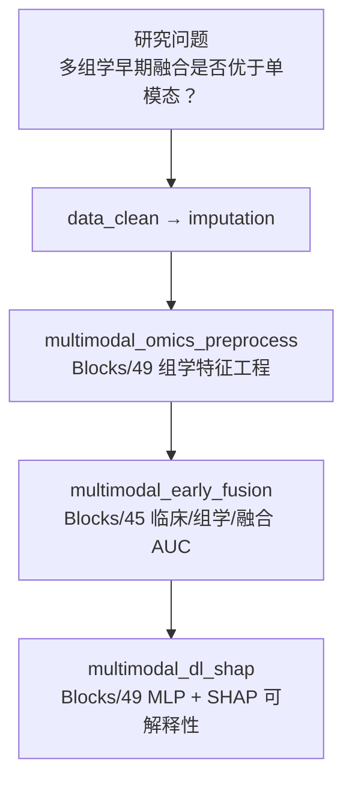

# 分析决策树 — 多模态融合（临床+组学 → TBI 手术/输血）

> 配置：`configs/config_multimodal_tbi.R`  
> 运行：`run/multimodal/run_multimodal_tbi.R`  
> Batch：`run/multimodal/run_multimodal_tbi_batch.R`  
> 文献：Deng 2025 *npj Digital Medicine* 02072-5

## 研究设定

| 项 | 值 |
|---|---|
| 模态 | 临床（Age/GCS/SBP…）+ 组学（Omics_1–5） |
| 结局 | `Outcome` 二分类 |
| 预处理 | 方差过滤、标准化、缺失填补后特征矩阵 |
| 融合 | 早期融合 logistic AUC + **深度学习 MLP + SHAP** |

## 完整流水线

## Block 映射

| Step | Block | 文件夹 | 状态 |
|------|-------|--------|------|
| 1 | `multimodal_omics_preprocess` | `Blocks/49_multimodal_full/` | ✅ |
| 2 | `multimodal_early_fusion` | `Blocks/45_multimodal/` | ✅ |
| 3 | `multimodal_dl_shap` | `Blocks/49_multimodal_full/` | ✅ smoke |

## 实现说明

| 模块 | 实现 | 与原文差距 |
|------|------|------------|
| 组学预处理 | 低方差剔除 + z-score + 特征表导出 | 非原文完整 WGCNA/批次校正 |
| 早期融合 | R `glm` + ROC-AUC 对比 | 与原文一致思路 |
| 深度学习 | Python `sklearn` MLPClassifier | 非原文自定义深度架构 |
| SHAP | `shap.TreeExplainer` / `KernelExplainer` 降级 | 正式论文级图需更大样本与调参 |

**注：** 原决策树「深度学习可解释模块 ❌」已改为 **✅ smoke 可跑**；生产环境需替换为正式模型权重与外部验证集。
