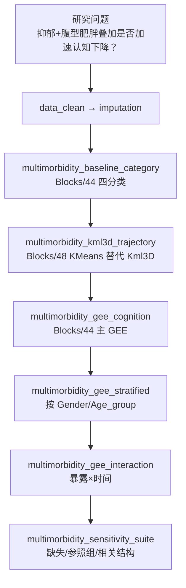

# 分析决策树 — 多病叠加（抑郁 × 腹型肥胖 → 认知）

> 配置：`configs/config_multimorbidity_additive.R`  
> 运行：`run/multimorbidity/run_multimorbidity_additive.R`  
> Batch：`run/multimorbidity/run_multimorbidity_additive_batch.R`  
> 文献：Wang 2025 *BMC Medicine* 04298

## 研究设定

| 项 | 值 |
|---|---|
| 暴露组合 | Depression × Abdominal_obesity 四分类 |
| 结局 | 纵向 `Cognition_z` |
| 轨迹 | **Kml3D 联合轨迹聚类**（方法学核心） |
| 主分析 | GEE（exchangeable）+ 基线分层 + 交互 + 敏感性套件 |

## 完整流水线

## Block 映射

| Step | Block | 文件夹 | 状态 |
|------|-------|--------|------|
| 1 | `multimorbidity_baseline_category` | `Blocks/44_multimorbidity/` | ✅ |
| 2 | `multimorbidity_kml3d_trajectory` | `Blocks/48_multimorbidity_full/` | ✅ smoke |
| 3 | `multimorbidity_gee_cognition` | `Blocks/44_multimorbidity/` | ✅ |
| 4 | `multimorbidity_gee_stratified` | `Blocks/48_multimorbidity_full/` | ✅ |
| 5 | `multimorbidity_gee_interaction` | `Blocks/48_multimorbidity_full/` | ✅ |
| 6 | `multimorbidity_sensitivity_suite` | `Blocks/48_multimorbidity_full/` | ✅ |

## 实现说明

| 模块 | 实现 | 与原文差距 |
|------|------|------------|
| Kml3D | Python `sklearn.KMeans` 多变量轨迹聚类 | 非 R `kml3d` 包；保留聚类数与轨迹图输出 |
| 分层 GEE | 按 `multimorbidity_gee$stratify_vars` 循环 | 与原文亚组一致 |
| 交互项 | 四分类 × `Followup_wave` | smoke 简化协变量 |
| 敏感性 | 交换相关结构 / 完整病例 / 参照组切换 | 非全文全部敏感性 |
