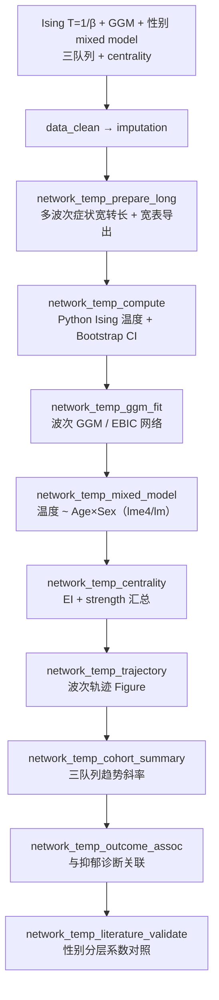

# 分析决策树 — 青少年抑郁网络温度（Grimes 2025）

> 配置：`configs/config_network_temperature_adolescent.R`  
> Batch：`configs/config_network_temperature_adolescent_batch.R` → `run/network_temperature/run_network_temperature_adolescent_batch.R`  
> 并行总入口：`run/study/run_four_user_paper_pipelines_parallel_batch.R`  
> 文献：Grimes 2025 *Nat Mental Health* — network temperature  
> Python：`python/block_literature_extensions.py`（`mode_network_temperature_ising`、`psych_network_ggm`）  
> 飞书：**B29**

## 研究问题

青春期抑郁症状网络的 **network temperature**（Grimes 2025：多组 Ising，T=1/β，首波 β=1）如何随发育下降？ABCD / ALSPAC / MCS 三队列、性别分层 mixed model 与 centrality 分析链如何？原文 Age×Sex 系数能否自动对照？

## 完整流水线（Single）

## Batch 分层

| 层 | Blocks | 说明 |
|----|--------|------|
| **shared** | `data_clean` → `imputation` → `network_temp_prepare_long` | 全队列合并准备 |
| **unit** | `network_temp_compute` → `network_temp_ggm_fit` → `network_temp_mixed_model` → `network_temp_centrality` → `network_temp_trajectory` → `network_temp_cohort_summary` → `network_temp_outcome_assoc` | 并行 3 路：`ABCD` / `ALSPAC` / `MCS` |
| **finalize** | `network_temp_literature_validate` | 三队列 mixed model 系数与 Grimes 2025 对照 |

## Block 映射

| Step | Block | 文件 | 主要产出 |
|------|-------|------|----------|
| 01 | `data_clean` | `Blocks/02_data_clean/` | 三队列宽表 |
| 02 | `imputation` | `Blocks/03_imputation/` | 插补后症状宽表 |
| 03 | `network_temp_prepare_long` | `61/01block_network_temp_prepare_long.R` | `_network_temp_wide.csv`、long 格式 |
| 04 | `network_temp_compute` | `61/02block_network_temp_compute.R` | `Table_Network_Temperature_Ising_by_Wave.csv`（T、β、Bootstrap CI） |
| 05 | `network_temp_ggm_fit` | `61/05block_network_temp_ggm_fit.R` | `Table_Network_Edges.csv`、`Table_Network_EI.csv` |
| 06 | `network_temp_mixed_model` | `61/06block_network_temp_mixed_model.R` | `Table_Network_Temperature_MixedModel.csv`、`Table_Network_Temperature_MixedModel_by_Sex.csv` |
| 07 | `network_temp_centrality` | `61/07block_network_temp_centrality.R` | `Table_Network_Centrality_EI_Strength.csv` |
| 08 | `network_temp_trajectory` | `61/03block_network_temp_trajectory.R` | `Figure_Network_Temperature_Trajectory.pdf` |
| 09 | `network_temp_cohort_summary` | `61/08block_network_temp_cohort_summary.R` | `Table_Network_Temperature_Cohort_Trends.csv` |
| 10 | `network_temp_outcome_assoc` | `61/04block_network_temp_outcome_assoc.R` | 温度–结局关联 |
| 11 | `network_temp_literature_validate` | `61/09block_network_temp_literature_validate.R` | `Table_Network_Temperature_Literature_Validation.csv` |

## 算法链（Grimes 2025）

| 步骤 | 方法 | 说明 |
|------|------|------|
| 二值化 | 中位数阈值 | 症状矩阵 → Ising 状态 |
| 边估计 | nodewise logistic PMLE | 伪似然 Ising 边权 J、h |
| 温度 | T = 1/β | 首波强制 β=1 锚定 |
| 熵 | Gibbs 配分函数 | 小网络精确枚举 |
| 不确定性 | Bootstrap | `T_lo95` / `T_hi95` |
| 网络结构 | GGM + LASSO/EBIC | `psych_network_ggm` 模式 |
| 趋势 | `lmer(network_temperature ~ Age * Sex + (1\|ID))` | 性别分层发育趋势 |

> **非**简单相关矩阵熵代理；旧 `network_temperature` 模式已重定向至 Ising 实现。

## 原文对照（`literature_targets`）

| 指标 | 原文目标（β） | 说明 |
|------|--------------|------|
| Age 主效应 | -0.08 | mixed model |
| Age×Sex 交互 | -0.04 | 性别分层斜率差 |
| 性别截距差 | 0.05 | 原文未明确说明时标记 NA |

> Smoke 数据系数符号/量级与原文 Figure 不一致属预期；需 ABCD/ALSPAC/MCS 真实数据重跑。

## 数据与 Smoke

- 原始：`Data/smoke/D01_network_temperature_adolescent.RData`（`NetworkTempAdolescent`，含 `Cohort` = ABCD/ALSPAC/MCS）
- 症状列：`DEP_S1_W1` … `DEP_S9_W4`
- 生成：`scripts/create_smoke_four_user_paper_pipelines_data.R`
