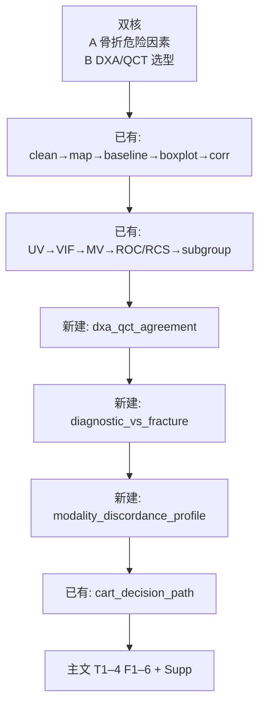

# 分析决策树 — 骨质疏松 DXA/QCT 适用场景 + 椎体骨折危险因素（personalized）

> 课题产出：`\\192.168.68.133\02block_result\10_osteoporosis\personalized`  
> WSL：`/mnt/g/02block_result/10_osteoporosis/personalized`  
> 设计规格：`docs/superpowers/specs/2026-09-22-osteoporosis-dxa-qct-personalized-design.md`  
> 方案：两份 docx（多因素画像 + 老师分析思路）  
> 打包：**方案 1** 主文双核精简；**D6** 优先复用 Block，缺口新建 3 块

---

## ★ 落地状态（2026-09-22）

| 卡点 | 状态 |
| --- | --- |
| 数据核对 n=208 / 无缺失 / 骨折差与不一致 | 已清 |
| 叙事 C + 方案 1 + 可新建 Block | 已确认 |
| 设计 spec 定稿 | 已写入 |
| 实现计划 | `docs/superpowers/plans/2026-09-22-osteoporosis-dxa-qct-personalized.md` |
| 三个新 Block 实现 | 已完成（agreement / diagnostic / discordance + catalog） |
| 双 config + Table2 合并脚本 | 已完成（Task 8–9） |
| config / pipeline 开跑 | **已跑**（Task 10，2026-09-22） |
| 主文 T1–4 / F1–6 + 四目录 | `summary_results/`（κ=0.316；QCT_only n=40；CART 中文叶标签） |

---

## 研究设定

| 项 | 值 |
| --- | --- |
| 类型 | 单库 **发病**（`study_type=incidence`） |
| N | 208 |
| 核 A 结局 | `Vertebral_fracture` 0/1 |
| 核 B 金标准 | 同上；比较 DXA vs QCT |
| 主分层 | Nathan 1–2 vs 3–4；AAC；BMI &lt;24 / ≥24 |
| 对照评分 | 不适用（非 ICU 评分课题） |

---

## 关键决策点

| ID | 定稿 |
| --- | --- |
| D1 | 双核并重（骨折风险 + 工具选型） |
| D2 | 骨折作金标准 |
| D3 | 主分层 Nathan/AAC/BMI；Age→补充 |
| D4 | 核 A 两套 Model（QCT-vBMD / DXA-T） |
| D5 | `cart_decision_path` ≤3 层 |
| D6 | 复用优先；新建 `dxa_qct_agreement` / `diagnostic_vs_fracture` / `modality_discordance_profile` |

---

## 总览

---

## 主文图表 ↔ Block

| 产物 | Block |
| --- | --- |
| T1 骨折基线 | `baseline_binary` |
| T2 多因素 OR 双 Panel | `univariate_incidence_binary` + `multivariate_incidence_binary` |
| T3–4 诊断效能±分层 | **`diagnostic_vs_fracture`（新建）** |
| F1 流程图 | `attrition_flowchart` |
| F2 OR 森林 | multivariate / logistic 出图 |
| F3 一致性 | **`dxa_qct_agreement`（新建）** |
| F4–5 ROC/分层 Sens | **`diagnostic_vs_fracture`（新建）** |
| F6 决策路径 | `cart_decision_path` |
| S5 不一致画像 | **`modality_discordance_profile`（新建）** |

---

## 推荐 pipeline

见 spec §6。顺序要点：核 A 回归链跑完 → 三个新 Block → `cart_decision_path` → `attrition_flowchart`。

---

## 新建 Block 一句话

1. **`dxa_qct_agreement`**：κ + 交叉表 + Bland–Altman → Fig3  
2. **`diagnostic_vs_fracture`**：骨折金标准诊断与分层 → T3–4、Fig4–5  
3. **`modality_discordance_profile`**：Both / QCT-only / DXA-only 画像 → Table S5  

实现后必须 `register_block` + `scripts/update_blocks_catalog.py`。
