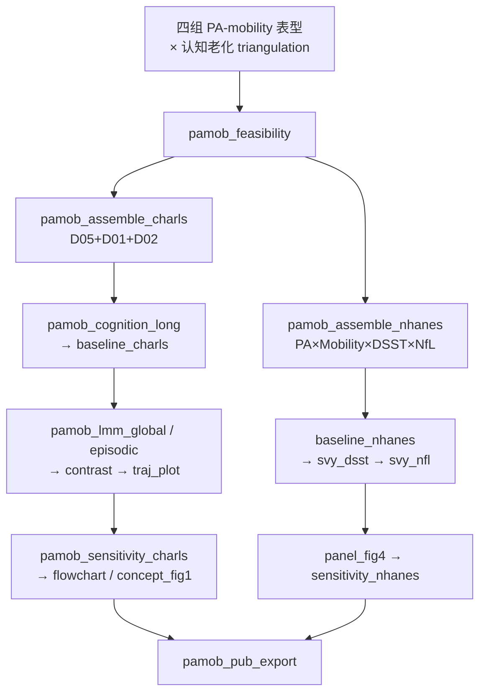

# 分析决策树 — PA–Mobility 联合表型与认知衰老（CHARLS + NHANES）

> 配置：`configs/config_pa_mobility_cognitive.R`  
> Batch：`configs/config_pa_mobility_cognitive_batch.R` → `run/pa_mobility_cognitive/run_pa_mobility_cognitive_batch.R`  
> 设计：`docs/superpowers/specs/2026-09-20-pa-mobility-cognitive-charls-nhanes-design.md`  
> 计划：`docs/superpowers/plans/2026-09-20-pa-mobility-cognitive-charls-nhanes.md`  
> 数据：`G:/02block_result/02_Cognitive_impairment/trajectory_Personalized_yuhan/data`  
> 产出：`G:/02block_result/02_Cognitive_impairment/pa_mobility_cognitive_charls_nhanes`  
> 选型：**A** — LMM `phenotype × time`（非 LCMM）  
> R：`/mnt/c/Program Files/R/R-4.5.1/bin/x64/Rscript.exe`

## 研究问题

四种 **身体活动–移动能力** 联合表型是否对应不同的 CHARLS 认知老化轨迹？NHANES 中是否呈现一致方向的 DSST / serum NfL 差异（cross-database triangulation，不合并个体）？

## 完整流水线

## Batch 分层

| 层 | Blocks | 说明 |
|----|--------|------|
| **shared** | `pamob_feasibility` | 可行性闸门（两库 n / 四组分布） |
| **unit CHARLS** | assemble → cognition_long → baseline → LMM → contrast → traj → sensitivity → flowchart → concept | 纵向主分析 |
| **unit NHANES** | assemble → baseline → svy_dsst → svy_nfl → panel_fig4 → sensitivity | 横断面补充 |
| **finalize** | `pamob_pub_export` | Figures 四目录 |

## Block 映射

| Step | Block | 文件 |
|------|-------|------|
| 01 | `pamob_feasibility` | `74/01block_pamob_feasibility.R` |
| 02 | `pamob_assemble_charls` | `74/02block_pamob_assemble_charls.R` |
| 03 | `pamob_cognition_long` | `74/03block_pamob_cognition_long.R` |
| 04 | `pamob_baseline_charls` | `74/04block_pamob_baseline_charls.R` |
| 05 | `pamob_lmm_global` | `74/05block_pamob_lmm_global.R` |
| 06 | `pamob_lmm_episodic` | `74/06block_pamob_lmm_episodic.R` |
| 07 | `pamob_contrast_preset` | `74/07block_pamob_contrast_preset.R` |
| 08 | `pamob_traj_plot` | `74/08block_pamob_traj_plot.R` |
| 09 | `pamob_sensitivity_charls` | `74/09block_pamob_sensitivity_charls.R` |
| 10 | `pamob_flowchart` | `74/10block_pamob_flowchart.R` |
| 11 | `pamob_concept_fig1` | `74/11block_pamob_concept_fig1.R` |
| 12 | `pamob_assemble_nhanes` | `74/12block_pamob_assemble_nhanes.R` |
| 13 | `pamob_baseline_nhanes` | `74/13block_pamob_baseline_nhanes.R` |
| 14 | `pamob_svy_dsst` | `74/14block_pamob_svy_dsst.R` |
| 15 | `pamob_svy_nfl` | `74/15block_pamob_svy_nfl.R` |
| 16 | `pamob_panel_fig4` | `74/16block_pamob_panel_fig4.R` |
| 17 | `pamob_sensitivity_nhanes` | `74/17block_pamob_sensitivity_nhanes.R` |
| 18 | `pamob_pub_export` | `74/18block_pamob_pub_export.R` |

## 图表

| 编号 | 内容 |
|------|------|
| Figure 1 | 概念框架 + 四组示意 |
| Figure 2 | CHARLS 纳排流程 |
| Figure 3 | CHARLS 四组校正 global trajectories |
| Figure 4 | NHANES DSST + sNfL 双面板 |
| Table 1 | CHARLS 四组基线 |
| Table 2 | LMM phenotype×time + 两项预设对比 |
| Table 3 | NHANES 四组基线（加权） |
| Table 4 | NHANES → DSST / log-sNfL |

## 铁律摘要

- 参照组：`Active_preserved`；PA 阈值 600；mobility = any difficulty  
- NHANES NfL：`WTSSNH2Y` + strata/PSU；主分析年龄 60–75、cycle H  
- 不合并个体；不做 NfL 中介；不做 LCMM 主路径  
- 不改动 `trajectory_Personalized_yuhan` 既有结果，只读其 `data/`
