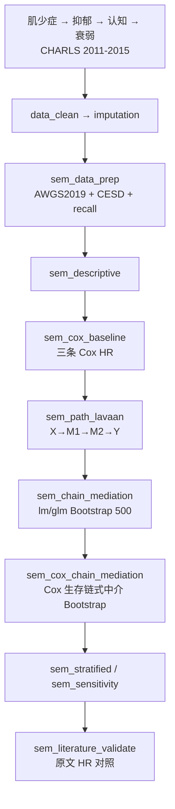

# 分析决策树 — SEM + 链式中介（Zhu 2025 CHARLS）

> 配置：`configs/config_sem_chain_mediation_charls.R`  
> Batch：`configs/config_sem_chain_mediation_charls_batch.R` → `run/sem_chain_mediation/run_sem_chain_mediation_charls_batch.R`  
> 并行总入口：`run/study/run_four_user_paper_pipelines_parallel_batch.R`  
> 文献：Zhu 2025 *J Adv Research* — sarcopenia → depression → cognitive → frailty  
> 飞书：**B25**（结构方程）+ **B27**（链式中介，同一流水线）

## 研究问题

基线肌少症是否通过抑郁与认知功能（链式中介）影响衰弱发生？Cox 生存 + SEM 路径 + Bootstrap 链式 indirect effect 如何分解？原文 HR / 间接效应能否自动对照？

## 完整流水线（Single）

## Batch 分层

| 层 | Blocks | 说明 |
|----|--------|------|
| **shared** | `data_clean` → `imputation` → `sem_data_prep` → `sem_descriptive` → `sem_cox_baseline` → `sem_path_lavaan` | 全样本共享 checkpoint |
| **unit** | `sem_chain_mediation` → `sem_cox_chain_mediation` → `sem_stratified` → `sem_sensitivity` → `sem_literature_validate`（仅 Overall） | 并行 3 路：`Overall` / `Male` / `Female` |

## Block 映射

| Step | Block | 文件 | 主要产出 |
|------|-------|------|----------|
| 01 | `data_clean` | `Blocks/02_data_clean/` | 清洗后宽表 |
| 02 | `imputation` | `Blocks/03_imputation/` | 插补后分析集 |
| 03 | `sem_data_prep` | `62/01block_sem_data_prep.R` | 肌少症/抑郁/认知/衰弱变量 |
| 04 | `sem_descriptive` | `62/02block_sem_descriptive.R` | `Table_SEM_Baseline_by_Sarcopenia.csv` |
| 05 | `sem_cox_baseline` | `62/03block_sem_cox_baseline.R` | `Table_SEM_Cox_Baseline_Paths.csv` |
| 06 | `sem_path_lavaan` | `62/04block_sem_path_lavaan.R` | `Table_SEM_Path_Coefficients.csv` |
| 07 | `sem_chain_mediation` | `62/05block_sem_chain_mediation.R` | `Table_Chain_Mediation_Bootstrap.csv` |
| 08 | `sem_cox_chain_mediation` | `62/08block_sem_cox_chain_mediation.R` | `Table_Cox_Chain_Mediation_Bootstrap.csv` |
| 09 | `sem_stratified` | `62/06block_sem_stratified.R` | `Table_SEM_Stratified_Cox.csv` |
| 10 | `sem_sensitivity` | `62/07block_sem_sensitivity.R` | `Table_SEM_Sensitivity.csv` |
| 11 | `sem_literature_validate` | `62/09block_sem_literature_validate.R` | `Table_SEM_Literature_Validation.csv` |

## 原文对照（`literature_targets`）

| 指标 | 原文目标 | 对照 block |
|------|----------|------------|
| Depression→Frailty HR | 1.371 | `sem_literature_validate` |
| Cognitive→Frailty HR | 1.514 | 同上 |
| Sarcopenia→Frailty HR | 1.456 | 同上 |
| 链式间接 HR | config 待填 | `sem_cox_chain_mediation` → validate |

> Smoke 数据下 HR 偏差大属预期；真实 CHARLS 数据接入后重跑 validate。

## Smoke 数据

- `Data/smoke/D01_sem_chain_mediation_charls.RData`（`SemChainCHARLS`）
- 生成：`scripts/create_smoke_four_user_paper_pipelines_data.R`
