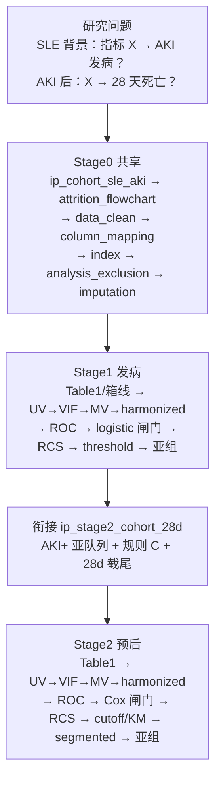

# 分析决策树 — SLE → AKI 发病 + 28 天预后（单库 MIMIC 两阶段）

> 运行入口：`run/sle_aki_inc_prog/run_sle_aki_inc_prog_batch.R`（Task 8）
> 模板：`configs/templates/config_sle_aki_inc_prog_batch.template.R`
> 研究 config：`G:/02block_result/29_SLE/inincidence_prognosis_39003396_42304330/config_sle_aki_inc_prog_batch.R`
> 架构：`dual_db$enable = FALSE`；Stage0 共享 + 按指标 worker（Stage1 → 胶水 → Stage2）
> 图门控：`pub_figure$profile = "mimic_inc_prog_sle_aki"`（仅本套路）
> 飞书工作计划：**Bxx**（Task 9 取下一空号）；多维表 [RBjfb2iwmamW14s4WhKcS7kwnie](https://lcn1in9jd6ie.feishu.cn/base/RBjfb2iwmamW14s4WhKcS7kwnie)
> 对照：单库发病 `decision_tree_incidence_single.md`；预后闸门对齐 survival dual-batch

## 研究设定

| 项 | 值 |
| -- | -- |
| 背景人群 | MIMIC ICU first-stay ∩ `SLE.csv`（现场筛入；dabiao 仅核对） |
| Stage1 类型 | `project$study_type = "incidence"`；结局 `Disease`（**AKI / No AKI**，非 SLE 成员身份） |
| Stage1 结局标签 | `analysis_group = "AKI"`，`reference_group = "No AKI"`；`project$disease = "SLE"` 仅用于课题名/表题 |
| Stage2 类型 | 胶水块改为 `prognosis`；结局 `fustatus` / 时间 `futime`（28 天行政截尾） |
| 暴露 | 营养/炎症复合指标（`index$only`：CONUT/PNI/GNRI/NLR/SII/…）；缺成分 skip |
| 库 | 单库 MIMIC；产出根 = `project$output_dir`（**不是**引擎仓库） |
| 分位 | 仅由 Stage1 logistic / Stage2 Cox 闸门锁定；下游禁止另写 grouping |

---

## 总览



---

## 流程图 15 步对照（全绿）

| # | 步骤 | 落实（block / 文档） |
| - | ---- | -------------------- |
| ① | MIMIC cohort | `ip_cohort_sle_aki`：baseline ∩ SLE.csv；Age≥18 |
| ② | 时间零点 | **规则 C**（见下）：Stage1 = ICU intime；Stage2 = `aki_time` 否则 ICU intime |
| ③ | 暴露基线窗 | `index` / dabiao 惯例：ICU intime 后首次/基线实验室；禁止用结局后实验室 |
| ④ | 疾病时间窗 | `ip_two_stage$aki_window_note`：ICU 住院期 ARF/AKI 二分类（无精确小时） |
| ⑤ | DAG 混杂 | 下文 DAG 文字版 + `force_covariates` ∪ UV/MV；无自动 DAG 软件 |
| ⑥ | Table 1 | Stage1 `baseline_binary`（按 AKI）；Stage2 再跑（按 28d 死亡） |
| ⑦ | Logistic | Stage1 闸门 Q→T→B→Quintile |
| ⑧ | RCS | `rcs_incidence` 与 `rcs_prognosis` |
| ⑨ | threshold / piecewise | `threshold_logistic` + `segmented_cox_*`（随 Cox 闸门） |
| ⑩ | subgroup + interaction | `subgroup_incidence` / `subgroup_prognosis`；Age **二分类 65** |
| ⑪ | ROC | 两端 `simple_ROC` |
| ⑫ | 第二阶段 cohort | `ip_stage2_cohort_28d` |
| ⑬ | KM + Cox | Stage2；28 天窗，脚注非真长期随访 |
| ⑭ | MI | Stage0 `imputation`（MICE cart） |
| ⑮ | sensitivity | `incidence_batch$sensitivity_suite$enable=TRUE` → 主分析 **success 后自动**跑轻量敏感性（Yes/No + 年龄±完整病例；Table1+Logistic）；两阶段从 `_shared` 回退插补 ck |

---

## 时间零点规则 C

1. **Stage1（发病）**：分析时钟与暴露窗的时间零点 = **ICU intime**（`icu_intime`）。
2. **Stage2（预后）**：
   - 若该行存在非缺失 `aki_time` → t0 = AKI 发生时刻（`ip_stage2_timezero_source = "aki_onset"`）；行内缺失仍回退 intime。
   - 否则全队列 t0 = **ICU intime**（`ip_stage2_timezero_source = "icu_intime"`）。
3. **本课题数据**：baseline / 预后表 **无 `aki_time` 列**（Task 1/4 冒烟：`timezero=icu_intime`）。正文与 Figure/Table 脚注必须写明「Stage2 时间零点回退 ICU intime，而非 AKI 精确起病」。

---

## 28 天死亡定义

由 `ip_admin_censor_28`（`00ip_common.R`）写出：

- `t` = 死亡时刻 − t0（天）；存活则用末次可得终点 `disch_time` 否则 `icu_outtime` − t0。
- `fustatus = 1` 当且仅当死亡且 `t ≤ 28`；否则 `0`。
- `futime = min(t, 28)`（活着行政截在 28）。

**院内截尾偏倚（Task 4）**：本提取以院内死亡/`disch_time` 为主，无社区 28 天随访。存活者在出院处截尾，等价于「院内 28 天死亡」。出院后 28 天内死亡被当作删失，可能低估真实 28 天死亡率（信息性删失）。image_information / 表注必须保留此脚注。

---

## DAG 文字版（非自动软件）

```text
  [Age, Gender, Race, BMI]
  [Hypertension, T2DM, Heart_Failure]
  [GCS]                        ← force 集（文献常用；不含肾泄漏）
           \  |  /
            \ | /
             ▼▼▼
  基线窗营养/炎症指标 X  ──────────────►  AKI（Stage1, Disease）
             │                              │
             │                              ▼
             └────────（同一 X，t0=规则 C）──►  28 天死亡（Stage2）

  禁止进入 DAG / 模型 / 亚组（disease_vars，Task 1）:
    Acute_Renal_Failure, CRRT, CRRT_Day, CKD,
    Creatinine, UreaNitrogen, 尿检全套, UrineVolume,
    SOFA, CHARLSON, DN
```

锁定协变量：**仅 Stage1** 经单因素 → VIF → 多因素 → logistic 闸门得到 Model1/Model2；**Stage2 不再筛协变量**，Cox/RCS/KM/亚组直接注入发病锁定集（`ip_two_stage$reuse_stage1_covariates=TRUE`）。`ip_two_stage$force_covariates` 仅作 Stage1 UV/MV 候选池必填项。Age/Gender 强制（`covariate_policy$force_age` / `force_sex`）。

---

## Stage0：队列与准备

| Step | Block | 说明 |
| ---- | ----- | ---- |
| 01 | `ip_cohort_sle_aki` | baseline ∩ SLE；Age≥18；写出 `Disease` / `ip_attrition_steps` |
| 02 | `attrition_flowchart` | Figure 1（见下「纳排计数」） |
| 03 | `data_clean` | 吃 `ip_cohort_prepared` 分析集，不重载全库 65366 |
| 04 | `column_mapping` | `database_type = "MIMIC"` |
| 05 | `index` | 计算 `index$only`；缺成分 skip |
| 06 | `analysis_exclusion` | `disease_vars` 硬排除 + 当前指标组成闭包 |
| 07 | `imputation` | MICE；Table S1 / 缺失图 |

真数据 sanity（Task 3）：baseline 65366 → SLE 271 → analytic **270**（1 例 Age=NA）→ AKI **110**。

### Figure 1 逐步人数从哪来

`attrition_flowchart` **不读取** `ctx$results$ip_attrition_steps`。Figure 1 由 `config$attrition$steps` 解析：

1. `source = "rdata"` → MIMIC ICU baseline n（65366）
2. `source = "id_file"` → `SLE.csv` ∩ baseline ID（271）
3. `source = "current"` → 当时分析集 n（Stage0 在 `ip_cohort` 之后为 Age 过滤后 ~270）

`ip_attrition_steps`（step / n_in / n_out / n_excluded / reason）仍由 `ip_cohort_sle_aki` 落在 ctx，供日志与 image_information 脚注。`auto_append=TRUE` 会在后续块 nrow 变化时追加「After \<block\>」行。dabiao 271 vs 现场 270 的差写入 `ip_cohort` 核对日志；**主分析以现场筛入为准**。

---

## 定稿主文图/表叙事线（发表层）

| 编号 | 内容 |
|------|------|
| Figure 1 | 纳排（`_shared` → 每指标拷贝） |
| Figure 2 | Stage1 RCS（指标 → AKI） |
| Figure 3 | Stage1 亚组森林 |
| Figure 4 | Stage2 RCS（指标 → 28d 死亡） |
| Figure 5 | 闸门 KM（仅一张；binary/Combined → Figure S） |
| Figure 6 | Stage2 亚组森林 |
| Table 1 | Stage1 基线（按 AKI）；`early_stop_if_index_ns=TRUE` |
| Table 2 | Stage1 Logistic（闸门 grouping） |
| Table 3 | Stage2 基线（among AKI by 28-day mortality） |
| Table 4 | Stage2 Cox（binary 强制导出，即使闸门 NS） |

---

## Stage1：发病


闸门失败链与单库发病模板一致：quartile → tertile → binary → quintile。无 `logistic_quintile_glm_rcs` 注册块，RCS 分组表只挂 Q/T/B。

---

## 衔接 + Stage2：预后

`ip_stage2_cohort_28d`：筛 `Disease==1` → 并 `mimic预后数据-all.csv` → 规则 C → `ip_admin_censor_28` → 覆写分析集为 AKI 亚队列，并切换 `study_type` / `futime`/`fustatus`。

**须先完成 Stage1 导出再切阶段**（覆写 `imputed`）。

Stage2：`baseline_binary` → UV/VIF/MV/harmonized → `simple_ROC` → Cox Q/T/B 闸门 → `rcs_prognosis` → `plot_cutoff`（本套路 `enable=TRUE`）→ `km_strata` / `km_binary` → `segmented_cox_*` → `subgroup_prognosis`。

28 天事件约 24/110（Task 4 冒烟）；Cox / 亚组可能不稳，属预期限制。

---

## 完整 Block 序（模板 `pipeline$blocks` / `pipeline_regular_batch`）

```text
# Stage0
ip_cohort_sle_aki
attrition_flowchart
data_clean
column_mapping
index
analysis_exclusion
imputation
# Stage1
baseline_binary
boxplot
univariate_incidence_binary
multicollinearity_screen
multivariate_incidence_binary
multicollinearity_final
multivariate_incidence_harmonized
simple_ROC
logistic_quartile_glm
logistic_tertile_glm
logistic_binary_glm
logistic_quintile_glm
rcs_incidence
logistic_quartile_glm_rcs
logistic_tertile_glm_rcs
logistic_binary_glm_rcs
threshold_logistic
subgroup_incidence
# Bridge
ip_stage2_cohort_28d
# Stage2
baseline_binary
univariate_prognosis
multicollinearity_screen
multivariate_prognosis
multicollinearity_final
multivariate_prognosis_harmonized
simple_ROC
cox_quartile
cox_tertile
cox_binary
rcs_prognosis
plot_cutoff
km_strata
km_binary
segmented_cox_quartile
segmented_cox_tertile
segmented_cox_binary
subgroup_prognosis
```

分列表：`pipeline_shared`（Stage0）、`pipeline_stage1`、`pipeline_stage2`，供 worker 分段调用。

---

## 脚注清单（表/图/image_information 必带）

1. **无 `aki_time`**：Stage2 t0 = ICU intime，不是 AKI 起病时刻。
2. **院内截尾**：存活者截在出院/出 ICU；28 天死亡为院内口径，存在出院后死亡漏计偏倚。
3. **AKI 窗**：ICU 期诊断/标志阳性，非 48h 早期窗（早期窗仅当数据可操作时作敏感性，本期主分析不做）。
4. **dabiao vs 现场**：以 `ip_cohort` 现场 n 为准；人数差写日志。
5. **KM/Cox 时间窗**：行政 28 天，不是住院外长期生存。

---

## 程序员常用命令

```bash
cd /mnt/e/01block/01Block-new-Final
"/mnt/c/Program Files/R/R-4.5.1/bin/x64/Rscript.exe" \
  run/sle_aki_inc_prog/run_sle_aki_inc_prog_batch.R \
  --config "G:/02block_result/29_SLE/inincidence_prognosis_39003396_42304330/config_sle_aki_inc_prog_batch.R" \
  --only-index NLR --workers 1
```

产出：结果根下 `by_index/`、`Tables/`、`Figures/`（`mirror_pub_outputs_to_root` 相对 **output_dir**）。成功指标 finalize 须带 `code/` 包（index_success_code_bundle）。

---

## 新课题挂接检查清单

- [x] `_column_review.md` 已审列；`disease_vars` 与 Task 1 名单一致
- [x] pipeline 含 `ip_cohort_sle_aki` / `analysis_exclusion` / `ip_stage2_cohort_28d` / `threshold_logistic`
- [x] `subgroup$age_cutoff = 65` 二分类；`Age_Group` 仅 `"< 65"` / `"≥ 65"`
- [x] `pub_figure$profile = "mimic_inc_prog_sle_aki"`；`dual_db$enable = FALSE`
- [x] 飞书编号占位 **Bxx**（Task 9 填写）
