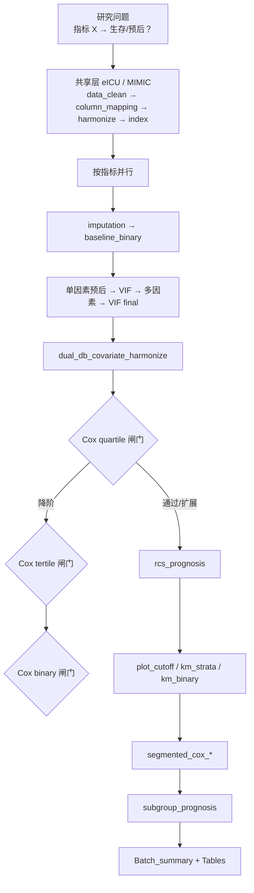

# 分析决策树 — 双库预后批量（survival dual batch）

> 程序员接口：`medical-blocks-studies`（5001）  
> 运行入口：`run/survival/run_survival_dual_batch.R`  
> 薄 config 构建：`configs/study_interface/survival_dual_batch_build.R`  
> 模板：`configs/templates/config_survival_dual_batch.template.R`  
> 常用库对：eICU + MIMIC（`dual_db`）

## 研究设定

| 项 | 值 |
|---|---|
| 研究类型 | `project$study_type = "prognosis"` |
| 时间 / 事件 | `survival$time_var` / `survival$event_var`（如 `futime` / `fustatus`） |
| 暴露 | 炎症/复合指标批量（每指标一 worker） |
| 架构 | **共享层 → 指标层 Cox 闸门链 → KM/RCS/分段 Cox → 亚组 → 汇总** |

---

## 总览



---

## 共享层（每库 1 次）

| Step | Block |
|------|-------|
| 01 | `data_clean` |
| 02 | `column_mapping` |
| 03 | `dual_db_column_harmonize` |
| 04 | `index` |

CLI：`run_study.bat <研究> --routine survival --shared-only`

---

## 指标层主链（`pipeline_regular_batch`）

| 阶段 | Blocks | 说明 |
|------|--------|------|
| 准备 | `imputation` → `baseline_binary` | 基线表；**不挂** `trim_index_extreme`（不修剪指标极端值） |
| 协变量 | `univariate_prognosis` → `multicollinearity_screen` → `multivariate_prognosis` → `multivariate_covariate_resolve` → `multicollinearity_final` | P&lt;0.1 筛 → VIF |
| 对齐 | `dual_db_covariate_harmonize` | 双库协变量一致 |
| Cox 闸门 | `cox_quartile` → `cox_tertile` → `cox_binary` | 粗模型最高层不显著可降阶 |
| 剂量反应 | `rcs_prognosis` | RCS |
| 生存图 | `plot_cutoff` → `km_strata` → `km_binary` | KM |
| 分段 | `segmented_cox_quartile` / `_tertile` / `_binary` | 分段 Cox |
| 亚组 | `subgroup_prognosis` | 森林图亚组 |

**闸门默认**（模板）：`stop_if_crude_highest_ns = TRUE`，`p_threshold = 0.05`；Q 失败 → T，T 失败 → B。

---

## 敏感性（可选）

`survival_batch$sensitivity_suite`：与发病同构。主分析成功后轻量重跑 Table 1/2；场景来自 Table 1 Yes/No（两库 Yes>50）+ 年龄分层；目录 `【success】`/`【failed】`；表 S12/S13。忽略旧课题残留的手写四场 `scenarios`。

---

## 程序员常用命令

```bat
run_study.bat <研究名> --routine survival --shared-only
run_study.bat <研究名> --routine survival --workers 4
run_study.bat <研究名> --routine survival --only-index NLR
```

若 config 含 `survival_dual_batch_build`，可省略 `--routine`（自动识别）。

产出：`by_index/<指标>/`、`Tables/Batch_summary_all_indices.csv`
