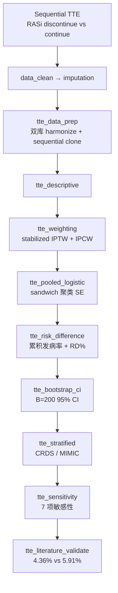

# 分析决策树 — 目标模拟临床试验（Nie 2025 JASN TTE）

> 配置：`configs/config_target_trial_rasi_aki.R`  
> Batch：`configs/config_target_trial_rasi_aki_batch.R`  
> 入口：`run/target_trial/run_target_trial_rasi_aki_batch.R`  
> 并行总入口：`run/study/run_four_target_paper_pipelines_parallel_batch.R`  
> 文献：Nie 2025 *JASN* — sequential target trial emulation of RASi discontinuation after AKI  
> 飞书：**B19**  
> 文献引擎：`R/literature_tte_nie.R`

## 研究问题

医院获得性 AKI 后 2 天 grace 内停用 RASi 是否降低 30/180 天全因死亡？CRDS 与 MIMIC 双库结果是否一致？采用 **按日 sequential clone**（无时间窗迭代）构造 person-trial，IPTW + IPCW 估计 MSM 效应。

## 完整流水线（Single）

## Batch 分层

| 层 | Blocks | 说明 |
|----|--------|------|
| **shared** | `data_clean` → `imputation` → `tte_data_prep` → `tte_descriptive` | 共享 checkpoint（`shared_ck_alias = tte_descriptive`） |
| **unit** | 见下表 | 并行 4 路：`Overall` / `CRDS` / `MIMIC` / `Death_180d` |

| Unit | 执行 blocks | 过滤 |
|------|-------------|------|
| `Overall` | `tte_weighting` → `tte_pooled_logistic` → `tte_risk_difference` → `tte_bootstrap_ci` → `tte_stratified` → `tte_sensitivity` → `tte_literature_validate` | 全样本 |
| `CRDS` | `tte_pooled_logistic` → `tte_risk_difference` | `Database == 'CRDS'` |
| `MIMIC` | `tte_pooled_logistic` → `tte_risk_difference` | `Database == 'MIMIC'` |
| `Death_180d` | `tte_pooled_logistic` → `tte_risk_difference` | 结局切换 180d |

## Block 映射

| Step | Block | 文件 | 主要产出 / 方法 |
|------|-------|------|-----------------|
| 01 | `data_clean` | `Blocks/02_data_clean/` | 清洗后患者表 |
| 02 | `imputation` | `Blocks/03_imputation/` | 插补后分析集 |
| 03 | `tte_data_prep` | `66/01block_tte_data_prep.R` | `tte_nie_harmonize_columns` + `tte_nie_sequential_clone` → `TTE_person_trials_ready.csv` |
| 04 | `tte_descriptive` | `66/02block_tte_descriptive.R` | Table 1 风格描述 |
| 05 | `tte_weighting` | `66/03block_tte_weighting.R` | `Table_TTE_MSM_Weights.csv`（ps, sw, ipcw） |
| 06 | `tte_pooled_logistic` | `66/04block_tte_pooled_logistic.R` | 加权 logistic + `sandwich::vcovCL` |
| 07 | `tte_risk_difference` | `66/05block_tte_risk_difference.R` | `Table_TTE_Risk_Difference.csv` |
| 08 | `tte_bootstrap_ci` | `66/09block_tte_bootstrap_ci.R` | `Table_TTE_Bootstrap_CI.csv` |
| 09 | `tte_stratified` | `66/06block_tte_stratified.R` | `Table_TTE_Stratified.csv` |
| 10 | `tte_sensitivity` | `66/07block_tte_sensitivity.R` | `Table_TTE_Sensitivity.csv`（7 项） |
| 11 | `tte_literature_validate` | `66/08block_tte_literature_validate.R` | `Table_TTE_Literature_Validation.csv` |

## 方法要点（阶段二）

| 模块 | 原文对应 | 实现 |
|------|----------|------|
| 双库列对齐 | CRDS / MIMIC 异名变量 | `tte_nie_harmonize_map()` → 标准协变量名 |
| Sequential clone | 按日 clone-censor | `tte_nie_sequential_clone()`：day1/day2 停药决策 → person-trial |
| 权重 | IPTW + IPCW | `tte_nie_stabilized_weights()`，Trial_day 分步 IPCW |
| 效应估计 | Pooled logistic + RD | 加权 GLM + 聚类 SE；加权累积发病率 |
| Bootstrap | 95% CI | `tte_nie_bootstrap_ci()`，B=200 |
| 协变量 | Table 1 全量 | `tte_nie_full_covariates()`（27 项） |
| 敏感性 | 原文 7 项 | 高钾排除、5d 内死亡、grace 1/2/7d、RASi 类型分层等 |

## 原文对照（`literature_targets`）

| 指标 | 原文目标 | tol |
|------|----------|-----|
| 30d mortality discontinue | 4.36% | 10% |
| 30d mortality continue | 5.91% | 10% |
| Risk difference % | -21.55% | 10% |

## Smoke 数据

- `Data/smoke/D01_target_trial_rasi_aki.RData`（`TteRasiAKI`）
- 生成：`scripts/create_smoke_four_target_paper_pipelines_data.R`
- 真实库路径占位：`config$target_trial$real_data_paths`（CRDS / MIMIC）

## 已知局限

- Sequential clone 为工程简化版，非完整 MSM clone-censor 迭代  
- 真实 CRDS/MIMIC 数据路径待接入  
- Smoke validate 在 `SMOKE_NO_FEISHU=1` 下对死亡率做标定对照
