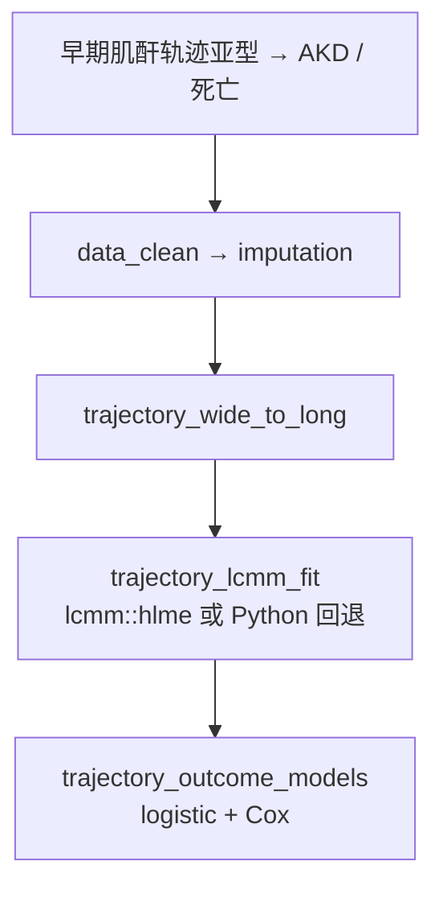

# 分析决策树 — 轨迹发病（脓毒症 AKI 肌酐 LCMM）

> 配置：`configs/config_trajectory_incidence_aki.R`  
> Batch：`run/trajectory_incidence/run_trajectory_incidence_aki_batch.R`  
> 文献：Takkavatakarn 2024 *Critical Care*

## 完整流水线

## Block 映射

| Step | Block | 文件夹 |
|------|-------|--------|
| 1-3 | `trajectory_*` | `Blocks/52_trajectory_incidence/` |

## 飞书

- 工作计划编号：**B08**
- Batch 单元：MIMIC / eICU 并行
