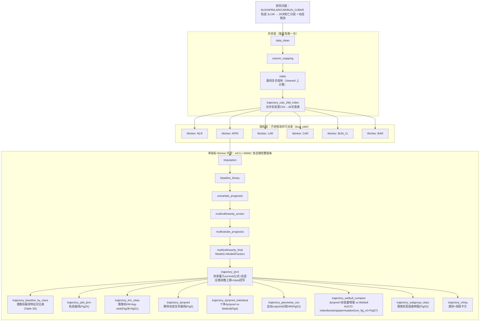
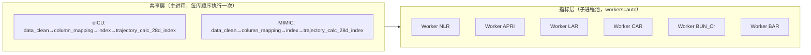

# 分析决策树 — 轨迹预后 APRI 多指标并行（NLR/APRI/LAR/CAR/BUN_Cr/BAR JLCM）

> 单指标调试配置：`configs/config_trajectory_prognosis_apri.R` → `run/trajectory_prognosis/run_trajectory_prognosis_apri.R`
> 多指标×双库批量配置：`configs/config_trajectory_prognosis_apri_batch.R` → `run/trajectory_prognosis/run_trajectory_prognosis_apri_batch.R`
> 归档版本：v1（迁移自 lcmm.R / Fig2A / Fig2B / Fig3 / FigS3 / run_fig_APRI_v2 / run_Fig4_APRI(_eICU) / run_figS1 / run_FigS2 / run_FigS7_APRI_v2）

## 研究问题

APRI（及 NLR/LAR/CAR/BUN_Cr/BAR 等多个复合指标）的入院后每日轨迹（JLCM 联合潜类别模型，协变量取 `multicollinearity_final` 筛出的全部因子）能否对 28 天死亡进行预后分层，其动态预测能力是否优于静态 Weibull 模型？

| 项 | 设定 |
|----|------|
| 研究类型 | `prognosis` |
| 暴露 | `index_group = dual_safe`（59 个两库共同复合指标，与发病 batch 一致），每指标独立建模 |
| 结局 | `survival_28d`（1=死亡）+ `survival_time_28d` |
| 队列 | eICU + MIMIC，**各自独立**拟合 JLCM（不做发现集→验证集迁移预测） |
| JLCM 协变量 | `multicollinearity_final` 的 `Model1Factors ∪ Model2Factors`，仅进入 `survival` 子公式 |
| 类别数规则 | `n_subj < 1000 → 最多4类；n_subj >= 1000 → 最多6类`（起始 ng=2，ng=1 为基线模型） |
| 下游默认类别数 | `prefer_final_ng = 2`（各图表/表格默认取用） |

## 关键架构决策（已与用户确认）

1. **协变量位置**：仅进入 `Jointlcmm` 的 `survival` 公式（调整组别特异性风险），`fixed`/`mixture` 仍只含时间样条。
2. **eICU / MIMIC**：两队列各自独立建模，互不迁移、互不协变量对齐。
3. **多指标并行**：新建独立的子进程池 batch runner（[R/trajectory_prognosis_batch_runner.R](../R/trajectory_prognosis_batch_runner.R)），复用 `R/study_batch_runner.R` 的通用派发/状态轮询工具，不复用 incidence 的 Gate A/B 跨库列名对齐机制。

## 完整流程图

## Block 映射表

| Step | 阶段 | Block | 路径 | 状态 |
|------|------|-------|------|------|
| 01 | 共享层 | `data_clean` | `Blocks/02_data_clean/` | 复用 |
| 02 | 共享层 | `column_mapping` | `Blocks/01_column_mappings/` | 复用 |
| 03 | 共享层 | `index` | `Blocks/00_index/01block_index.R` | **新增 APRI/BUN_Cr 公式** |
| 04 | 共享层 | `trajectory_calc_28d_index` | `Blocks/53_trajectory_prognosis_full/08block_trajectory_calc_28d_index.R` | **新增**（合并实验室CSV→28天宽表→`12_{Index}.RData`；≥2天非空，不插补） |
| 05 | Worker | `imputation` | `Blocks/03_imputation/` | 复用（复合指标列排除 MICE） |
| 06 | Worker 前缀 | `baseline_binary` | `Blocks/04_baseline/` | 复用 |
| 07 | Worker 前缀 | `univariate_prognosis` | `Blocks/06_univariate/` | 复用 |
| 08 | Worker 前缀 | `multicollinearity_screen` | `Blocks/08_vif/` | 复用 |
| 09 | Worker 前缀 | `multivariate_prognosis` | `Blocks/07_multivariate/` | 复用 |
| 10 | Worker 前缀 | `multicollinearity_final` | `Blocks/08_vif/` | 复用 |
| 11 | 轨迹段 | `trajectory_jlcm` | `Blocks/26_trajectory/02block_trajectory_jlcm.R` | **修复+增强**（协变量入公式、自适应类别数、class回写） |
| 12 | 轨迹段 | `trajectory_baseline_by_class` | `Blocks/53_trajectory_prognosis_full/07block_trajectory_baseline_by_class.R` | **新增**（Table S5，TableS5.R 迁移） |
| 13 | 轨迹段 | `trajectory_plot_jlcm` | `Blocks/26_trajectory/04block_trajectory_plot_jlcm.R` | 复用（已覆盖 Fig2A） |
| 14 | 轨迹段 | `trajectory_km_class` | `Blocks/53_trajectory_prognosis_full/04block_trajectory_km_class.R` | **新增**（Fig2B+figS1） |
| 15 | 轨迹段 | `trajectory_dynpred` | `Blocks/26_trajectory/06block_trajectory_dynpred.R` | 复用（已覆盖 Fig3） |
| 16 | 轨迹段 | `trajectory_dynpred_individual` | `Blocks/53_trajectory_prognosis_full/05block_trajectory_dynpred_individual.R` | **新增**（Fig4 两队列合并） |
| 17 | 轨迹段 | `trajectory_piecewise_cox` | `Blocks/53_trajectory_prognosis_full/01block_trajectory_piecewise_cox.R` | **重写**（原空模型→自动cutpoint扫描，FigS2） |
| 18 | 轨迹段 | `trajectory_weibull_compare` | `Blocks/53_trajectory_prognosis_full/02block_trajectory_weibull_compare.R` | **重写**（原简化C-index→完整dynpred对比，run_fig_v2+FigS7合并） |
| 19 | 轨迹段 | `trajectory_subgroup_class` | `Blocks/53_trajectory_prognosis_full/06block_trajectory_subgroup_class.R` | **新增**（FigS3参数化） |
| 20 | 轨迹段 | `trajectory_chisq` | `Blocks/26_trajectory/05block_trajectory_chisq.R` | 复用 |

## 多指标并行批量架构

| 层 | 实现函数 | 说明 |
|----|----------|------|
| 共享层 | `trajectory_batch_run_shared_layer()`（[R/trajectory_prognosis_batch_runner.R](../R/trajectory_prognosis_batch_runner.R)） | 每库各跑一次，写 `checkpoints/_shared/{eicu,mimic}/trajectory_calc_28d_index.rds` |
| 指标层派发 | `trajectory_batch_dispatch_workers()` | 复用 `study_batch_dispatch_unit_workers`（processx/system2 子进程池），按 `Index_All` 派发 |
| Worker 主体 | `run/trajectory_prognosis/run_trajectory_prognosis_apri_batch_worker.R` | 单指标内 eICU/MIMIC 各自从共享 checkpoint 续跑完整链条 |
| config 收窄 | `trajectory_batch_patch_config_for_index()` | 把全量指标 config 收窄为单一 Index，`multicollinearity$exclude_vars` 追加其余指标避免自相关 |

## 与原始脚本的对应关系

| 原始脚本 | 迁移去向 |
|----------|----------|
| `lcmm.R` | `trajectory_jlcm`（修复协变量未入公式的 bug，新增自适应类别数） |
| `TableS5.R` | `trajectory_baseline_by_class`（新建，vars_to_include 默认取自 VIF final 而非写死清单） |
| `Fig2A.R` | `trajectory_plot_jlcm`（原有 block 已覆盖，无需新建） |
| `Fig2B.R` | `trajectory_km_class`（新建，合并 `run_figS1_APRI.R`） |
| `Fig3.R` | `trajectory_dynpred`（原有 block 已覆盖，无需新建） |
| `FigS3.R` | `trajectory_subgroup_class`（新建，亚组变量参数化） |
| `run_fig_APRI_v2.R` | `trajectory_weibull_compare`（重写，合并 `run_FigS7_APRI_v2.R` 的 Youden 敏感度作为开关） |
| `run_Fig4_APRI.R` / `run_Fig4_APRI_eICU.R` | `trajectory_dynpred_individual`（新建，两队列版本合并为单 block） |
| `run_figS1_APRI.R` | 并入 `trajectory_km_class` |
| `run_FigS2_APRI.R` | `trajectory_piecewise_cox`（重写，自动 cutpoint 扫描） |
| `run_FigS7_APRI_v2.R` | 并入 `trajectory_weibull_compare`（`include_youden_metrics` 开关） |

## 修复的代码问题

| 问题 | 原实现 | 修复 |
|------|--------|------|
| JLCM 协变量未入公式 | `lcmm.R` 合并了 Age/Race/Aniongap 但 `Jointlcmm` 公式仍是 `~1`，变量名 `models_list_with_cov` 名不副实 | `trajectory_jlcm` 新增 `covariate_vars_from_vif`，协变量正确进入 `survival` 公式 |
| 分段 Cox 空模型 | 旧 `trajectory_piecewise_cox` 用 `coxph(Surv~1)`，算不出组间 HR | 重写为自动扫描最优 cutpoint + `class` 项两段 Cox |
| "动态模型"并非真动态 | 旧 `trajectory_weibull_compare` 用 `trajectory_class` 因子 Cox 冒充"动态"，无 AUC/CI | 重写为真正 `lcmm::dynpred()` + bootstrap CI + permutation 检验 |
| 类别未回写 | 26/02 与 53 系列此前从无桥接，`trajectory_class` 列一直不存在，下游 block 静默跳过 | `trajectory_jlcm` 新增 `assign_class_ng` 回写 `ctx$data$imputed$trajectory_class` |
| 两脚本 ~90% 重复代码 | `run_fig_APRI_v2.R` 与 `run_FigS7_APRI_v2.R` | 合并为 `trajectory_weibull_compare` 一个开关参数 `include_youden_metrics` |

## 已知限制

- 沙盒环境未安装 `lcmm`/`flexsurv`/`Hmisc`/`pROC`/`timeROC`/`survminer`/`MASS`/`patchwork` 等包，本次仅完成 R 语法解析校验（`Rscript -e "parse(...)"`）与 `codetools::checkUsage` 静态检查，**未接入真实数据做端到端回归测试**。建议在有完整依赖与真实数据的环境中先用单指标单库配置（`config_trajectory_prognosis_apri.R`）试跑，确认无误后再启用批量。
- 数据与产出根目录（与发病 batch 相同约定）：
  - 项目根：`{BLOCK_RESULT_ROOT}/09_HF/Prognosis_Trajectory_38882552/`
  - Windows：`\\192.168.68.133\02block_result\09_HF\Prognosis_Trajectory_38882552`
  - WSL：`/mnt/g/02block_result/09_HF/Prognosis_Trajectory_38882552`
  - 输入数据：`data/eicu/`、`data/mimic/`
  - 分析产出：`checkpoints/`、`_shared/`、`by_index/`、`Figures/`、`Tables/`、`logs/`
  - 28天宽表：`data/{eicu,mimic}/12_{Index}.RData`
- `trajectory_calc_28d_index` 在共享层从实验室 CSV 直接计算 28 天宽表，**不对日度指标值做插补**；`save_28d_index` 仅保留 **≥2 天非空** 的受试者（`min_non_na_days = 2`）
- Worker 层 `imputation` 仅插补协变量/基线化验列；**全部复合指标列**（`.composite_index_vars`）通过 `exclude_from_mice_cols` 排除在 MICE 之外
- 未使用 `trajectory_prepare_wide_rdata`（52 系列）：宽表由 `trajectory_calc_28d_index` 从实验室原始 CSV 直接生成

## 飞书

- 工作计划编号：**B07**
- 批量单元：eICU / MIMIC（Worker 内顺序执行）× NLR/APRI/LAR/CAR/BUN_Cr/BAR（子进程池并行）
