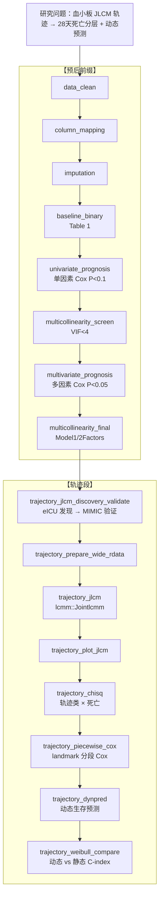

# 分析决策树 — 轨迹预后（脓毒症血小板 JLCM）

> 配置：`configs/config_trajectory_prognosis_plt.R`  
> Batch：`configs/config_trajectory_prognosis_plt_batch.R` → `run/trajectory_prognosis/run_trajectory_prognosis_plt_batch.R`  
> 文献：Ye 2024 *Burns & Trauma* (tkae016)  
> 归档名：`decision_tree_trajectory_prognosis_plt`（v2 — 预后前缀 + 轨迹段）

## 研究问题

脓毒症患者 ICU 入院后 0–7 天血小板轨迹（JLCM）能否对 28 天院内死亡进行预后分层与动态预测？

| 项 | 设定 |
|----|------|
| 研究类型 | `prognosis` |
| 暴露 | 纵向血小板 `PLT_0`~`PLT_7` |
| 结局 | `Mortality_28d` + `futime` |
| 队列 | eICU（发现）+ MIMIC（验证） |
| 轨迹类别数 | 4（AIC/BIC/SABIC/entropy） |
| Landmark | 1 / 7 / 14 天 |

## 完整流水线



## Block 映射

| Step | 阶段 | Block | 路径 | 主要产出 |
|------|------|-------|------|----------|
| 01 | 预后前缀 | `data_clean` | `Blocks/02_data_clean/` | 清洗数据 |
| 02 | 预后前缀 | `column_mapping` | `Blocks/01_column_mappings/` | 双库列名对齐 |
| 03 | 预后前缀 | `imputation` | `Blocks/03_imputation/` | 插补数据 + Table S1 |
| 04 | 预后前缀 | `baseline_binary` | `Blocks/04_baseline/` | Table 1 基线特征 |
| 05 | 预后前缀 | `univariate_prognosis` | `Blocks/06_univariate/` | Table S2a 单因素 HR |
| 06 | 预后前缀 | `multicollinearity_screen` | `Blocks/08_vif/` | VIF 筛查表 |
| 07 | 预后前缀 | `multivariate_prognosis` | `Blocks/07_multivariate/` | Table S2 多因素 HR |
| 08 | 预后前缀 | `multicollinearity_final` | `Blocks/08_vif/` | Model1/2Factors |
| 09 | 轨迹段 | `trajectory_jlcm_discovery_validate` | `53_trajectory_prognosis_full/03block_*.R` | `Table_Discovery_Validation_Split.csv` |
| 10 | 轨迹段 | `trajectory_prepare_wide_rdata` | `52_trajectory_incidence/04block_*.R` | 宽表 RData |
| 11 | 轨迹段 | `trajectory_jlcm` | `26_trajectory/02block_*.R` | `Table_Trajectory_IC_JLCM.xlsx` |
| 12 | 轨迹段 | `trajectory_plot_jlcm` | `26_trajectory/04block_*.R` | 轨迹类别曲线 PDF |
| 13 | 轨迹段 | `trajectory_chisq` | `26_trajectory/05block_*.R` | 轨迹类 × 结局卡方 |
| 14 | 轨迹段 | `trajectory_piecewise_cox` | `53_trajectory_prognosis_full/01block_*.R` | `Table_Piecewise_Cox_By_Class.csv` |
| 15 | 轨迹段 | `trajectory_dynpred` | `26_trajectory/06block_*.R` | `Figure_Dynpred_Platelet_D*.pdf` |
| 16 | 轨迹段 | `trajectory_weibull_compare` | `53_trajectory_prognosis_full/02block_*.R` | 动态 vs 静态 C-index |

## `pipeline$blocks`（单次运行）

```
data_clean → column_mapping → imputation
→ baseline_binary
→ univariate_prognosis → multicollinearity_screen
→ multivariate_prognosis → multicollinearity_final
→ trajectory_jlcm_discovery_validate
→ trajectory_prepare_wide_rdata
→ trajectory_jlcm → trajectory_plot_jlcm
→ trajectory_chisq
→ trajectory_piecewise_cox
→ trajectory_dynpred
→ trajectory_weibull_compare
```

## Batch 三层拆分

| 层 | blocks | 说明 |
|----|--------|------|
| **共享层** | 预后前缀 + `trajectory_jlcm_discovery_validate` | 全队列跑一次；`shared_ck_alias = trajectory_jlcm_discovery_validate` |
| **Worker 层** | `trajectory_prepare_wide_rdata` → … → `trajectory_weibull_compare` | eICU / MIMIC 并行 |
| **汇总层** | 飞书 + `Batch_summary` | batch runner 自动 |

## 飞书

- 工作计划编号：**B07**
- Batch 单元：eICU / MIMIC 并行

## 与文献对应

| 文献步骤 | 本流水线 |
|----------|----------|
| 队列筛选 + Table 1 | 预后前缀 `data_clean` ~ `baseline_binary` |
| 协变量（APS III、CCI、基线血小板） | `univariate` → `multivariate` → VIF 终 |
| JLCM 四类轨迹 | `trajectory_jlcm` |
| 四类基线比较 + KM | `trajectory_chisq` + `trajectory_plot_jlcm` |
| Piecewise Cox | `trajectory_piecewise_cox` |
| 动态 vs Weibull C-index | `trajectory_dynpred` + `trajectory_weibull_compare` |
