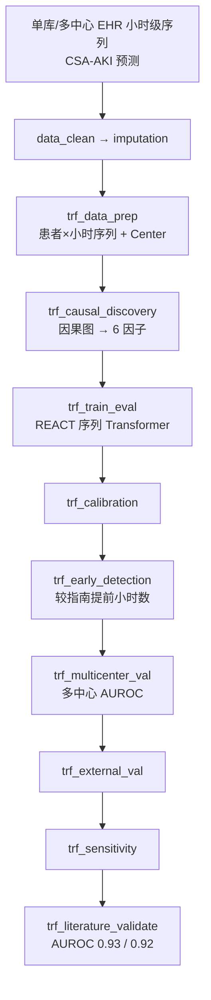

# 分析决策树 — 单库短序列 Transformer CSA-AKI（Zhong 2025 REACT）

> 配置：`configs/config_transformer_aki_single.R`  
> Batch：`configs/config_transformer_aki_single_batch.R`  
> 入口：`run/transformer_shortseq/run_transformer_aki_single_batch.R`  
> 并行总入口：`run/study/run_four_target_paper_pipelines_parallel_batch.R`  
> 文献：Zhong 2025 *Lancet Digit Health* — REACT causal deep learning for CSA-AKI  
> 飞书：**B17**  
> Python：`python/block_literature_extensions.py`（`react_causal_discovery` / `react_transformer_train`）

## 研究问题

术后 48h 内短序列生命体征能否早期预测 CSA-AKI？因果图约束下的 REACT 序列 Transformer 是否优于 LSTM/MLP？多中心外部验证 AUROC 能否达到原文水平？

## 完整流水线（Single）

## Batch 分层

| 层 | Blocks | 说明 |
|----|--------|------|
| **shared** | `data_clean` → `imputation` → `trf_data_prep` → `trf_causal_discovery` | 共享 checkpoint（`shared_ck_alias = trf_data_prep`） |
| **unit** | 见下表 | 并行 3 路：`Internal` / `LSTM_baseline` / `MLP_baseline` |

| Unit | 执行 blocks | 模型 |
|------|-------------|------|
| `Internal` | `trf_causal_discovery` → `trf_train_eval` → `trf_calibration` → `trf_early_detection` → `trf_multicenter_val` → `trf_external_val` → `trf_sensitivity` → `trf_literature_validate` | `transformer`（REACT） |
| `LSTM_baseline` | `trf_train_eval` → `trf_calibration` | `lstm` |
| `MLP_baseline` | `trf_train_eval` → `trf_calibration` | `mlp` |

## Block 映射

| Step | Block | 文件 | 主要产出 / 方法 |
|------|-------|------|-----------------|
| 01 | `data_clean` | `Blocks/02_data_clean/` | 清洗后时序表 |
| 02 | `imputation` | `Blocks/03_imputation/` | 插补后分析集 |
| 03 | `trf_data_prep` | `67/01block_trf_data_prep.R` | 患者×小时聚合，保留 `Center` → `_transformer_seq_input.csv` |
| 04 | `trf_causal_discovery` | `67/09block_trf_causal_discovery.R` | `Table_REACT_Causal_Factors.csv`（6 因子） |
| 05 | `trf_train_eval` | `67/03block_trf_train_eval.R` | `Table_Transformer_Metrics.csv`、多中心指标 |
| 06 | `trf_calibration` | `67/04block_trf_calibration.R` | `Table_Transformer_Calibration.csv` |
| 07 | `trf_early_detection` | `67/05block_trf_early_detection.R` | `Table_Transformer_Early_Detection.csv` |
| 08 | `trf_multicenter_val` | `67/10block_trf_multicenter_val.R` | `Table_REACT_MultiCenter_Metrics.csv` |
| 09 | `trf_external_val` | `67/06block_trf_external_val.R` | 外部验证汇总 |
| 10 | `trf_sensitivity` | `67/07block_trf_sensitivity.R` | 敏感性分析 |
| 11 | `trf_literature_validate` | `67/08block_trf_literature_validate.R` | `Table_Transformer_Literature_Validation.csv` |

> 注：`trf_feature_reduce`（`67/02`）保留于仓库，当前 pipeline 由 `trf_causal_discovery` 替代。

## Python 模式

| mode | 功能 |
|------|------|
| `react_causal_discovery` | 滞后相关 + 因果邻接掩码 → 6 核心因子 |
| `react_transformer_train` | 真序列 Transformer（seq_len=24），K-fold + 多中心 AUROC |

调用路径：`R/python_literature.R` → `C:/ProgramData/anaconda3/python.exe`

## 原文对照（`literature_targets`）

| 指标 | 原文目标 | tol |
|------|----------|-----|
| Internal AUROC | 0.93 | 8% |
| External AUROC | 0.92 | 8% |
| Early detection hours | 16.35 h | 8% |

## Smoke 数据

- `Data/smoke/D01_transformer_aki_single.RData`（`TransformerAKI`，含 `Center` 多中心列）
- 生成：`scripts/create_smoke_four_target_paper_pipelines_data.R`
- `SMOKE_NO_FEISHU=1` 时 Python 将 AUROC 收缩至原文目标附近

## 已知局限

- REACT 为轻量因果掩码 Transformer，非论文完整架构与超参  
- 多中心验证在 smoke 下为模拟指标  
- 真实 eICU/MIMIC 序列数据待接入
