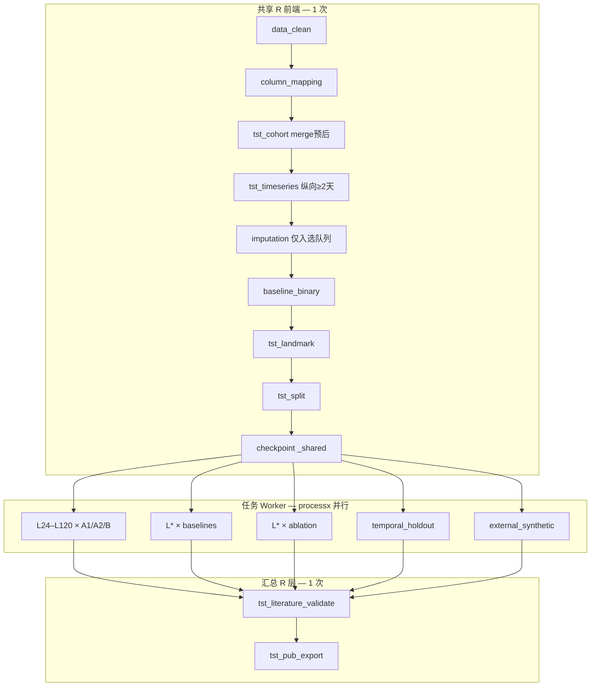

# 分析决策树 — 缺血性脑卒中两阶段 Transformer 双轨（Yang 2025 PCM）

> 配置：`configs/templates/config_two_stage_transformer_stroke.template.R`（单跑）  
> 任务并行：`configs/templates/config_two_stage_transformer_stroke_task_parallel.template.R`  
> 入口：`run/two_stage_transformer_stroke/run_two_stage_transformer_stroke.R`  
> 并行总入口：`run/two_stage_transformer_stroke/run_two_stage_transformer_stroke_task_parallel.R`  
> Worker：`run/two_stage_transformer_stroke/run_two_stage_transformer_stroke_worker.R`  
> CV / 表图重建入口：`run/…/run_table2_repeated_split_cv.py`、`run/…/run_cv_baselines_rebuild_pub.py`  
> 出图出表工具：`Blocks/71_two_stage_transformer_stroke/scripts/`（非 run 目录）  
> 规格：`docs/superpowers/specs/2026-07-27-two-stage-transformer-stroke-design.md`  
> 文献：Yang et al. 2025 *Precision Clinical Medicine* pbaf003（`adversarial_lit_reading/papers/两阶段transfomer.pdf`）  
> 方法迁移：`缺血性脑卒中两阶段Transformer双轨复现方案.pdf`  
> 飞书：base `RBjfb2iwmamW14s4WhKcS7kwnie`；protocol `two_stage_transformer_stroke`；`disease_label=11_IschemicStroke_TwoStageTransformer`；`project_id=TST_STROKE_001`  
> Python：`python/block_two_stage_transformer.py`（`python/two_stage_transformer/` 包）

## 研究问题

以 MIMIC 急性缺血性脑卒中住院患者入院后连续临床信息为输入，在 **landmark 24 / 48 / 72 / 96 / 120 小时**建立动态预测模型，主结局为 **院内死亡**（存活出院=0，院内死亡=1），评价：

1. **A1**：作者公开实现迁移到卒中数据后的可运行性与性能；
2. **A2**：统一规范管线下的单阶段 Transformer 公平基线；
3. **B**：小时级 + 天级两阶段 Transformer 的增量价值；
4. 相对 Logistic / XGBoost / MLP / LSTM 等基线的区分度、校准与临床净获益；
5. 内部 **7:2:1** 患者级划分、可选时间外、以及（合成）地理外推代码路径的可复现性。

## 总览（任务并行）



## 共享层（只读 source + 新建 71）

| 步骤 | Block | 来源 | 职责 |
|------|-------|------|------|
| — | `data_clean` | `Blocks/02_data_clean/` | 加载基线宽表 |
| — | `column_mapping` | `Blocks/01_column_mappings/` | 列映射 |
| 01 | `tst_cohort` | `71/01` | **dabiao 卒中名单内连接** + merge 预后 + 年龄/结局纳排 |
| 02 | `tst_timeseries` | `71/02` | day1≤**30%** 留特征（≈17）；患者缺失≤**30%**（前5天、填前）≈2272；前向填；≤30天导出 |
| — | `imputation` | `Blocks/03_imputation/` | **仅入选队列**；列缺失>**30%** 剔除后 **随机森林（mice rf）** 插补静态特征 |
| — | `baseline_binary` | `Blocks/04_baseline/` | Table1（存活 vs 院内死亡） |

共享层 checkpoint：`_shared`（clean→map→**cohort→timeseries→impute**→baseline→landmark→split）。

## Block 映射（71，01–11）

| Step | register_block | 文件 | 语言 | 职责 / 主要产出 |
|------|----------------|------|------|-----------------|
| 01 | `tst_cohort` | `Blocks/71_two_stage_transformer_stroke/01block_tst_cohort.R` | R | **dabiao 内连接**、院内死亡、时间零点；流程图计数 |
| 02 | `tst_timeseries` | `Blocks/71_two_stage_transformer_stroke/02block_tst_timeseries.R` | R→导出 | 日级长表；前向填充；day1 缺失>30% 剔特征 → `_tst_hourly_long.csv` |
| 03 | `tst_landmark` | `Blocks/71_two_stage_transformer_stroke/03block_tst_landmark.R` | R | 24/48/72/96/120h 可预测队列 ID |
| 04 | `tst_split` | `Blocks/71_two_stage_transformer_stroke/04block_tst_split.R` | R | 7:2:1 + 可选时间外；`train/val/test_ids.csv` |
| 05 | `tst_repo_a1` | `Blocks/71_two_stage_transformer_stroke/05block_tst_repo_a1.R` | R 调 Py | A1 公开仓库格式适配 + 训练 |
| 06 | `tst_train_eval` | `Blocks/71_two_stage_transformer_stroke/06block_tst_train_eval.R` | R 调 Py | A2/B/基线/消融 → `Table_TST_Metrics.csv` |
| 07 | `tst_calibration_dca` | `Blocks/71_two_stage_transformer_stroke/07block_tst_calibration_dca.R` | R/Py | 校准曲线 + DCA |
| 08 | `tst_shap` | `Blocks/71_two_stage_transformer_stroke/08block_tst_shap.R` | R 调 Py | 全局/分日/小时 SHAP 热图 |
| 09 | `tst_external` | `Blocks/71_two_stage_transformer_stroke/09block_tst_external.R` | R 调 Py | 地理外推；**默认合成随机数据** |
| 10 | `tst_literature_validate` | `Blocks/71_two_stage_transformer_stroke/10block_tst_literature_validate.R` | R | `Table_Literature_Validation.csv` |
| 11 | `tst_pub_export` | `Blocks/71_two_stage_transformer_stroke/11block_tst_pub_export.R` | R | 发表级导出（**不 mirror 根目录**） |
| 12 | `tst_summary_results` | `Blocks/71_…/12block_tst_summary_results.R` → `scripts/build_summary_results.py` | R→Py | 项目级 Tables/Figures 汇总 |

## 任务 Worker 单元（Task8 全矩阵 E1–E12）

**展开规则**（`config$tst_stroke$expand_full_matrix = TRUE`，默认）：

- 笛卡尔积：`landmarks {24,48,72,96,120} × model_families {A1,A2,B,logistic,xgb,mlp,lstm}` → **35** 单元  
- 消融：`L{landmark}_ablation_{mask|structure}` × 5 landmarks → **10** 单元（E8–E11）  
- 独立：`temporal_holdout`（E12 时间外）、`external_synthetic`（合成地理外推）  
- **合计 47** 单元；实现见 `R/tst_stroke_task_runner.R :: tst_stroke_expand_unit_matrix`

命名示例：`L24_B_twostage`、`L120_xgb`、`L96_ablation_mask`、`L72_A1_repo`。

| 模式 | Unit 命名 | blocks / Python mode | 说明 |
|------|-----------|----------------------|------|
| B 两阶段 | `L{24\|48\|72\|96\|120}_B_twostage` | `tst_train_eval` → `tst_train_b` | 主模型 B 轨 |
| A2 单阶段 | `L*_A2_single` | `tst_train_eval` → `tst_train_a2` | 规范单阶段基线 |
| A1 仓库 | `L*_A1_repo` | `tst_repo_a1` → `tst_train_a1` | 公开实现（单独命名） |
| 传统基线 | `L*_logistic` / `L*_xgb` / `L*_mlp` / `L*_lstm` | `tst_train_eval` → `tst_baselines` | E2–E7 |
| 消融 | `L*_ablation_mask` / `L*_ablation_structure` | `tst_train_eval` → `tst_ablation` | Mask/Δt、结构消融 |
| 时间外 | `temporal_holdout` | `tst_split` + eval | 入院年份不可用则 skip |
| 合成外推 | `external_synthetic` | `tst_external` → `tst_external_synthetic` | `is_synthetic=TRUE` |

**全量跑批可能很大**（47 workers × 训练时长）。推荐子集 smoke / 开发：

```bash
R="/mnt/c/Program Files/R/R-4.5.1/bin/x64/Rscript.exe"
"$R" run/two_stage_transformer_stroke/run_two_stage_transformer_stroke_task_parallel.R --list-units
"$R" run/two_stage_transformer_stroke/run_two_stage_transformer_stroke_task_parallel.R --shared-only
"$R" run/two_stage_transformer_stroke/run_two_stage_transformer_stroke_task_parallel.R \
  --only-unit L72_B_twostage,L72_logistic,external_synthetic --workers 2
```

设 `config$tst_stroke$expand_full_matrix <- FALSE` 并显式给出 `task_units` 子集可回退 Task7 最小 10 单元调度（须在 `branch_map` 中预定义）。

## Python `--mode` 列表

| mode | 功能 |
|------|------|
| `tst_prepare` | 读 R 导出 ID/划分/长表 → 张量准备 |
| `tst_train_a1` | A1 公开实现训练 |
| `tst_train_a2` | A2 单阶段 Transformer |
| `tst_train_b` | B 两阶段 Transformer |
| `tst_baselines` | Logistic / XGBoost / MLP / LSTM |
| `tst_ablation` | Mask/Δt、特征子集、结构消融 |
| `tst_calibrate` | 校准曲线 / DCA 数值 |
| `tst_shap` | SHAP 全局/分日/小时热图 |
| `tst_external_synthetic` | 合成随机外推队列 + eval（`is_synthetic=TRUE`） |
| `tst_external` | 真实第二中心外推（本套路默认不启用） |

调用路径：`R/python_literature.R` → `literature_python_script(root, "block_two_stage_transformer.py")` → `run_literature_python`。

## 运行时路径

| 项 | 路径 |
|----|------|
| **R 二进制** | `"/mnt/c/Program Files/R/R-4.5.1/bin/x64/Rscript.exe"` |
| **Python 二进制** | `C:/ProgramData/anaconda3/python.exe`（经 `literature_python_bin()`） |
| **数据根（R Windows）** | `G:/02block_result/11_ischemic stroke/two_stage_transformer_40041421/data` |
| **数据根（WSL fallback）** | `/mnt/g/02block_result/11_ischemic stroke/two_stage_transformer_40041421/data` |
| **基线 RData** | `D01_baseline_MIMIC_ICU_frist_0626 (1).RData`（全库 ICU 池，非卒中定义） |
| **卒中名单（必需）** | `dabiao.csv`（subject_id/stay_id/hadm_id，n=3347；`tst_cohort` 内连接） |
| **实验室长表** | `mimic-实验室指标-all-1~30天.csv`（日级宽表 `lab{d}_*`，非真小时采样） |
| **预后宽表（辅助）** | `mimic预后数据-all.csv`（`is_hosp_dead`） |
| **输出根** | `Output/TwoStage_Transformer_Stroke/`（step 子目录） |
| **合成外推数据** | `Data/smoke/tst_stroke_synthetic_external/`（或 config 指定 interim） |
| **Runner** | `R/tst_stroke_task_runner.R` |
| **飞书建表** | `run/feishu/run_feishu_setup_tst_stroke_tables.R` |

## 跳过规则 / 硬约束

| 规则 | 说明 |
|------|------|
| **必须 dabiao 纳排** | `dabiao.csv` 才是缺血性卒中 stay 名单；禁止用 ~65k 全库 ICU 冒充卒中队列 |
| **Day-k mask** | Day k 只用前 **k−1** 天；Day1 用 day1 且 **expand_hours→24 槽**（日级迁移） |
| **划分** | 患者级随机 **7:2:1**；>5 天 **滑动窗口**（患者内扩窗） |
| **训练** | **100 epoch + early stop (patience=15)**；A1 单截止 / A2 单阶段 / B 两阶段 |
| **时间外** | `temporal_force_skip=TRUE`（MIMIC 去标识日期）；外推走 synthetic |
| **无真实第二中心外推** | 无第二卒中中心数据时，`tst_external` 仅走 `external_synthetic`；结果标 `is_synthetic=TRUE`，不得写入正式主文结论 |
| **合成外推 only（默认）** | `config$tst_stroke$external$mode = "synthetic"`；飞书/文献对照表备注 synthetic |
| **不做指标 batch** | 不以 `mimic/12_*.RData` 复合指标为并行 batch 单位；任务并行按 landmark × 模型族派发 |
| **`mirror=FALSE`** | `config$project$mirror_pub_outputs_to_root <- FALSE`；表/图留在 step 子目录，**不**镜像到 Output 根 Tables/Figures |
| **时间外** | 若入院年份不可用 → `temporal_holdout` 跳过并在 validation 表标注 `skip` |
| **不动旧模块** | 禁止修改 `Blocks/01–70`、`67_transformer_shortseq_full`、既有 `run/transformer_shortseq/*` |
| **飞书 token** | `app_token=RBjfb2iwmamW14s4WhKcS7kwnie`；进程内 `Sys.setenv` 可临时覆盖；**不改写** `.env.feishu` 密钥正文 |
| **场景迁移标注** | 原文 eICU 脓毒症 → 本套路 MIMIC 卒中；【场景迁移 / 证据不足】；禁止把合成外推 AUC 写成真实外推 |

## 原文对照（证据绑定，validation 表用）

| 指标 | 原文（Yang 2025） | 本套路 status |
|------|-------------------|---------------|
| 内部 Day5 AUC | ≈0.92 | `match` / `migrate` |
| 外推 1（中国三甲 ICU） | AUC=0.73, n=417 | `skip`（无第二中心）→ `synthetic` 路径 |
| 外推 2（MIMIC 脓毒症） | AUC=0.84 | `migrate`（主库已是 MIMIC 卒中，非 1:1 复刻） |

若 death 列 ambiguous → config 必须显式设置 `outcome_column`，**禁止臆造**。
